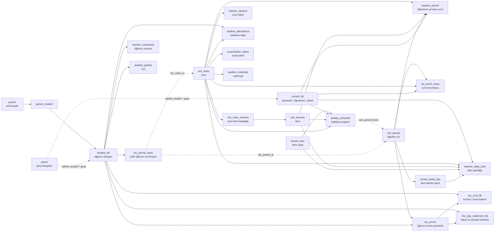

# 00 — HorizonEdu eski sistem veri modeli ve veri akışı

Tarih: 2026-09-30

Durum: **Mevcut sistemin kaynak koddan ve salt okunur canlı API kontrollerinden çıkarılmış “olduğu gibi” (`as-is`) haritası.** Bu belge henüz yeni veritabanı tasarımı veya dönüşüm kararı değildir.

## 1. Amaç ve inceleme sınırı

Bu raporun amacı, `horizonedu/backend` içindeki Flask uygulamasının veriyi nasıl temsil ettiğini, tabloların birbirine nasıl bağlandığını ve ana iş akışlarının hangi kayıtları hangi sırayla ürettiğini ortak bir konuşma zemini olarak açıklamaktır.

İncelenen ana kaynaklar:

- `horizonedu/backend/app/modeller/models.py`: SQLAlchemy model tanımları.
- Öğrenci, yönetim, öğretmen, veli, ayarlar, finans ve mobil blueprint route'ları.
- `horizonedu/backend/app/__init__.py`: uygulama kurulumu ve tablo oluşturma davranışı.
- `horizonedu/backend/run.py`: günlük veli raporu akışı.
- `horizonedu/backend/seed_status.py`: toplu dönem kapatma/pasifleştirme davranışı.
- `horizonedu/backend/app/static/pdfiles/horizonschool.db`: depoda bulunan SQLite kopyasının yalnızca şema ve satır sayısı düzeyinde okunması.
- Mobil uygulamanın `EXPO_PUBLIC_API_BASE_URL` hedefi olan `https://hschool.online` üzerindeki seçili GET endpoint'leri: canlı katalog, öğretmen ataması, aktif program, sınıf sorumlusu, performans ve sınırlı finans sayımları.

Model dosyasında:

- 46 SQLAlchemy model sınıfı,
- 326 kolon bildirimi,
- 80 foreign key bildirimi,
- 79 ORM relationship bildirimi,
- yalnızca 4 tek-kolon `unique` tanımı,
- açık bileşik unique constraint, check constraint veya özel index tanımı yoktur.

Birincil anahtarların ve `unique=True` kolonların veritabanı tarafından oluşturulan doğal index'leri son maddenin dışındadır.

### Kanıt sınırı

Uygulama yapılandırması çalışma veritabanı olarak MySQL'i göstermektedir. Bu incelemede canlı MySQL'e doğrudan bağlanılmadı ve gerçek üretim şeması değiştirilmedi. Bu nedenle belgede dört ayrı katman özellikle ayrılmıştır:

1. **Model:** Python/SQLAlchemy kodunun bugün tanımladığı hedef yapı.
2. **Uygulama davranışı:** Route ve arka plan işlerinin fiilen nasıl okuyup yazdığı.
3. **SQLite kopyası:** Depoda bulunan, modelden daha eski olduğu görülen yerel veritabanı dosyası.
4. **Canlı API görünümü:** Endpoint'in filtrelediği ve serialize ettiği kayıtlar; doğrudan tablo/constraint dökümü değildir.

`db.create_all()` yalnız eksik tabloları oluşturur; mevcut tabloları migration gibi dönüştürmez. Bu nedenle model dosyası ile çalışan MySQL'in birebir aynı olduğu ayrıca doğrulanmalıdır.

## 2. Sistemin kısa özeti: benim anladığım ana kurgu

Eski sistem tek okul için geliştirilmiş, modüler görünse de ortak bir veritabanını kullanan Flask monolitidir. Merkezde dört farklı kimlik/kayıt kavramı vardır:

1. `student_tbl`: öğrencinin kalıcı kişisel dosyası.
2. `stu_period_class`: öğrencinin belirli öğretim yılı ve sınıftaki kaydı.
3. `current_tbl`: personel, öğretmen ve aynı zamanda tedarikçi/şirket kartı.
4. `admin` ve `parent`: sisteme giriş yapan hesaplar.

Sistem şu temel fikre göre kurulmuş görünüyor:

- Öğrenci ve personel kartı kalıcıdır.
- Öğretim yılına göre sınıf ve öğretmen atamaları ayrıca açılır.
- `Active` olan kayıtlar “şu anda kullanılacak” kaydı temsil eder.
- Günlük akademik olaylar; tarih, sınıf, ders, öğretmen ve bazen ders saati tekrar edilerek ayrı tablolara yazılır.
- Veli ve öğrenci ekranları, öğrencinin `Active` yıllık sınıf kaydını bularak programı ve sınıfa ait günlük kayıtları okur.
- Ücret sözleşmesi öğrenci + öğretim yılı etrafında kurulur; hizmet kalemleri ve ödeme planı bunun altına eklenir.
- Geçmiş çoğu yerde ayrı tarih aralıkları yerine `Active/Passive` metniyle korunmaya çalışılır.

Bu yaklaşımın güçlü yanı, kalıcı öğrenci kartını yıllık sınıf kaydından; öğretmen ders atamasını sınıf sorumluluğundan; ücret protokolünü ödeme hareketlerinden ayırmış olmasıdır. Ana sorun, bu ayrımların foreign key, bileşik tekillik, zaman aralığı ve durum kurallarıyla tam güvenceye alınmamış olmasıdır.

## 3. Üst seviye veri haritası

Aşağıdaki şemada düz oklar gerçek foreign key'i, kesik oklar yalnızca kod tarafından anlamlandırılan veya metin/ID kopyasıyla kurulan mantıksal bağı gösterir.



## 4. Kimlikler ve aynı kişiyi temsil eden kayıtlar

### 4.1 Öğrenci

Bir öğrencinin sistemde tek kaydı yoktur; farklı amaçlarla birden fazla kayıt oluşur:

| Amaç | Tablo | Bağlantı |
| --- | --- | --- |
| Kalıcı öğrenci profili | `student_tbl` | Ana öğrenci ID'si |
| Öğretim yılı ve sınıfı | `stu_period_class` | `studid_per_class → student_tbl.id` |
| Web/mobil giriş hesabı | `admin` | FK olmayan `admin_empID`; `admin_group='Nxënësit'` anlamı belirler |
| Veli bağlantısı | `parent_student` | Gerçek iki FK ile veli–öğrenci köprü tablosu |
| Fotoğraf ve belge | `student_photo`, `stu_attached` | Öğrenci FK'si |
| Ön kayıt/kayıt formu | `stu_fletaparaqit` | Öğrenci FK'si; sınıf/yıl gibi bilgiler metin |
| Yıllık ücret protokolü | `stu_prices` | Öğrenci ve öğretim yılı FK'si |

`student_tbl.studpass_hash` içinde bir parola alanı bulunmasına rağmen web ve mobil öğrenci girişi `admin` tablosundaki hesap üzerinden yapılmaktadır. Böylece öğrenci için iki farklı parola saklama yeri oluşmuştur; incelenen giriş akışı `student_tbl.studpass_hash` alanını kullanmıyor.

### 4.2 Öğretmen/personel

Öğretmen önce `current_tbl` içinde personel olarak açılır. Ardından `admin.admin_empID`, öğretmenin `current_tbl.id` değerini tutar ve `admin_group='Mësues'` ile hesabın öğretmen olduğu anlaşılır.

Öğretmenin iş bağlamları ayrı tablolardadır:

- `teacher_period`: hangi öğretim yılında hangi sınıfa hangi dersi verdiği.
- `res_teach_class`: hangi öğretim yılında hangi sınıfın sorumlu öğretmeni olduğu.
- `weekly_schedule`: haftanın hangi günü ve saatinde hangi dersi verdiği.
- Günlük akademik tablolardaki `teacher_id`: günlük kaydı hangi personelin oluşturduğu/verdiği.

### 4.3 Veli

Veli, öğretmen ve öğrenciden farklı olarak doğrudan `parent` tablosunda hem profil hem giriş hesabıdır. Çocukları `parent_student` ile bağlanır. Öğrenci kartındaki `stu_father` ve `stu_mother` alanları yalnızca metindir; otomatik olarak veli hesabına veya `parent_student` ilişkisine dönüşmez.

### 4.4 Admin hesabının çok biçimli bağı

`admin.admin_empID` foreign key değildir. Aynı kolon:

- öğretmen/yönetim hesabında `current_tbl.id`,
- öğrenci hesabında `student_tbl.id`

olarak yorumlanır. Hedef tabloyu `admin_group` metni belirler. Bu, veritabanının doğrulayamadığı çok biçimli bir ilişkidir.

## 5. Tablo envanteri

Bu bölüm model dosyasındaki 46 tablonun tamamını iş alanlarına göre özetler.

### 5.1 Hesap, veli ve cihaz tabloları

| Tablo | İşlev | Ana alanlar ve ilişkiler | Gözlenen kullanım |
| --- | --- | --- | --- |
| `admin` | Yönetici, öğretmen ve öğrenci giriş hesabı | Benzersiz `admin_username`; ad/soyad, grup, durum, parola hash'i; FK olmayan `admin_empID` | Flask-Login web girişi ve öğrenci mobil JWT girişi |
| `parent` | Veli profili ve giriş hesabı | Benzersiz kullanıcı adı/e-posta, parola hash'i, ad/soyad | Web ve mobil veli girişi |
| `parent_student` | Veli–öğrenci N:N bağlantısı | `parent_id → parent`, `student_id → student_tbl` | Velinin çocuk listesi ve erişim kontrolü |
| `device_token` | Mobil push cihaz kaydı | `user_type`, FK olmayan `user_id`, platform, cihaz/push token, sürüm ve zamanlar | Parent/student cihaz token'ı için uygulama düzeyi upsert |

Notlar:

- `parent_student` için `(parent_id, student_id)` tekillik constraint'i yoktur; aynı bağlantı iki kez eklenebilir.
- `device_token` için hedef kullanıcı FK'si ve `(user_type, user_id, push_token)` DB tekilliği yoktur; tekillik yalnız route sorgusuyla korunmaya çalışılır.
- Flask-Login `user_loader`, aynı sayısal ID için önce `admin`, sonra `parent` arar. İki tabloda aynı ID varsa parent oturumu yanlış kullanıcı türüne çözülebilir.

### 5.2 Öğrenci dosyası ve yıllık kayıt tabloları

| Tablo | İşlev | Ana alanlar ve ilişkiler | Gözlenen kullanım |
| --- | --- | --- | --- |
| `student_tbl` | Kalıcı öğrenci dosyası | Kayıt tarihi, ilk sınıf metni, benzersiz kişisel ID, kimlik/aile/iletişim alanları, durum, parola hash'i | Öğrenci merkezi; çoğu modül bu ID'yi kullanır |
| `student_photo` | Öğrenci fotoğrafı | Dosya adı/türü; `studphoto_stuID → student_tbl` | Profil ve sınıf listesi |
| `stu_attached` | Öğrenci belgesi | Açıklama, dosya adı/türü; `student_attid → student_tbl` | Yükleme, listeleme, indirme ve fiziksel silme |
| `stu_fletaparaqit` | Başvuru/ön kayıt bilgi formu | Sınıf, okul yılı, önceki okul/başarı, transport, indirim metinleri; öğrenci FK'si | Kayıt formu ve yazdırma |
| `stu_period_class` | Öğrencinin öğretim yılı–sınıf kaydı | Öğrenci FK'si; FK olmayan yıl/sınıf ID'leri; yıl/sınıf adlarının kopyaları; `status` | Aktif sınıfı bulma ve geçmiş yıl kayıtlarını tutma |

`stu_period_class` sistemin en kritik bağlayıcı tablosudur. Buna rağmen `stu_period_id` ve `stu_class_id` gerçek FK değildir. Yıl ve sınıf adları da aynı satıra kopyalanır. Böylece referans kayıtlar değişse bile eski ad kalabilir; fakat ID'nin gerçekten var olduğu DB tarafından garanti edilmez.

### 5.3 Akademik yapı ve program tabloları

| Tablo | İşlev | Ana alanlar ve ilişkiler | Gözlenen kullanım |
| --- | --- | --- | --- |
| `sch_period` | Öğretim yılı | Ad, başlangıç/bitiş, serbest metin durum | Yıllık kayıtların ve birçok finans/akademik kaydın üstü |
| `sch_class` | Sınıf/kademe-şube benzeri kayıt | Sınıf adı ve açıklaması | Öğrenci yerleşimi, program, not ve günlük olayların sınıfı |
| `sch_lessons` | Ders kataloğu | Ders adı | Atamalar, program, günlük olaylar ve notlar |
| `sch_class_lessons` | Sınıf–ders köprüsü | `sch_clsID → sch_class`, `sch_lessonID → sch_lessons` | Bir sınıfta okutulacak derslerin kataloğu |
| `lesson_time` | Günlük ders saati | Ad, başlangıç ve bitiş saati | Program ve saatli günlük olaylar |
| `school_week_day` | Gerçek okul takvim günü | Hafta no, tarih, gün adı, semester metni, `sch_periods → sch_period`, durum | Günlük kayıtların takvim referansı |
| `teacher_period` | Öğretmen ders ataması | Öğretmen/personel, yıl, ders, sınıf FK'leri; durum ve görev metni | Öğretmenin yetkili/atanmış olduğu sınıf-ders-yıl kombinasyonu |
| `res_teach_class` | Sınıf sorumlu öğretmeni | Sınıf, öğretmen/personel ve yıl FK'leri; durum | Sınıf öğretmeni/sorumlusu ekranları |
| `weekly_schedule` | Haftalık ders programı satırı | Sınıf, ders saati, ders, öğretmen FK'leri; gün adı; öğretim yılı **metni**; durum | Öğretmen, öğrenci ve veli programı |
| `grade_periods` | Not kategorisi/dönemi sözlüğü | `period_grade`, `grade_name` | `student_grades.period_id` hedefi; akademik dönem FK'si değildir |

Burada üç farklı zaman kavramı vardır:

- `sch_period`: öğretim yılı.
- `school_week_day.semester`: “1st Semester / 2nd Semester” metni.
- `grade_periods`: not dönemi/kategorisi.

Bunlar birbirine doğrudan bağlı tek bir dönem modeli değildir.

### 5.4 Günlük eğitim ve değerlendirme tabloları

| Tablo | İşlev | Ana alanlar ve ilişkiler | Gözlenen kullanım |
| --- | --- | --- | --- |
| `teacher_daily_task` | Derste işlenen konu/günlük | Tarih + takvim günü + ders saati + ders + sınıf + öğretmen | Veli/öğrenci günlük raporu |
| `teacher_detyres` | Sınıfa verilen ödev metni | `teacher_daily_task` ile aynı bağlam kolonları + ödev metni | Güncel web/mobil ödev listesi |
| `student_metarials` | Sınıf ders materyali | Açıklama/dosya + aynı tarih/saat/ders/sınıf/öğretmen bağlamı | Öğretmenin yüklediği materyaller |
| `student_attendance` | Yalnız istisna yoklama olayı | Tarih, öğrenci, ders, sınıf, öğretmen; `Late/Absent`, neden, admin okuma işareti, durum | `Present` satırı yazılmaz; yokluk/geç kalma kaydedilir |
| `teacher_comments` | Öğrenci davranış/geri bildirim kaydı | Tarih, takvim günü, saat, ders, sınıf, öğretmen, öğrenci; metin, puan/kategori, durum | Kart/yorum sistemi ve günlük rapor |
| `examination_dates` | Sınav planı | Tarih, takvim günü, saat, ders, sınıf, öğretmen, açıklama | Öğretmen, veli ve öğrenci sınav takvimi |
| `teacher_homework` | Başlık ve tarih aralıklı eski/alternatif ödev modeli | Ders, sınıf, öğretmen; üç sabit ek dosya alanı | Günlük mail işinde kullanılıyor; güncel ekranların ana ödev kaynağı değil |
| `student_homework` | Öğrenci bazlı ödev durumu/teslimi | Öğrenci ve `teacher_homework` FK'leri; tamamlanma, teslim tarihi, not, okunma | Günlük mail akışı ve durum toplu pasifleştirme |
| `student_grades` | Öğrenci notu | Öğretmen, öğrenci, ders, sınıf, not kategorisi ve öğretim yılı FK'leri; not/tarih/durum | Öğretmen girişi, öğrenci/veli gösterimi |

Önemli ayrım: sistemde iki ödev kurgusu birlikte bulunmaktadır.

1. `teacher_homework → student_homework`: başlık, başlangıç/bitiş, öğrenci teslim/tamamlanma/not durumu olan ayrıntılı model.
2. `teacher_detyres`: belirli gün/saat/ders/sınıf için tek metin olan daha basit model.

İncelenen öğretmen, veli ve mobil ekranların güncel akışı ağırlıklı olarak `teacher_detyres` kullanır. `run.py` içindeki günlük e-posta raporu ise hâlâ `student_homework → teacher_homework` yolunu okur. Dolayısıyla “ödev” için iki paralel gerçeklik vardır.

### 5.5 Öğrenci ücretleri ve tahsilat tabloları

| Tablo | İşlev | Ana alanlar ve ilişkiler | Gözlenen kullanım |
| --- | --- | --- | --- |
| `sherbimet` | Hizmet türü sözlüğü | Hizmet adı | Ücret kalemi oluşturma ekranında kaynak liste |
| `stu_prices` | Öğrenci–öğretim yılı ücret protokolü/sözleşmesi | Protokol no/tarih; yıl ve öğrenci FK'leri | Bir öğrenci için dönem/yıl bazlı finans kabı |
| `stu_cost_tbl` | Protokolün hizmet/ücret kalemi | Liste fiyatı, indirim yüzdesi, net tutar, durum; öğrenci ve protokol FK'leri | Eğitim, servis vb. ücret hesapları |
| `Stu_pay_statement_tbl` | Taksit ve tahsilat hareketleri | Tarih, taksit, açıklama, debit/credit, fatura durumu; öğrenci ve protokol FK'leri | Ödeme planı, ödeme kaydı ve gecikmiş fatura listesi |

Route davranışından çıkan muhasebe anlamı:

- Ödeme planı satırları `stment_credit > 0`, `invoice_status='Papaguar'` (ödenmemiş) olarak yazılıyor.
- Gerçek ödeme/tahsilat satırı `stment_debit > 0`, `stment_credit=0`, `invoice_status=NULL` olarak yazılıyor.
- Taksit satırının durumu `Paguar/Papaguar` olarak elle değiştiriliyor.

Yani aynı tabloda hem beklenen taksitler hem alınan ödemeler tutuluyor; fakat bir tahsilatın hangi taksiti kapattığını gösteren doğrudan bir ilişki yoktur.

### 5.6 Personel, sözleşme ve organizasyon tabloları

| Tablo | İşlev | Ana alanlar ve ilişkiler | Gözlenen kullanım |
| --- | --- | --- | --- |
| `current_tbl` | Ortak cari kart | Kişi/şirket adı, kimlik/vergi, iletişim, banka, bölüm, durum, işe başlama | Personel, öğretmen ve tedarikçi/şirket aynı tabloda |
| `current_foto` | Personel fotoğrafı | Dosya adı/türü; personel FK'si | Yönetim ve öğretmen profili |
| `current_contract` | Personel iş sözleşmesi | Başlangıç/bitiş, brüt/net, personel FK'si | Modelde var; incelenen route'larda aktif CRUD görülmedi |
| `emp_pdfcont_tbl` | Sözleşme PDF eki | Dosya adı/türü; sözleşme FK'si | Modelde var; incelenen route'larda aktif CRUD görülmedi |
| `emp_attached` | Personel genel belgesi | Açıklama, dosya; personel FK'si | Modelde var; incelenen route'larda aktif CRUD görülmedi |
| `emp_missingdays` | Personel devamsızlığı/kararı | Tarih, açıklama, karar, dosya; personel FK'si | Modelde var; incelenen route'larda aktif CRUD görülmedi |
| `cont_departments` | Departman/unvan sözlüğü | Departman ve başlık | Personel `current_emp_department` alanı bu ID ile join ediliyor |
| `cont_responsbilities` | Departman sorumluluk maddesi | Açıklama; departman FK'si | Organizasyon/sözleşme içeriği |
| `director` | Müdür bilgisi | Kişisel ID, ad, durum | Bağımsız model; diğer modellerle FK veya aktif route kullanımı görülmedi |

`current_tbl.current_emp_department` modelde integer olmasına rağmen `cont_departments.id` için foreign key değildir. Ayrıca finans route'u `current_emp_department='5210'` değerini şirket/tedarikçi türü için özel işaret olarak kullanmaktadır. Böylece aynı alan bazen departman ID'si, bazen kişi türü kodudur.

### 5.7 Genel finans tabloları

| Tablo | İşlev | Ana alanlar ve ilişkiler | Gözlenen kullanım |
| --- | --- | --- | --- |
| `expenses_grp` | Gider kategorisi | Kategori adı | Bütçe ve cari hareketlerin sınıflandırması |
| `budget` | Yıl + gider kategorisi bütçe hedefi | Gider grubu ve yıl FK'leri; hedef tutar ve durum | Aktif yıl bütçe planı |
| `current_move` | Şirket/cari gider hareketi | Tarih, fatura, açıklama, debit/credit; gider grubu, dönem ve cari kart FK'leri | Tedarikçi giderleri |

`current_move` oluşturma ve güncelleme route'ları aynı tutarı hem `curmove_debit` hem `curmove_credit` alanına yazmaktadır. Bunun bilinçli çift taraflı kayıt mı, geçici uygulama davranışı mı olduğu kaynak koddan anlaşılamıyor.

### 5.8 Bağımsız/eksik bağlanmış tablolar

| Tablo | İşlev | Bağlantı durumu |
| --- | --- | --- |
| `tasks` | Kullanıcıya bağlı genel görev | `user_id` var fakat FK ve kullanıcı türü yok; incelenen route'larda kullanılmıyor |
| `chat_messages` | Öğretmen–öğrenci mesajı | Öğrenci ve personel FK'leri var; ayrıca FK olmayan `sender_id`/`receiver_id`; incelenen route'larda kullanılmıyor |

## 6. İlişki haritası

### 6.1 En çok merkeze alınan tablolar

#### `student_tbl` doğrudan hedefi olan tablolar

- `parent_student`
- `student_photo`
- `stu_attached`
- `stu_period_class`
- `stu_prices`
- `stu_cost_tbl`
- `Stu_pay_statement_tbl`
- `stu_fletaparaqit`
- `student_homework`
- `student_attendance`
- `teacher_comments`
- `student_grades`
- `chat_messages`

Ek olarak `admin.admin_empID` öğrenci hesabında mantıksal olarak `student_tbl.id` değerini tutar, fakat FK değildir.

#### `current_tbl` doğrudan hedefi olan tablolar

- `current_contract`
- `current_foto`
- `current_move`
- `emp_attached`
- `emp_missingdays`
- `teacher_period`
- `weekly_schedule`
- `res_teach_class`
- `teacher_daily_task`
- `student_attendance`
- `teacher_comments`
- `teacher_homework`
- `student_grades`
- `examination_dates`
- `student_metarials`
- `teacher_detyres`
- `chat_messages`

Ek olarak `admin.admin_empID` öğretmen/yönetim hesabında mantıksal olarak `current_tbl.id` değerini tutar.

#### `sch_period` doğrudan hedefi olan tablolar

- `stu_prices`
- `budget`
- `current_move`
- `teacher_period`
- `school_week_day`
- `res_teach_class`
- `student_grades`

`stu_period_class.stu_period_id` ve `weekly_schedule.sch_period` de öğretim yılını temsil eder; ancak birincisi FK olmayan integer, ikincisi yıl adı metnidir.

#### `sch_class`, `sch_lessons`, `lesson_time`, `school_week_day`

Bu dört tablo günlük akademik olayların ortak koordinat sistemidir. Çoğu olay “aynı ders oturumu”na FK vermek yerine aşağıdaki kolonları tekrarlar:

- tarih veya takvim günü,
- ders saati,
- ders,
- sınıf,
- öğretmen.

Bu tekrar `teacher_daily_task`, `teacher_detyres`, `student_metarials`, `teacher_comments` ve `examination_dates` tablolarında görülür. `student_attendance` ise takvim günü ve ders saati taşımadan tarih + öğrenci + ders + sınıf + öğretmen tutar.

### 6.2 Veritabanının doğrulamadığı mantıksal ilişkiler

| Kaynak alan | Kodun verdiği anlam | DB'nin garanti etmediği şey |
| --- | --- | --- |
| `admin.admin_empID` | Gruba göre öğrenci veya personel ID'si | Hedef kaydın varlığı ve doğru tür |
| `stu_period_class.stu_period_id` | Öğretim yılı | `sch_period` kaydının varlığı |
| `stu_period_class.stu_class_id` | Sınıf | `sch_class` kaydının varlığı |
| `weekly_schedule.sch_period` | Öğretim yılı adı | Yeniden adlandırma, varlık ve tekillik |
| `current_tbl.current_emp_department` | Departman ID'si veya şirket kodu | Departmanın varlığı ve alanın tek anlamı |
| `tasks.user_id` | Görevin sahibi | Hangi kullanıcı tablosu ve kaydın varlığı |
| `device_token.user_id` | Parent veya student hesabı | Kullanıcı türü ve hedef kaydın varlığı |
| `chat_messages.sender_id/receiver_id` | Mesaj tarafları | Kullanıcı türleri ve hedef kayıtlar |

### 6.3 Aynı bilginin birden fazla yerde tutulduğu bağlar

- `stu_period_class`: yıl/sınıf ID'si yanında yıl/sınıf adı ve açıklaması.
- `stu_cost_tbl`: hem öğrenci ID'si hem protokol ID'si; protokol zaten öğrenciyi gösterir.
- `Stu_pay_statement_tbl`: hem öğrenci ID'si hem protokol ID'si; iki yolun aynı öğrenciye gitmesi garanti edilmez.
- Günlük akademik tablolar: `date` ile `day_week_id` birlikte tutulur; ikisinin aynı günü göstermesi garanti edilmez.
- Günlük akademik tablolar: ders, sınıf ve öğretmen ayrı FK'lerle tutulur; bunların aynı `teacher_period` veya `weekly_schedule` satırına ait olması garanti edilmez.
- `student_tbl.stu_reg_class`, `stu_fletaparaqit.stuflet_klasa` ve `stu_period_class.stu_class_*` sınıf bilgisinin üç ayrı temsilidir.
- `student_tbl.studpass_hash` ve öğrenciye ait `admin.loginpass_hash` iki parola alanıdır.

## 7. Mevcut veri akışları

### 7.1 Yeni öğretim yılı ve akademik hazırlık

```text
sch_period oluştur
  -> okul günlerini/haftalarını school_week_day olarak üret
  -> sınıf ve ders kataloglarını hazırla
  -> sch_class_lessons ile sınıfa dersleri bağla
  -> teacher_period ile öğretmen + yıl + ders + sınıf ata
  -> res_teach_class ile sınıf sorumlusunu ata
  -> weekly_schedule ile gün + saat + ders + sınıf + öğretmen programını oluştur
```

Detaylar:

1. Yeni `sch_period` doğrudan `Active` oluşturulur. Aynı anda yalnız bir aktif yıl olmasını sağlayan DB kuralı yoktur.
2. `create_weeks`, aktif olarak bulduğu **ilk** `sch_period` için iki yarıyılın hafta içi günlerini `school_week_day` içine yazar.
3. Hafta numarası seçili yıl içinden değil, tablodaki küresel en yüksek hafta numarasından devam eder.
4. `sch_class` ve `sch_lessons` öğretim yılına bağlı değildir; global katalog gibi kullanılır.
5. `teacher_period` bir öğretmenin belirli yıl, sınıf ve derse atanmasını temsil eder.
6. `res_teach_class`, ders öğretmenliğinden ayrı olarak sınıf sorumluluğunu tutar.
7. `weekly_schedule`, `teacher_period` satırını referanslamaz; aynı öğretmen/ders/sınıf bilgilerini yeniden tutar. Yılı da FK yerine metin olarak taşır.

### 7.2 Yeni öğrenci kaydı

```text
student_tbl
  -> isteğe bağlı student_photo / stu_attached
  -> isteğe bağlı stu_fletaparaqit
  -> stu_period_class ile yıl ve sınıf
  -> isteğe bağlı admin öğrenci hesabı
  -> isteğe bağlı parent + parent_student
  -> stu_prices ile yıllık ücret protokolü
       -> stu_cost_tbl hizmet kalemleri
       -> Stu_pay_statement_tbl taksit planı ve tahsilatlar
```

Bu adımlar tek transaction veya tek kayıt sihirbazı değildir. Ayrı endpoint'ler ve ayrı commit'lerle yürür. Bu nedenle kaynak kodun izin verdiği ara durumlar şunlardır:

- kişisel dosyası var, yıllık sınıfı yok;
- yıllık sınıfı var, giriş hesabı yok;
- anne/baba adı metin olarak var, veli hesabı/bağı yok;
- sınıf kaydı var, ücret protokolü yok;
- protokol var, hizmet kalemi veya taksit planı yok.

`register_period_class`, aynı öğrenci + yıl kaydını route sorgusuyla engeller. DB bileşik tekilliği olmadığı için yarışan iki istek yine çift kayıt üretebilir. Yeni yıllık kayıt açılırken eski aktif kaydın otomatik kapatılması da bu işlemde yapılmaz.

### 7.3 Öğretmenin günlük çalışma akışı

```text
admin hesabı ile giriş
  -> admin_empID üzerinden current_tbl öğretmenini çöz
  -> weekly_schedule içinden aktif programı getir
  -> school_week_day ve lesson_time ile gün/saat bağlamı seç
  -> aynı ders bağlamında aşağıdaki kayıtlardan birini yaz
       - teacher_daily_task: işlenen konu
       - teacher_detyres: verilen ödev
       - student_metarials: dosya/materyal
       - student_attendance: absent/late istisnası
       - teacher_comments: öğrenci yorumu/kartı
       - examination_dates: sınav planı
       - student_grades: not
```

Öğrenci listesi, `stu_period_class.status='Active'` ve sınıf ID'si üzerinden alınır. Öğretmen kimliği bazı yazma isteklerinde session'dan, bazılarında ise istemcinin gönderdiği `teacher_id` alanından alınır.

`Present` yoklama kaydı yazılmadığı için yoklama tablosu tam bir sınıf listesi değil, istisna olayları tablosudur. “Satır yok” hem öğrenci mevcut hem de yoklama henüz alınmadı, hem de öğrenci present anlamına gelebilir; bu üç durum ayrı kayıtlarla gösterilmez.

### 7.4 Öğrenci ve veli okuma akışı

Öğrenci/veli ekranlarının çoğu şu zinciri kullanır:

```text
öğrenci ID
  -> stu_period_class içindeki ilk Active kayıt
  -> active sınıf ID
  -> weekly_schedule / teacher_daily_task / teacher_detyres / materyaller
  -> student_attendance / teacher_comments / student_grades / examination_dates
```

Web veli route'larında `@login_required` bulunmasına rağmen öğrenci ID'si alan birçok endpoint, istenen öğrencinin gerçekten `current_user` velisine bağlı olduğunu tekrar doğrulamıyor. Mobil veli route'larının bir bölümünde `parent_student` kontrolü vardır; ancak günlük görev ve günlük yorum gibi bazı mobil endpoint'lerde de bu sahiplik kontrolü eksiktir. Erişim kuralı web ve mobil arasında tutarlı uygulanmamıştır.

### 7.5 Günlük e-posta raporu

`run.py` içindeki zamanlanmış iş her öğrenci için o günün:

- öğretmen yorumlarını,
- devamsızlık/geç kalma kayıtlarını,
- `student_homework → teacher_homework` ödevlerini,
- işlenen ders konularını,
- `teacher_detyres` ödev metinlerini

toplar. Ardından `parent_student` üzerinden bağlı velilerin e-posta adreslerine öğrenci bazlı rapor gönderir.

Bu akış iki ödev modelini aynı raporda yan yana okuyabilmektedir. Zamanlayıcı uygulama sürecinin içinde çalışır; ayrı bir iş kuyruğu veya kalıcı job durumu yoktur.

### 7.6 Öğrenci ücret ve tahsilat akışı

```text
öğrencinin ilk Active stu_period_class kaydı
  -> aynı öğrenci + yıl için stu_prices protokolü
  -> sherbimet listesinden stu_cost_tbl ücret kalemleri
  -> fiyat - yüzde indirim = net tutar
  -> Stu_pay_statement_tbl içine 1..11 taksit satırı
  -> ödeme geldikçe aynı tabloya debit hareketi
  -> taksit durumu Paguar/Papaguar olarak değiştirilir
```

Protokol silindiğinde ORM tarafında bağlı `stu_cost_tbl` ve `Stu_pay_statement_tbl` satırları için delete cascade tanımlıdır. Bunun DB `ON DELETE CASCADE` değil SQLAlchemy ilişki davranışı olduğu unutulmamalıdır.

### 7.7 Genel gider ve bütçe akışı

```text
expenses_grp
  -> sch_period ile budget hedefi

current_tbl içinde department='5210' olan şirket
  -> current_move gider hareketleri
       -> expenses_grp kategorisi
       -> opsiyonel sch_period
```

Personel ve tedarikçi aynı `current_tbl` içinde olduğu için ayrım özel bir bölüm koduyla yapılır. Bu ayrım veritabanı tipi veya foreign key ile korunmaz.

### 7.8 Yıl/dönem kapatma akışı

`seed_status.py`, aşağıdaki tabloların bütün satırlarını tek tek `Passive` yapar:

- öğrenci yıllık sınıf kayıtları,
- öğretim yılları,
- ücret kalemleri ve ödeme hareketleri,
- bütçe ve cari hareketler,
- öğretmen atamaları ve program,
- okul günleri,
- sınıf sorumluları,
- yoklama, yorum, iki ödev modeli ve notlar.

Her modelden sonra ayrı commit yapılır. İşlem yarıda kalırsa bazı tablolar pasif, bazıları aktif kalabilir. Kayıtların hangi öğretim yılına ait olduğuna bakmadan bütün satırlar pasifleştirilir.

## 8. Durum (`status`) mantığı

`Active/Passive` aynı sistemde farklı anlamlar taşır:

- öğrencinin okulda aktif olması,
- öğrencinin o yıl/sınıf kaydının güncel olması,
- öğretim yılının açık olması,
- öğretmen atamasının geçerli olması,
- program satırının görünmesi,
- yorum/not/yoklama kaydının kullanılabilir olması,
- finans kaydının geçerli olması.

Bu durumlar birbirine bağlı bir state machine değildir. Örneğin:

- öğrenci pasif yapılınca yalnız son `stu_period_class` kaydı pasifleştirilir;
- yeni yıl/sınıf kaydı açılınca eski aktif kayıt otomatik kapanmaz;
- bir yıl pasifleştirildiğinde ona bağlı bütün kayıtların otomatik pasif olması DB tarafından sağlanmaz;
- çoğu sorgu `.first()` ile ilk aktif kaydı seçer.

Dolayısıyla sistemin “şu anki doğru kaydı” bulma yöntemi büyük ölçüde veri giriş disiplinine dayanır.

## 9. Silme, geçmiş ve dosya davranışı

### 9.1 ORM cascade ile silinen ana ilişkiler

Modelde `cascade='all,delete'` örnekleri:

- öğrenci → fotoğraf, yıllık sınıf, maliyet kalemi, başvuru formu, öğrenci ödevi, mesaj, yorum, yoklama;
- protokol → maliyet kalemi ve ödeme hareketi;
- öğretim yılı → öğretmen ataması, sınıf sorumlusu ve okul günleri;
- sınıf/ders/personel → birçok günlük akademik kayıt;
- personel → cari hareket, fotoğraf, belge, sözleşme, öğretmen ataması vb.

Ancak bu davranışlar foreign key üzerindeki `ON DELETE CASCADE` değildir. Silme SQLAlchemy dışından yapılırsa aynı garanti yoktur.

Bazı ilişkilerde cascade yoktur:

- öğrenci → notlar,
- öğrenci → veli bağları,
- öğrenci → ödeme hareketleri,
- öğretim yılı → notlar/protokoller/bütçeler/cari hareketler.

Bu nedenle bazı üst kayıt silmeleri child kayıt nedeniyle hata verebilir; bazıları ise ORM'nin ilişkiyi nasıl yüklediğine göre farklı davranabilir.

### 9.2 Aynı relationship adının tekrar tanımlanması

`sch_class`, `sch_lessons` ve `current_tbl` içinde `examination` relationship'i iki kez aynı attribute adıyla tanımlanmıştır. Python sınıf gövdesinde ikinci tanım birincinin üzerine yazar. İlk tanımdaki `cascade='all,delete'` ikinci tanımda bulunmadığı için beklenen cascade davranışı fiilen kaybolabilir.

### 9.3 Fiziksel dosyalar

Fotoğraf, öğrenci belgesi, materyal ve sözleşme eki gibi dosyaların kendisi veritabanında saklanmaz. DB'de dosya adı ve MIME türü tutulur; dosyalar uygulamanın yerel `static` dizinlerindedir.

Sonuçları:

- DB yedeği tek başına tam sistem yedeği değildir.
- Aynı dosya adının çakışma ihtimali vardır.
- Bazı delete route'ları hem DB satırını hem fiziksel dosyayı siler; bazı model ilişkilerindeki cascade ise yalnız DB satırını etkiler.
- Depodaki eski klasörde gerçek öğrenci belgelerine benzeyen çok sayıda dosya bulunduğu için bu dizin hassas veri olarak ele alınmalıdır.

## 10. Bütünlük ve modelleme açısından önemli bulgular

Bu bölüm yeni tasarım önermekten çok, mevcut yapıda karar vermeden önce bilinmesi gereken gerçekleri sıralar.

### 10.1 Şema migration geçmişi yok

Uygulama açılışında `db.create_all()` çalıştırılıyor. Projede uygulamaya ait sürümlü Alembic/Flask-Migrate klasörü veya SQL migration geçmişi görülmedi. `create_all()` mevcut kolonları dönüştürmediği için kod ile DB zaman içinde ayrışabilir.

### 10.2 Tek okul varsayımı var

46 modelin hiçbirinde `school_id` veya tenant ilişkisi yoktur. Sınıf, ders, kullanıcı adı, öğrenci, finans ve dosyalar globaldir. Bu şema birden fazla okulu güvenli biçimde aynı DB'de ayıramaz.

### 10.3 Kritik iş kuralları route kodunda

Şu kurallar DB constraint'i değil, yalnız endpoint sorgusudur:

- öğrenci + yıl tekrarını önleme,
- öğretmen + yıl + ders + sınıf tekrarını önleme,
- sınıf sorumlusu tekliği,
- programda sınıf/öğretmen saat çakışması,
- öğrenci + yıl ücret protokolü tekliği,
- ücret kalemi tekrarını önleme,
- notun aynı kombinasyonda güncellenmesi,
- günlük konu/ödev/yorum tekrarını güncelleme.

Başka bir endpoint, manuel SQL veya eşzamanlı istek bu kuralları aşabilir.

### 10.4 Operasyonel olaylar ortak “ders oturumu”na bağlı değil

Program satırı, öğretmen ataması ve gerçekleşen ders birbirinden FK ile bağlanmamıştır. Günlük konu, ödev, materyal, yorum, sınav ve yoklama kendi ders/sınıf/öğretmen kombinasyonunu taşır. Böylece var olmayan veya birbiriyle uyumsuz kombinasyonların yazılması mümkündür.

### 10.5 Tarihçe çoğunlukla “durum” üzerinden

Çoğu atamada `valid_from/valid_to`, değişikliği yapan kullanıcı, oluşturma/güncelleme zamanı veya revision yoktur. Eski kayıt ya silinir ya da `Passive` yapılır. Kim, ne zaman, neden değiştirdi bilgisi kaybolur.

### 10.6 Personel ve şirket aynı varlık türünde

`current_tbl` hem öğretmen/personel hem tedarikçi şirket olarak kullanılır. Öğretmen FK'lerinin hedefi bu tablo olduğundan DB, bir şirket satırının yanlışlıkla öğretmen atanmasını engelleyemez.

### 10.7 Hesap ve profil ayrımı tutarsız

- Veli profil + hesaptır.
- Öğretmen `current_tbl` profil + `admin` hesaptır.
- Öğrenci `student_tbl` profil + `admin` hesaptır; ayrıca profil tablosunda ikinci parola alanı vardır.
- `admin_group` serbest metindir ve ilişki hedefini/rolü belirler.

### 10.8 Yetkilendirme çoğunlukla oturum varlığı düzeyinde

Birçok route yalnız `login_required` kontrolü yapar; rol, okul, öğretmen ataması veya veli–öğrenci sahipliği ayrıca doğrulanmaz. Bazı yazma route'larında giriş kontrolü de yoktur. Veri akışı tasarlanırken “hangi kullanıcı hangi kaydı görebilir/değiştirebilir?” ilişkisi verinin parçası olarak ele alınmalıdır.

### 10.9 Kaynak kodda sırlar bulunuyor

Veritabanı, e-posta ve JWT için hassas değerlerin bir bölümü kaynak kodda sabit yazılmıştır. Bu rapor değerleri tekrar etmez. Bunlar açığa çıkmış kabul edilerek değiştirilmesi ve ortam değişkeni/secret store'a taşınması gerekir.

### 10.10 İsimlendirme ve veri türleri tutarsız

- Tekil/çoğul ve büyük/küçük harf karışık: `Stu_pay_statement_tbl` gibi.
- Yazım hataları API'ye kadar taşınmış: `metarials`, `detyres`, `responsbilities`.
- Aynı anlam için ID, ad ve açıklama kopyaları birlikte tutuluyor.
- Tarih bazı tablolarda `Date`, `current_birthday` içinde `String`.
- Durum ve rol değerleri Türkçe/İngilizce/Arnavutça serbest metinlerle temsil ediliyor.

## 11. Depodaki SQLite kopyası ile model arasındaki farklar

`app/static/pdfiles/horizonschool.db` dosyası 42 tablo içeriyor. Modeldeki 46 tablodan şu dört tablo bu kopyada yoktur:

- `student_metarials`
- `teacher_detyres`
- `device_token`
- `tasks`

Belirlenen önemli kolon/şema farkları:

| Alan | Model dosyası | SQLite kopyası |
| --- | --- | --- |
| `admin.admin_empID` | Integer | `VARCHAR(10)` |
| `budget` | `expenses_id` ve `period_id` FK'leri | `budget_group` ve `financial_year` metinleri |
| `current_move` | gider/yıl/cari FK'leri | eski grup/yıl metinleri ve farklı cari kolon adı |
| `current_tbl.current_emp_department` | Integer | `VARCHAR(50)` |
| `stu_prices.date_protocol` | Var | Yok |
| `stu_fletaparaqit` transport/indirim | Var | Yok |
| `sch_class_lessons` FK'leri | Modelde var | SQLite DDL'sinde FK olarak oluşmamış |
| `sch_period.start_date/finish_date` | `nullable=False` | Kopyada nullable |

SQLite kopyasındaki seçili satır sayıları:

| Tablo | Satır |
| --- | ---: |
| `student_tbl` | 187 |
| `stu_period_class` | 374 |
| `stu_attached` | 1.236 |
| `stu_prices` | 260 |
| `stu_cost_tbl` | 631 |
| `Stu_pay_statement_tbl` | 986 |
| `teacher_period` | 46 |
| `weekly_schedule` | 51 |
| `school_week_day` | 233 |

Bu kopyada günlük konu, yoklama, yorum, not, sınav ve iki ayrıntılı ödev tablosu sıfır satırdır. Ancak çalışma yapılandırması MySQL'i gösterdiği için bu sayılar canlı kullanım hakkında kanıt değildir; yalnız SQLite dosyasının eski bir snapshot olduğunu destekler.

En önemli sonuç: **model dosyası, depodaki DB kopyası ve muhtemel canlı MySQL aynı şema sürümünde kabul edilemez.** Canlı şema ayrıca `information_schema` üzerinden okunmadan migration planı yapılmamalıdır.

## 12. Canlı API ile veri doğrulaması

### 12.1 Yöntem ve güvenlik sınırı

30 Eylül 2026, 09:31 Europe/Belgrade saatinde mobil uygulamanın yapılandırdığı `https://hschool.online` adresine yalnız GET istekleri gönderildi. Kayıt oluşturan, değiştiren veya silen hiçbir endpoint çağrılmadı. Kişi adları, kimlik/vergi numaraları, telefonlar, e-postalar ve dosya içerikleri rapora alınmadı.

Bu okumalar tek DB transaction/snapshot içinde yapılmadı. Kullanıcılar aynı anda veri yazıyor olabilir; sayımlar birkaç saniye içinde bile değişebilir. API'nin `Active` filtresi, inner join'i, `.first()` kullanımı veya response DTO'su DB'deki bazı satırları gizleyebilir. Dolayısıyla bu bölüm **API'nin bugün gösterdiği görünümü** doğrular; gerçek FK, index, trigger ve bütün tablo sayılarını doğrulamaz.

### 12.2 30 Eylül 2026 canlı akademik envanteri

| Alan | Canlı sonuç | Yorum |
| --- | ---: | --- |
| Öğretim yılı | 5 | 4 Passive, 1 Active |
| Aktif öğretim yılı | 1 | `2026 / 2027` |
| Sınıf | 20 | 1 anaokulu, 12 FILLOR, 4 MESËM I ULËT, 3 MESËM I LARTË |
| Ders | 49 | Global ders kataloğu görünümü |
| Ders saati | 7 | Ters/sıfır süre ve kendi aralarında saat çakışması görülmedi |
| Öğretmen/personel kartı | 52 | 38 Active, 14 Passive |
| API'de aktif ataması olan öğretmen | 32 | `teacher_period` görünümü |
| API'de aktif programı olan öğretmen | 32 | `weekly_schedule` görünümü |
| Görünür öğretmen ataması | 797 | 295 Active, 502 Passive |
| Aktif program satırı | 668 | Tamamı `2026 / 2027` metnini taşıyor |
| Dönen sınıf sorumlusu | 19 | 19 farklı sınıf; endpoint öğretmen başına yalnız ilk aktif kaydı döndürüyor |
| Ücret/hizmet türü | 9 | `sherbimet` kataloğu |

Öğretmen atamalarının öğretim yılı dağılımı:

| Öğretim yılı | Atama satırı | Durum |
| --- | ---: | --- |
| 2023 / 2024 | 31 | Passive |
| 2024 / 2025 | 239 | Passive |
| 2025 / 2026 | 232 | Passive |
| 2026 / 2027 | 295 | Active |

Canlı görünümde:

- öğretmen + yıl + ders + sınıf kombinasyonunda tekrar görülmedi;
- aktif programda aynı sınıf + gün + saat için tekrar görülmedi;
- aktif programda aynı öğretmen + gün + saat için tekrar görülmedi;
- 668 program satırının tamamı API'de görünen aktif bir öğretmen atamasıyla eşleşti;
- 295 aktif atamanın 5'i programda karşılık bulmadı.

Son madde otomatik olarak hata değildir. Bu atamalar programı henüz yapılmamış, program dışı veya farklı iş kuralı olan dersler olabilir. Haftalık ders saati hedefi bilinmeden “eksik program” kararı verilmemelidir.

### 12.3 Canlı programın sınıf dağılımı

| Sınıf | Aktif program satırı |
| --- | ---: |
| PRF | 26 |
| 1 / 1 | 35 |
| 1 / 2 | 35 |
| 1 / 3 | 35 |
| 2 / 1 | 35 |
| 2 / 2 | 35 |
| 2 / 3 | 35 |
| 3 - 1 | 35 |
| 3 / 2 | 35 |
| 3 / 3 | 35 |
| 4 - 1 | 35 |
| 4 / 2 | 35 |
| 5 - 1 | 35 |
| 6 - 1 | 31 |
| 7 - 1 | 32 |
| 8 - 1 | 32 |
| 9 - 1 | 33 |
| 10 - 1 | 31 |
| 11 - 1 | 30 |
| 12 - 1 | 33 |
| Toplam | 668 |

Beş sınıf adında sonda boşluk bulunmaktadır. Ayrıca sınıf kataloğunda `3 - 1` / `3 / 2`, `4 - 1` / `4 / 2` gibi tire ve slash biçimleri birlikte kullanılmaktadır. Bu, sınıf kimliğinin görünen addan türetilmemesi gerektiğini canlı veride de doğrular.

### 12.4 Canlı verinin doğruladığı tarih ve metrik sorunları

#### Ters öğretim yılı tarih aralığı

`2024 / 2025` kaydı canlı API'de başlangıç `2024-09-01`, bitiş `2024-06-26` olarak dönmektedir. Bitiş başlangıçtan öncedir. Doğru bitiş tarihi kullanıcı teyidi olmadan tahmin edilmemelidir.

#### Performans yüzdesi

Canlı `/api/admin/performance` yanıtında 51 satırın:

- 39'u `%100` üzerindedir,
- 4'ünde beklenen görev sayısı sıfırdır,
- en yüksek yüzde yaklaşık `%621,11`'dir.

Bu değerler öğretmen performansı/başarısı olarak kullanılamaz. Kod, farklı zaman kapsamlarındaki program ve tamamlanan günlük sayılarını karşılaştırmaktadır. Canlı sonuç, kaynak koddan görülen pay/payda kapsamı probleminin gerçek çıktıya yansıdığını doğrular.

### 12.5 Öğrenci ve yıllık kayıtların son yetkili snapshot'ı

Öğrenci listesi web endpoint'i bu turda oturumsuz isteği login sayfasına yönlendirdi (`302`); mobil veli listesi JWT olmadan `401` döndürdü. Kullanıcı kimlik bilgisi denenmedi ve oturum aşılmadı.

Bu nedenle öğrenci tarafında son ayrıntılı, yetkili salt-okunur snapshot 19 Eylül 2026 tarihli mevcut incelemeden alınmıştır:

| Ölçüm | 19 Eylül 2026 sonucu |
| --- | ---: |
| Kalıcı öğrenci dosyası | 447 |
| Aktif öğrenci | 330 |
| Pasif öğrenci | 117 |
| Toplam yıllık sınıf kaydı | 1.051 |
| Aktif yıllık sınıf kaydı | 330 |
| Pasif yıllık sınıf kaydı | 721 |
| Hiç yıllık kaydı olmayan pasif öğrenci | 27 |

Yıllık kayıt dağılımı:

| Öğretim yılı | Yıllık kayıt |
| --- | ---: |
| 2022 / 2023 | 45 |
| 2023 / 2024 | 146 |
| 2024 / 2025 | 233 |
| 2025 / 2026 | 297 |
| 2026 / 2027 | 330 |

Bu sayımlar geçmiş yılın kesin okul mevcudu değildir; silinmiş, hiç girilmemiş veya API'nin göstermediği kayıtlar olabilir. Ayrıntılı geçiş ve sınıf dağılımı `docs/legacy-live-data-review.md` belgesinde kayıtlıdır.

### 12.6 Canlı erişim kontrolü gözlemi

Oturum/Authorization header olmadan aşağıdaki seçili endpoint'ler `200` ve JSON döndürdü:

- öğretim yılları,
- sınıf, ders ve ders saati katalogları,
- öğretmen/personel listesi,
- öğretmen atamaları,
- aktif program,
- sınıf sorumlusu sonucu,
- performans sonucu,
- dönem listesi ve aylık finans özeti,
- hizmet kataloğu.

Öğretmen liste yanıtı kimlik ve iletişim alanları da içeriyor; değerler bu rapora alınmadı. Öğrenci listesi ve mobil veli listesi ise sırasıyla session/JWT istedi. Sonuç, “bütün API açık” değildir; **endpoint bazında koruma tutarsızdır**. Özellikle kişi ve finans verisi döndüren oturumsuz GET uçları öncelikli güvenlik konusu olmalıdır.

## 13. Korunmaya değer mevcut fikirler

Yeni modeli tartışırken eski sistemdeki her şeyi yanlış kabul etmemek gerekir. Aşağıdaki ayrımlar doğru problem alanlarını yakalamaktadır:

- Kalıcı öğrenci profili ile yıllık sınıf kaydının ayrı olması.
- Öğretmen ders ataması ile sınıf sorumluluğunun ayrı olması.
- Ders kataloğu ile sınıf–ders ilişkisinin ayrı olması.
- Haftalık program ile gerçek takvim günlerinin ayrı olması.
- Öğrenci ücret protokolü, hizmet kalemi ve ödeme hareketinin katmanlı olması.
- Veli–öğrenci ilişkisinin köprü tabloyla N:N kurulması.
- Yoklamada neden ve admin okuma durumu; yorumlarda kategori/puan gibi iş kavramlarının bulunması.

Sorun çoğunlukla kavramların varlığında değil; sahiplik, zaman, tekillik, kaynak kayıt ve yaşam döngüsü kurallarının eksik olmasındadır.

## 14. Kaynak koddan çıkardığım iş kuralları ve belirsizlikler

Aşağıdakiler mevcut davranıştan yapılan çıkarımlardır; kullanıcı görüşmesinde doğrulanmalıdır.

1. `sch_period` teknik olarak “period” adını taşısa da fiilen öğretim yılını temsil ediyor.
2. Öğrencinin bir yılda tek sınıf kaydı olması amaçlanmış; route yalnız öğrenci + yıl tekrarını engelliyor.
3. `stu_period_class` içinde yıl/sınıf adlarının kopyalanması muhtemelen geçmişi ve ekran performansını korumak için yapılmış.
4. `teacher_period` öğretmenin atanabileceği dersleri; `weekly_schedule` ise bunun gün/saat yerleşimini temsil ediyor.
5. `res_teach_class`, branş öğretmenliğinden farklı olarak sınıfın ana sorumluluğunu temsil ediyor.
6. `teacher_daily_task` işlenen konudur; `teacher_detyres` sınıfa verilen ödevdir.
7. `teacher_homework/student_homework` daha ayrıntılı teslim takibi amacıyla başlanmış, ancak güncel ekran akışı basit ödev modeline kaymış.
8. `student_attendance` tam yoklama listesi değil; yalnız absent/late olaylarını tutmak için tasarlanmış.
9. `teacher_comments.comment_point/comment_category` davranış kartı veya öğrenci geri bildirim puanlamasıdır.
10. `grade_periods` yarıyıldan çok not türü/kategorisi olabilir; adlandırmadan kesinleşmiyor.
11. `stu_prices` bir fiyat satırından çok öğrenciye ait yıllık sözleşme/protokol başlığıdır.
12. `Stu_pay_statement_tbl.credit` beklenen borç/taksit, `debit` tahsilat gibi kullanılmaktadır.
13. `sherbimet` eğitim, servis vb. ücretlendirilebilir hizmet türlerini temsil ediyor.
14. `current_tbl` başlangıçta genel cari/personel kartı olarak düşünülmüş; zamanla öğretmen ve şirket rolleri aynı tabloda birleşmiş.
15. `Active/Passive`, fiziksel silmeden geçmişi korumak için genel çözüm olarak kullanılmış.

## 15. Sizinle netleştirilmesi gereken sorular

Bu soruların yanıtları alınmadan yeni tablo tasarımına geçilmemesi daha sağlıklı olur.

### Öğretim yılı, sınıf ve öğrenci kaydı

1. `sch_period` kesin olarak bir öğretim yılı mıdır (`2025/2026` gibi), yoksa dönem/semester anlamı da taşıyor mu?
2. Aynı anda iki öğretim yılı `Active` olabilir mi? Örneğin mevcut yıl sürerken gelecek yıl için kayıt alınması gerekiyor mu?
3. `stu_period_class.status='Active'` neyi ifade ediyor: öğrencinin okulda olması mı, o yılki kaydın güncel olması mı, yoksa sınıf üyeliğinin devam etmesi mi?
4. Öğrenci yıl içinde sınıf/şube değiştirebilir mi? Değişirse eski yerleşim satırı korunmalı mı?
5. `sch_class` içindeki kayıtlar örneğin `4/1` gibi yıllık şube midir, yoksa yıllar arasında kullanılan kalıcı sınıf tanımı mıdır?
6. `student_tbl.stu_reg_class`, `stu_fletaparaqit.stuflet_klasa` ve `stu_period_class.stu_class_id` alanlarının her birinin iş amacı nedir?

### Öğretmen, program ve günlük ders

7. `teacher_period` öğretmenin resmî ders görevlendirmesi midir? Bir atama yarıyıl içinde değişebilir mi?
8. `res_teach_class` için bir sınıfta aynı anda yalnız bir sorumlu öğretmen kuralı kesin midir? Yardımcı veya geçici sorumlu olabilir mi?
9. Programdaki bir satır tek bir sınıfı mı temsil etmelidir, yoksa iki sınıfın ortak işlediği dersler var mı?
10. Gerçekleşen ders için ayrı bir “ders oturumu” kaydı düşünülmüş müydü, yoksa günlük konu satırı bu görevi mi görüyor?
11. Öğretmen derse girmese/yerine başka öğretmen girse gerçek dersi hangi öğretmenle kaydetmek istersiniz?

### Ödev, not, yorum ve yoklama

12. `teacher_homework/student_homework` ile `teacher_detyres` arasındaki amaç farkı nedir? Hangisi gerçek kullanılan model olmalıdır?
13. `grade_periods` kayıtları yarıyıl, sınav türü, yazılı sırası veya karne notu türlerinden hangisini temsil ediyor?
14. Aynı ders ve not türü için bir öğrenciye tek not mu, birden fazla değerlendirme mi girilebilir?
15. Present öğrencilerin hiç yazılmaması bilinçli tercih mi? “Yoklama alınmadı” ile “herkes present” ayrılmalı mı?
16. Yorum/kart puanları kümülatif bir disiplin sistemi midir; yıl kapanınca sıfırlanır mı?

### Veli ve hesaplar

17. Öğrenci kartındaki anne/baba adları yalnız bilgi midir, yoksa gerçek veli profillerine dönüştürülmesi mi beklenir?
18. Bir öğrenciye birden fazla veli; bir veliye birden fazla öğrenci normal midir? Veli türü, önceliği, yasal yetkisi veya bildirim tercihi tutulmalı mı?
19. Öğrencinin `student_tbl.studpass_hash` alanı hiç kullanıldı mı, yoksa eski bir denemeden mi kaldı?
20. `admin_group` için gerçek ve tam rol listesi nedir? Bir kullanıcı birden fazla role sahip olabilir mi?

### Finans

21. `stu_prices` okul kayıt sözleşmesi/protokolü müdür? Bir öğrenci aynı yılda birden fazla protokole sahip olabilir mi?
22. `sherbimet` içindeki hizmetlerin hangileri öğrenci bazlı, hangileri dönemsel veya tek seferliktir?
23. Taksit ile tahsilat arasında eşleştirme gerekiyor mu? Bir ödeme birden fazla taksiti kapatabilir mi?
24. `debit/credit` alanlarının muhasebesel anlamı tam olarak nedir?
25. `current_tbl` içinde şirketleri `5210` ile ayırma kuralının kaynağı nedir? Personel ve tedarikçi bilinçli olarak aynı cari kartta mı tutuldu?
26. `current_move` içinde debit ve credit'in aynı tutarla yazılması istenen davranış mıdır?

### Geçmiş, silme ve çoklu okul

27. Hangi kayıtlar hiçbir zaman fiziksel silinmemeli: not, yoklama, ödeme, sözleşme, öğrenci belgesi, öğretmen ataması?
28. Değişiklik geçmişinde “kim, ne zaman, neyi değiştirdi?” zorunlu mudur?
29. Yeni sistem birden fazla okulu aynı uygulama/veritabanında mı yönetecek?
30. Canlı MySQL şeması ve gerçek veri sayımları bu kaynak kopyasından ne kadar farklıdır?

## 16. Bu rapordan sonraki önerilen çalışma sırası

Bu belge üzerinden önce kavramların iş anlamı doğrulanmalıdır. Uygun sıra:

1. Yukarıdaki 30 soruyu modül modül yanıtlamak.
2. Eski sistem için onaylı bir “gerçek iş kuralları” sözlüğü çıkarmak.
3. Canlı MySQL şemasını salt okunur inceleyip model–DB farklarını kesinleştirmek.
4. Korunacak, dönüştürülecek, birleştirilecek ve kaldırılacak tabloları belirlemek.
5. Bundan sonra yeni sistemin hedef ER diyagramı, yaşam döngüleri ve migration/veri taşıma planını hazırlamak.

Bu aşamada doğrudan tablo değiştirmek yerine önce kavramları doğrulamak önemlidir; çünkü mevcut sorunların çoğu kolon eksikliğinden değil, aynı alanın farklı iş anlamlarında kullanılmasından kaynaklanmaktadır.

## 17. Kaynak yolları

- Model: `horizonedu/backend/app/modeller/models.py`
- Uygulama kurulumu: `horizonedu/backend/app/__init__.py`
- Yapılandırma: `horizonedu/backend/app/config.py`
- Öğrenci akışı: `horizonedu/backend/app/blueprints/students/routes.py`
- Öğretmen/personel atamaları: `horizonedu/backend/app/blueprints/admin/routes.py`
- Akademik ayarlar: `horizonedu/backend/app/blueprints/setting/routes.py`
- Öğretmen günlük işlemleri: `horizonedu/backend/app/blueprints/teachers/routes.py`
- Veli web akışı: `horizonedu/backend/app/blueprints/parents/routes.py`
- Veli mobil akışı: `horizonedu/backend/app/blueprints/mobiles/parents_mob.py`
- Öğrenci mobil akışı: `horizonedu/backend/app/blueprints/mobiles/student_mob.py`
- Mobil kimlik: `horizonedu/backend/app/blueprints/mobiles/auth_mob.py`
- Mobil cihaz: `horizonedu/backend/app/blueprints/mobiles/device_mob.py`
- Finans: `horizonedu/backend/app/blueprints/finances/routes.py`
- Günlük rapor: `horizonedu/backend/run.py`
- Toplu durum işlemi: `horizonedu/backend/seed_status.py`
- SQLite kopyası: `horizonedu/backend/app/static/pdfiles/horizonschool.db`
- Ayrıntılı önceki canlı veri incelemesi: `docs/legacy-live-data-review.md`
