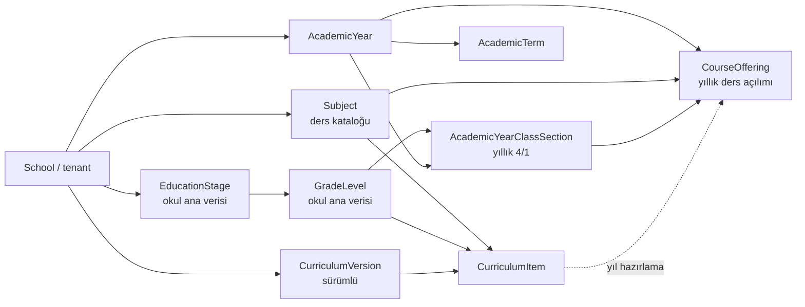
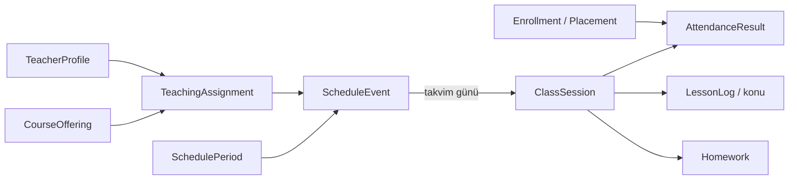
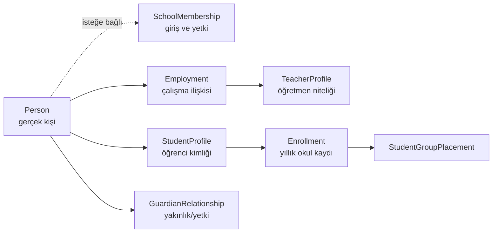

# 01 — Hedef veri mimarisi ve karar defteri

Tarih: 2026-09-30  
Durum: `KARARLAR TAMAMLANDI — AYRINTILI TASARIM 02 BELGESİNE AKTARILDI`  
Kapsam: Arsimio çok kiracılı okul ERP'sinin veri sahipliği, akademik omurgası, yıllık geçişi ve sonraki modüller için sınırlar

> Bu belge henüz migration veya uygulama talimatı değildir. Önce kavramları ve iş kurallarını birlikte kesinleştirmek, ardından onaylanan modele göre güvenli bir geçiş planı çıkarmak için hazırlanmıştır. Bu aşamada Prisma şeması, çalışan ekranlar ve canlı veriler değiştirilmemiştir.

## 1. İncelenen kaynaklar

Bu taslak aşağıdaki kaynakların birlikte değerlendirilmesiyle hazırlandı:

- Mevcut Prisma şeması ve uygulanmış migration'lar
- Akademik yapı okuma/yazma servisleri, Server Action'lar ve okul admin ekranı
- [Mevcut veri modeli](./data-model.md)
- [Mevcut akademik yapı teslimi](./academic-structure.md)
- [Yeni yılda tekrar kullanım incelemesi](./legacy-subject-seed-and-year-reuse.md)
- [Eski HorizonEdu veri akışı raporu](./00-veri-akisi.md)
- Eski sistem için daha önce kaydedilmiş canlı veri bulguları ve kullanıcı açıklamaları

İnceleme salt okunur yapılmıştır. Bu belgenin oluşturulması dışında uygulama koduna veya veritabanına yazma yapılmamıştır.

## 2. Yönetici özeti

Önerilen ana karar şudur:

> **Yıllık kayıtların varlığı doğrudur; her yıl elle tekrar oluşturulmaları yanlıştır.**

Kalıcı okul verileri bir kez tanımlanmalı, değişebilen kurallar sürümlenmeli ve her öğretim yılının operasyonel kayıtları bir hazırlık sihirbazıyla otomatik üretilmelidir.

Bu nedenle veri modeli üç katmana ayrılmalıdır:

1. **Tekrar kullanılan okul ana verisi:** ders kataloğu, kademeler, seviyeler, şube tanımları, bölüm/departmanlar, kişiler, hizmetler ve tedarikçiler.
2. **Sürümlü kurallar ve şablonlar:** müfredat, seviye–ders eşleşmeleri, haftalık ders yükü, zil/ders saati düzeni, ücret tarifeleri ve gerektiğinde şube şablonları.
3. **Öğretim yılına ait gerçekleşen kayıtlar:** öğrenci grupları, yıllık kayıtlar, ders açılımları, öğretmen atamaları, program, ders oturumları, yoklama, notlar ve yılın finans sözleşmeleri.

`Subject` gibi bir ana kaydı her yıl çoğaltmak gereksizdir. Buna karşılık 2026/27 yılı 4/1 Matematik dersi ile 2027/28 yılı 4/1 Matematik dersi aynı operasyonel kayıt olmamalıdır. Öğretmeni, programı, öğrencileri, notları ve gerçekleşen dersleri farklıdır. Bu yıllık kayıt sistem tarafından hazırlanır; okul yönetimi yalnız istisnaları düzenler.

Mevcut şemada tenant, kullanıcı, üyelik, rol, izin, audit, öğretim yılı/dönem ve okul kapsamlı ders kataloğu doğru yöndedir. Temel revizyon; `EducationStage`, `GradeLevel`, `ClassSection` ve `LessonPeriod` kavramlarının yaşam sürelerini yeniden ayırmak ve araya sürümlü müfredat/yıl hazırlama katmanını eklemektir.

## 3. “Global” kelimesinin kesin anlamı

“Global” tek bir kapsam değildir. Karışıklığı önlemek için bu projede aşağıdaki terimler kullanılmalıdır:

| Terim | Anlam | Örnek |
| --- | --- | --- |
| Platform geneli | Bütün okulların ortak sistem kataloğu; okul tarafından doğrudan değiştirilmez | İzin kodları, desteklenen diller, ülke/para birimi kodları |
| Okul geneli / tenant ana verisi | Yalnız o okula ait, yıllar arasında tekrar kullanılan veri | HorizonEdu ders kataloğu, seviye ve şube tanımları |
| Sürümlü okul verisi | Okula ait, belirli tarihten/yıldan itibaren geçerli kural seti | 2026 müfredatı, A zil düzeni, ücret tarifesi |
| Öğretim yılı verisi | Belirli okul ve öğretim yılında gerçekleşen veya kullanılan veri | 2026/27 öğrenci grubu, yıllık kayıt, ders açılımı |
| Dönem/tarih verisi | Belirli dönem, gün veya olayla ilgili işlem | Öğretmen ataması, ders oturumu, yoklama, ödeme |

Kesinleşen karar: **dersler, seviyeler, şubeler ve okulun diğer ana verileri platform genelinde değil okul genelinde olmalıdır.** Bir okulun eklediği veya adını değiştirdiği ders başka tenant'ı etkilememelidir. Platform isterse başlangıç şablonu sunabilir; okul bunu kendi kataloğuna kopyalayıp sahiplenir.

## 4. Kavram sözlüğü

Türkçedeki “sınıf” sözcüğü mevcut modelde birden fazla iş kavramını taşıyor. Yeni şemada bunlar aynı tablo veya kimlik olmamalıdır.

| İş kavramı | Önerilen teknik ad | Yaşam süresi | Açıklama |
| --- | --- | --- | --- |
| Okul / tenant | `School` | Kalıcı | Veri izolasyonunun ana sahibi |
| Eğitim kademesi | `EducationStage` | Okul ana verisi | Anaokulu, ilkokul, ortaokul, lise |
| Sınıf seviyesi | `GradeLevel` | Okul ana verisi | PRF, 1, 2, … 12 |
| Şube tanımı | `ClassSectionDefinition` | Okul ana verisi | Örneğin seviye 4 için `1`, `2`, `A` veya `B`; etiketi okul belirler |
| Yıllık şube/öğrenci grubu | `AcademicYearClassSection` | Öğretim yılı | Örneğin 2026/27 – 4/1; o yıl birlikte yönetilen öğrenci grubu |
| Ders kataloğu kaydı | `Subject` | Okul ana verisi | Matematik, Fizik, MZ Matematik gibi tekrar kullanılan ders kimliği |
| Müfredat sürümü | `CurriculumVersion` | Sürümlü | Bir kurallar bütününün adı ve geçerlilik aralığı |
| Müfredat dersi | `CurriculumItem` | Sürümlü | Seviye + ders + haftalık yük + zorunlu/seçmeli bilgisi |
| Yıllık ders açılımı | `CourseOffering` | Öğretim yılı | Bir öğrenci grubuna o yıl gerçekten açılmış ders |
| Öğretmen görevlendirmesi | `TeachingAssignment` | Dönem/tarih aralığı | Bir öğretmenin belirli ders açılımındaki görevi |
| Ders saati profili | `ScheduleProfileVersion` | Sürümlü | Tam Gün, Sabahçı veya Öğlenci günlük zaman bloklarının sürümü |
| Haftalık program olayı | `ScheduleEvent` | Dönem/tarih aralığı | Gün, saat, oda, öğretmen ve katılan ders açılımları |
| Gerçek ders oturumu | `ClassSession` | Tarihli olay | Programın belirli bir günde gerçekleşen örneği |
| Öğrenci yıllık kaydı | `Enrollment` | Öğretim yılı | Öğrencinin ilgili okul yılındaki kayıt durumu |
| Grup yerleşimi | `StudentGroupPlacement` | Tarih aralığı | Öğrencinin yıl içinde hangi öğrenci grubunda olduğu |

### 4.1 Sınıf seviyesi ile şube neden ayrılmalı?

Bu projede fiziksel oda/bina takibi yapılmayacaktır. “Sınıf”, `1`, `2`, `4` veya `9` gibi eğitim seviyesini; `4/1`, `4/A` gibi ifadeler ise seviye + şubeyi belirtir. Seviye kalıcı kimliğini korur. `1`, `2`, `A`, `B` gibi şube etiketi okul tarafından serbestçe belirlenir.

Şube tanımı yıllar arasında tekrar kullanılır; fakat o şubenin öğrencileri, öğretmenleri, ders açılımları ve programı öğretim yılı bağlamında ayrı tutulur. Böylece okul her yıl `4/A` metnini yeniden yazmaz, ancak 2026/27 ile 2027/28 geçmişi birbirine karışmaz.

## 5. Veri yaşam süresi haritası

| Alan | Platform geneli | Okul ana verisi | Sürümlü şablon | Yıl/dönem | Tarihli işlem |
| --- | :---: | :---: | :---: | :---: | :---: |
| Tenant, domain, marka |  | ✓ |  |  |  |
| Kullanıcı hesabı | ✓ |  |  |  |  |
| Okul üyeliği ve okul rolü |  | ✓ |  |  |  |
| Kademe ve seviye kataloğu |  | ✓ |  |  |  |
| Şube tanımları |  | ✓ |  |  |  |
| Ders kataloğu |  | ✓ |  |  |  |
| Müfredat ve seviye–ders kuralları |  |  | ✓ |  |  |
| Zil/ders saati düzeni |  |  | ✓ |  |  |
| Öğretim yılı ve dönem |  |  |  | ✓ |  |
| Yıllık öğrenci grubu |  |  | şablondan üretilebilir | ✓ |  |
| Öğrenci yıllık kaydı ve grup yerleşimi |  |  |  | ✓ | tarih aralıklı |
| Yıllık ders açılımı |  |  | müfredattan üretilebilir | ✓ |  |
| Öğretmen görevlendirmesi |  |  | önceki yıldan taslak önerilebilir | ✓ | tarih aralıklı |
| Haftalık program |  |  | taslak kopyalanabilir | ✓ | sürüm/tarih aralıklı |
| Ders oturumu, yoklama, konu, ödev |  |  |  |  | ✓ |
| Kişi profili |  | ✓ |  |  | yaşam döngülü |
| Personel/öğretmen çalışma ilişkisi |  | ✓ |  |  | tarih aralıklı |
| Ücret/hizmet kataloğu |  | ✓ |  |  |  |
| Ücret tarifesi |  |  | ✓ | yıl için seçilir |  |
| Öğrenci sözleşmesi, borç ve ödeme |  |  |  | ✓ | ✓ |

Bu tablo “değişmez” anlamına gelmez. Ana veri düzenlenebilir veya arşivlenebilir; ancak geçmiş operasyon kayıtları yeni ada/kurala körlemesine dönüştürülmemelidir. Tarihsel rapor için gerektiğinde kod/ad anlık görüntüsü veya sürüm bağı korunur.

## 6. Hedef akademik omurga

### 6.1 Ana veri, müfredat ve yıllık üretim



### 6.2 Yıllık planın günlük operasyona dönüşmesi



Ortak derslerde tek zaman olayına birden fazla ders açılımı bağlanabilmelidir. Örneğin 4/1 ve 4/2 aynı öğretmenle aynı saatte birlikte ders yapıyorsa iki çakışan program satırı yerine:

- bir `ScheduleEvent`,
- iki `ScheduleEventOffering`,
- her grup için ayrı öğrenci/yoklama/konu/ödev kapsamı

oluşur. Böylece öğretmen aynı anda iki bağımsız yerde görünmez; sınıf bazlı işlemler de kaybolmaz.

### 6.3 `CourseOffering` neden yine yıllık kalmalı?

Kullanıcının eski sistemdeki sınıf–ders ilişkisini tek kimlik üzerinden yönetme fikri korunmalıdır; doğru merkez `CourseOffering` kaydıdır. Fakat bu kimlik yıllar üstü tek satır olmamalıdır.

`CourseOffering` şu bağlamı temsil eder:

```text
okul + öğretim yılı + öğrenci grubu + ders + müfredat kaynağı
```

Alt modüller mümkün olduğunca bu kimliğe bağlanır:

- öğretmen görevlendirmesi,
- haftalık program katılımı,
- gerçek ders oturumları,
- konu/ödev/materyal,
- değerlendirme ve notlar.

Yıllık olmasının yararı, geçmiş yılın öğretmen ve ders kayıtlarını yeni yıl değişikliklerinden korumasıdır. Manuel tekrar yükünü ise müfredat sürümünden otomatik üretim ortadan kaldırır.

### 6.4 Ders–seviye ilişkisi için öneri

Tek tek her şubeye kalıcı ders eşleştirmek yerine ilişki **seviye + ders** düzeyinde kurulmalıdır. Örneğin 4. seviyenin bütün şubeleri Matematik alıyorsa tek `CurriculumItem` yeterlidir. Kullanıcı kararına göre normal, seçmeli ve IGCSE dersleri ilgili seviyenin bütün şubelerine ve öğrencilerine uygulanır; öğrenci bazlı ders katılım tablosu kurulmaz.

Önerilen `CurriculumItem` alanları:

| Alan | Amaç |
| --- | --- |
| `curriculum_version_id` | Hangi sürümlü kural setine ait olduğu |
| `grade_level_id` | Hedef seviye |
| `subject_id` | Ders kataloğu kimliği |
| `requirement_type` | Zorunlu, seçmeli, etkinlik vb. |
| `grading_bucket` | İleride normal/seçmeli/IGCSE ortak not hanesi |
| `archived_at` veya sürüm durumu | Kuralın yaşam döngüsü |

Haftalık hedef ders adedi sistem kuralı olarak tutulmaz. Müfredat değişikliğinde geçmiş sürüm güncellenmez. Yeni sürüm hazırlanır, yeni öğretim yılı ona bağlanır. Yıl içinde zorunlu değişiklik gerekiyorsa etkili başlangıç tarihi ve audit ile ayrı revizyon yapılır.

### 6.5 Ders saatleri için öneri

Mevcut `LessonPeriod` doğrudan öğretim yılına bağlıdır. Saatler aynı kalıyorsa bu yapı her yıl yeniden giriş yaptırır. Bunun yerine:

```text
ScheduleProfile (Tam Gün / Sabahçı / Öğlenci)
  └── ScheduleProfileVersion
        └── SchedulePeriod
```

şeklinde tekrar kullanılabilir bir düzen uygulanır. Yıllık şube uygun profil sürümüne bağlanır. Böylece kullanıcı yalnız kendi grubuna ait saatleri görür; karşı vardiyanın boş saatleri ekranda gösterilmez.

## 7. Yeni öğretim yılı hazırlama akışı

Amaç “geçen yılın bütün verisini kopyalamak” değil, yeni yıl için gereken yapıyı kontrollü ve tekrar çalıştırılabilir biçimde üretmektir.

### 7.1 Önce eski yılı kapatma

1. Okul Admin aktif yılı `CLOSED`/Pasif durumuna getirir.
2. Aktif yıl kapanmadan gelecek yıl oluşturulamaz veya hazırlanamaz.
3. Gerekirse kalıcı şube tanımları, yapı sürümü, seviye–ders planı ve saat profilleri güncellenir.
4. Yeni öğretim yılı ve okulun kendi dönem tarihleri oluşturulur.
5. Yıl aktif edilir; akademik yapı eksikleri aktivasyonu engellemez, kurulum uyarısı olarak gösterilir.

### 7.2 Önizleme

Aktif yıl setup'ı operasyonel kayıt oluşturmadan önce şu kapsamı gösterir:

- açılacak yıllık öğrenci grupları,
- müfredattan üretilecek ders açılımları,
- mevcut planda olup yeni sürümde bulunmayan dersler,
- öğretmensiz kalacak dersler,
- bir üst seviyeye önerilen öğrenciler,
- mezun, ayrılmış veya özel karar gereken öğrenciler,
- seçilen Tam Gün/Sabahçı/Öğlenci profilleri ve varsa çakışmalar.

### 7.3 Uygulama

Tek bir kontrollü işlem aşağıdakileri üretir:

- `AcademicYearClassSection` kayıtları,
- `CourseOffering` kayıtları,
- öğrenci yükseltme için kaynak/hedef listeleri.

Öğretmen görevlendirmesi ve haftalık program üretilmez veya eski yıldan kopyalanmaz.

İşlem **idempotent** olmalıdır: aynı hazırlık tekrar çalıştırılırsa kopya kayıt üretmez. Bir `AcademicYearSetupRun`/işlem kimliği; kaynağı, hedef yılı, seçimleri, sonucu, hataları ve uygulayan kullanıcıyı kaydeder.

### 7.4 Aktivasyon ve kurulum durumu

Yıl, geçerli başlangıç/bitiş ve en az bir dönem tanımından sonra aktif edilebilir. Şube, ders açılımı, öğrenci geçişi, öğretmen veya program eksikleri aktivasyonu engellemez. Bunlar ayrı `setup_status` ve kontrol listesiyle gösterilir. Tenant dışı veya başka yıl kimliğiyle bağ kurulması ise her durumda DB ve servis tarafından reddedilir.

### 7.5 Kapanış ve geçmiş

Bir yıl kapatıldığında:

- o yılın operasyon kayıtları salt okunur hale gelir,
- düzeltmeler normal düzenleme yerine gerekçe ve özel izinle yapılır,
- yeni yıl kayıtları eski satırların `academic_year_id` değerini değiştirerek oluşturulmaz,
- raporlar geçmişteki müfredat, grup, öğretmen ve öğrenci yerleşimini korur.

## 8. Öğrenci ve kişi omurgası için sınırlar

Bu aşamada ayrıntılı kişi şeması uygulanmayacak; fakat akademik modelin yanlış bağımlılık üretmemesi için aşağıdaki sınırlar şimdiden sabitlenmelidir.



Temel kurallar:

- Gerçek kişi, kullanıcı hesabı ve okul üyeliği aynı şey değildir.
- Hesabı olmayan öğrenci, veli veya personel kaydedilebilir.
- Bir kişi aynı okulda birden fazla işleve sahip olabilir; örneğin hem çalışan hem veli.
- Öğretmen, sabit bir “ders/sınıf alanı” değil kişi + çalışma ilişkisi + öğretmen niteliğidir.
- Öğretmenin belirli yıl/ders görevi `TeachingAssignment` ile tutulur.
- Öğrencinin kalıcı profili ile yıllık kaydı ve yıl içindeki grup yerleşimi ayrıdır.
- Transfer, sınıf değişikliği, mezuniyet ve ayrılma geçmiş satırın üzerine yazılmaz; tarihli yaşam döngüsü olayıdır.

## 9. Finans omurgası için sınırlar

Eski sistemde öğrenci borcu/tahsilatı, genel gelir-gider, tedarikçi ve bütçe kavramları dağınıktır. Yeni sistemde en az iki iş alanı ayrılmalıdır.

### 9.1 Öğrenci alacakları

```text
ServiceCatalog
  → FeeTariffVersion
  → StudentContract
  → ContractLine / Charge
  → Installment
  → Payment
  → PaymentAllocation
```

- Hizmet kataloğu okul ana verisidir.
- Fiyat/tarife sürümlüdür; geçmiş sözleşmeyi yeni fiyatla değiştirmez.
- Sözleşme bir öğrenci ve öğretim yılı bağlamındadır.
- Borç, taksit, ödeme ve ödemenin hangi borca dağıtıldığı ayrı kayıtlardır.
- İndirim, iade, iptal ve düzeltme ayrı ve denetlenebilir olaylardır.
- Parasal değerler `Decimal` veya minor unit ile para birimi eşliğinde tutulur; `Float` kullanılmaz.

### 9.2 Okul giderleri ve tedarikçiler

```text
Organization / Vendor
  → ExpenseDocument
  → ExpenseLine
  → Approval / Payment
  → BudgetComparison
```

Gerçek kişiler ile şirket/tedarikçi tek “cari” tablosunda türü belirsiz kayıtlar olarak karıştırılmamalıdır. Öğrenci alacak sistemi ile okul gider sistemi rapor düzeyinde birleşebilir; aynı hareket tablosuna zorla sıkıştırılmamalıdır.

Tam çift taraflı muhasebe defteri gerekiyorsa hesap planı, yevmiye ve dönem kapatma ayrı bir uzmanlık fazı olur. İlk öğrenci tahsilat modülüne yalnız adı “borç/alacak” olan iki kolon eklemek muhasebe sistemi oluşturmaz.

## 10. Tenant ve veri bütünlüğü kuralları

Mevcut uygulamadaki iyi güvenlik yönü korunmalı ve bütün yeni tablolara uygulanmalıdır:

1. Okula ait her iş kaydında `school_id` bulunur.
2. `school_id` formdan güvenilir veri olarak alınmaz; doğrulanmış hostname/session bağlamından gelir.
3. Tenant içi ilişkiler mümkün olduğunda `(id, school_id)` veya gerekli durumda `(id, school_id, academic_year_id)` bileşik foreign key ile korunur.
4. Yıllık kayıtta `academic_year_id` yalnız aynı okula ait yıla bağlanabilir.
5. Arayüzde saklamak yetki kontrolü değildir; her okuma ve yazma sunucuda izin ister.
6. Kritik yazmalar audit olayını aynı transaction içinde üretir.
7. Normal iş kayıtları fiziksel silinmez; yaşam döngüsü durumu, arşivleme veya ters işlem kullanılır.
8. Kapalı öğretim yılı kayıtları varsayılan olarak değiştirilemez.
9. Toplu yıl hazırlama ve finans işlemleri tekrar çalıştırmaya karşı idempotent olmalıdır.
10. Uygulama doğrulamasına ek olarak benzersizlik, tarih aralığı, tenant ve kritik çakışma kuralları DB constraint/trigger ile korunur.

Mevcut migration dokümanında PostgreSQL RLS'nin henüz tamamlanmadığı belirtiliyor. RLS, uygulama düzeyi tenant kontrollerinin yerine değil ikinci savunma katmanı olarak ayrıca planlanmalıdır.

## 11. Mevcut Arsimio şemasıyla fark analizi

### 11.1 Korunması gereken mevcut yapı

| Mevcut alan | Değerlendirme |
| --- | --- |
| `School`, `SchoolDomain`, `SchoolBranding` | Tenant ve alan adı temeli doğru yönde |
| `User`, `SchoolMembership`, rol/izin tabloları | Küresel hesap ile okul üyeliğini ayırması doğru |
| `AuthSession`, `UserCredential`, throttle | Kimlik doğrulama sınırı ayrı tutulmuş |
| `AuditEvent` | Yeni modüllerde aynı-transaction audit yaklaşımı sürdürülmeli |
| `AcademicYear`, `AcademicTerm` | Yıllık operasyonun doğru omurgası |
| `Subject`, `SubjectTranslation` | Zaten okul genelinde ve yıllar arasında tekrar kullanılıyor |
| Bileşik tenant/yıl foreign key'leri | Veri sızıntısı ve yanlış bağları DB düzeyinde azaltıyor |
| Serializable transaction ve optimistic revision | Yönetim yazmalarında korunmalı |

### 11.2 Yeniden ele alınması gereken yapı

| Mevcut model | Bugünkü davranış | Hedef yön |
| --- | --- | --- |
| `EducationStage` | `academicYearId` zorunlu; her yıl yeniden giriş | Okul ana verisi veya müfredat şablonuyla etkinleştirilen kalıcı tanım |
| `GradeLevel` | `academicYearId` zorunlu; her yıl yeniden giriş | Okul ana verisi; yıllık kullanım müfredat/yıl planıyla belirlenir |
| `ClassSection` | Yıllık `4/1` kaydı | Kalıcı `ClassSectionDefinition` + sistemin ürettiği `AcademicYearClassSection` |
| `CourseOffering` | Doğru biçimde yıllık, ancak tek tek elle oluşturuluyor | Yıllık kalır; müfredat sürümünden toplu ve idempotent üretilir |
| `LessonPeriod` | Her öğretim yılı için tekrar giriş | Sürümlü `ScheduleProfile` + yıllık şube ataması |
| Akademik yapı ekranı | Tek seçili yıl içinde beş kavramı birlikte yönetiyor | Ana veri, müfredat ve yıllık hazırlama ayrı görev ekranlarına bölünür |

### 11.3 Sorunun kodda yerleştiği noktalar

Bu yalnızca arayüz problemi değildir:

- Prisma şemasındaki bileşik foreign key ve unique constraint'ler kademe, seviye, şube ve ders saatini öğretim yılına bağlar.
- Okuma servisi bu tabloları `schoolId + academicYearId` ile filtreler.
- Form doğrulama tipleri ilgili kayıtlar için `academicYearId` zorunlu tutar.
- Yazma servisi üst kayıtları aynı okul ve aynı yılda arar.
- Akademik yapı sayfası önce yıl seçer ve bütün yönetimi o yıl bağlamında açar.

Dolayısıyla yalnız ekrana “önceki yıldan kopyala” düğmesi eklemek geçici rahatlama sağlar; kavram ayrımını çözmez. Buna karşılık var olan bütün modelleri silip baştan kurmak da gereksiz ve risklidir. Geçiş eklemeli ve veri koruyan migration'larla yapılmalıdır.

## 12. Önerilen güvenli geçiş stratejisi

Kullanıcı kararlarından sonra ayrıntılandırılacak önerilen sıra:

1. **Kararları dondur:** Bu belgedeki temel kavramlar ve sorular onaylanana kadar yeni akademik tablo eklememek.
2. **Canlı envanter al:** İki pilot tenant için kademe, seviye, şube, ders, plan ve saatlerin sayısını/ilişkilerini salt okunur doğrulamak.
3. **Eklemeli migration:** Önce `rooms`, müfredat sürümleri, şablonlar ve yıl hazırlama tablolarını eklemek; mevcut kolonları hemen silmemek.
4. **Backfill önizlemesi:** Mevcut 2026/27 kayıtlarından hangi kalıcı ve sürümlü kayıtların üretileceğini raporlamak; çakışmaları kullanıcıya göstermek.
5. **Kontrollü backfill:** Her okul için ayrı transaction ve audit/import kaydıyla yeni kimlikleri üretmek.
6. **Servis geçişi:** Okuma/yazmaları yeni modele geçirmek; UI'da ana veri, müfredat ve yıllık hazırlamayı ayırmak.
7. **İki tenant doğrulaması:** Aynı işlemleri HorizonEdu ve ikinci deneme okulunda tenant izolasyonu, tekrar çalıştırma ve yıl geçişiyle test etmek.
8. **Eski bağı kaldır:** Ancak yeni akış canlı veride doğrulandıktan sonra eski `academic_year_id` bağı veya artık kullanılmayan tablolar için ayrı cleanup migration hazırlamak.

Production/pilot verisi bulunduğu için tek migration içinde tabloyu silme, ID'leri değiştirme veya mevcut ilişkileri körlemesine yeniden yazma önerilmez.

## 13. Önerilen çalışma sırası

Her başlıkta aynı döngü uygulanır: mevcut kanıt → kavram/ER taslağı → kullanıcı kararı → Prisma/migration → servis/UI → test ve belge.

| Sıra | Çalışma paketi | Çıkış ölçütü |
| ---: | --- | --- |
| 1 | Bu belge: kavramlar, kapsamlar ve kararlar | Kullanıcı temel soruları belge içinde yanıtladı |
| 2 | Akademik ana veri + müfredat sürümü | Oda, kademe, seviye, ders ve müfredat sınırları onaylı |
| 3 | Yıllık öğrenci grubu + ders açılımı + yıl hazırlama | Yeni yıl tekrar çalıştırılabilir önizlemeyle hazırlanıyor |
| 4 | Kişi, personel, öğretmen, öğrenci ve veli omurgası | Profil, hesap, çalışma ilişkisi ve yıllık kayıt ayrılmış |
| 5 | Öğrenci yükseltme/ayrılma/mezuniyet | Geçmişi koruyan toplu yıl geçişi çalışıyor |
| 6 | Öğretmen ataması, zil düzeni ve haftalık program | Ortak ders ve çakışma kuralları doğrulanmış |
| 7 | Tarihli ders oturumu ve yoklama | Programdan günlük oturum ve saat bazlı sonuç üretiliyor |
| 8 | Konu, ödev, materyal, sınav ve not | Hepsi doğru ders açılımı/oturum/öğrenci bağlamında |
| 9 | Öğrenci finansı | Sözleşme–borç–taksit–ödeme–dağıtım ayrımı tamam |
| 10 | Gider, tedarikçi, bütçe ve gerekirse muhasebe | Kapsama göre ayrı finans alt sistemi |
| 11 | Eski veri aktarımı ve mutabakat | Sayım, toplam ve örnek kayıtlar iki sistemde doğrulanmış |

## 14. Yanıtlanan temel kararlar

Aşağıdaki sorular bir sonraki teknik tasarımın girdisidir. Lütfen `Yanıt:` satırlarına kendi kararınızı ve gerekiyorsa örnek veriyi yazın. Öneriye katılıyorsanız yalnız “Onay” yazmanız yeterlidir.

### K01 — Tenant sınırı

**Öneri:** Ders, oda, kademe, seviye ve müfredat her okulun kendi verisi olsun. Platform yalnız başlangıç şablonu sunsun; bir okulun değişikliği diğerini etkilemesin.
Cevap = Bu kesinlikle korumamız gereken bir yapıdır. 

**Soru:** İki deneme okulunun ders/seviye kayıtları tamamen bağımsız mı kalmalı, yoksa Süper Admin'in yönettiği ortak katalogdan canlı biçimde paylaşılması gereken kayıtlar var mı?

**Yanıt:**
Burada her okulun farklı bir yapısı olmalı. Süper Admin sadece Yeni okul açma , Okulun index sayfası ve içerikteki Logo , görseller , domain , okulun platforn ödeme takipleri gibi işlemleri yapacak. Okul admini her okul için kendi okul yönetimi tarafından düzenlenecek. 

### K02 — Kampüs ve bina

**Öneri:** Gelecekte veri taşıması zor olmaması için `Campus`/yerleşke kavramını şimdi modelleyelim; tek kampüslü okulda varsayılan tek kayıt otomatik oluşsun. Oda kampüse bağlansın.

**Soru:** Bir okulun bugün veya yakın gelecekte birden fazla bina/kampüsü olabilir mi? “A-101” gibi oda kodları okul genelinde mi, kampüs içinde mi benzersiz olmalıdır?

**Yanıt:**
Bina ile örneğimi yanlış yorumladın. Bina - Sınfın konumu gibi bir bilgiye ihtiyaç yok.  Türkçe de dediğin gibi Sınıf tan kastım 1.nci Sınıf 2nci Sınıf gibi okul seviyesi. 

### K03 — Fiziksel sınıf/oda davranışı

**Öneri:** Fiziksel oda okul genelinde kalıcı olsun; program olayı odayı kullansın. Yıllık öğrenci grubuna isteğe bağlı “ana oda” atanabilsin.

**Soru:** Aynı fiziksel oda gün içinde farklı öğrenci grupları/dersler tarafından kullanılabilir mi? Bir grubun sabit ana sınıfı olsa bile laboratuvar veya başka odalara geçmesi normal midir?

**Yanıt:**
 Fiziksel oda takibi projede olmayacak. Kesin. 
### K04 — `4/1` ifadesinin gerçek anlamı

**Öneri:** `4/1` fiziksel oda değil, 4. seviyedeki 1 numaralı yıllık öğrenci grubu/şubesi olsun. Oda ayrı alandan seçilsin.

**Soru:** Mevcut okul dilinde `4/1` tam olarak öğrencilerin grubu mu, kapısında 4/1 yazan fiziksel derslik mi, yoksa pratikte ikisi birlikte mi kullanılıyor? Aynı grup oda değiştirirse adı yine 4/1 olarak kalır mı?

**Yanıt:**
4/1 açılımı bu okulda. Öğrenci öğretim seviyesi 4 - 1 ise şube ismini belirtiyor.  4/2 dördüncü sınıf 2nci şubeyi temsil ediyor. Bazı okullar ise bunları  4 / A - 4/B gibi yönetiyor.  Rakam eğitim seviyesi - A,B ise şubeyi tanımlıyor. O yüzden burda ID ve ekrandaki LABEL içeriği serbets olmalı okullara göre tanımlamalarda farklılıklar oluyor.  


### K05 — Kademe ve seviyelerin ömrü

**Öneri:** Anaokulu/ilkokul/ortaokul/lise ve PRF/1–12 okul ana verisi olarak bir kez tanımlansın. Bir müfredat sürümü hangi seviyelerin o yapıda kullanıldığını belirlesin.

**Soru:** Aynı okulda seviye kodlarının anlamı yıllara göre değişir mi? Örneğin `9` bir yıl ortaokul, başka yıl lise olabilir mi; olursa geçmişi korumak için yeni müfredat sürümü yeterli midir?

**Yanıt:**
Ülkedeki eğitim sistemi şuanda  5 Yıl İlkokul , 4 Yıl ortaokul ve 3 yıl Lise olarak geçiyor. Fakat gelecek yıl bunu 4+4+4'e çevirebiliyor.
Fakat bu öğretim yılı başlamadan karar verilmiş oluyor ve yeni yıla girerken okul Admin'i yeni tanımlamalar yaparak eski kayıtları bozmamak adına eski tanımlanan 9'uncu Sınıf ortaokul detayını 9'uncu sınıf Lise'ye çevirmek yerine eski kayfı passive yapıp yeni kayıt ile sistemi günceller . Yeni okul dönemleri de yeni active olan ID ile devam eder. 

### K06 — Şube kalıbı ve yıllık grup

**Öneri:** Tekrar kullanılan `4/1`, `4/2` kalıpları bir kez tanımlansın; her yıl gerçek `StudentGroup` kayıtları bu kalıplardan otomatik oluşturulsun. Yıl içinde yeni grup eklenebilsin veya bir kalıp o yıl kullanılmasın.

**Soru:** Şube numaraları çoğunlukla her yıl aynı mı kalır? Yeni yılda geçen yılın gruplarını varsayılan getirmek mi, yoksa okulun sabit şube kalıplarını kullanmak mı sizin gerçek çalışma şeklinize daha uygundur?

**Yanıt:**
Okul 1nci sınıf 3 şube 2ni sınıf 4 şube ve 3üncü sınıf 1 şube olabilir. Ertesi yık 3ncü sınıf'ı 4 şubeye çıkartmak gerekir. O yüzden Okul mevcut sınıf - şubelerini tanımlar . yıl bitine yeni yılda ihtiyaç olan şube eklemesini yapabilir yada kullanılmayan şubeyi passive çevirerek yeni okul döneminde active tutmaz. Her okul mevcut yapısına göre ekleme - passive yapabilmelidir. 
### K07 — Müfredatın kapsamı ve sürümü

**Öneri:** Ders–seviye ilişkisi sürümlü müfredatta tutulsun; bir sürüm birden fazla öğretim yılında kullanılabilsin. Değişiklikte eski sürüm düzenlenmesin, yenisi oluşturulsun.

**Soru:** Okulda bütün seviyeler için tek müfredat sürümü mü olur, yoksa kademe/program bazında (ör. ulusal, IGCSE, farklı lise programı) aynı yıl birden fazla müfredat birlikte kullanılabilir mi?

**Yanıt:**
Evet kullanılabiliyor. Yıl içerisinde de yeni ders eklenebiliyor. O yüzden tüm okulun verdiği dersleri ben globalde tanımlıyordum ve hangi sınıf için yeni bir ders eklenirse . Yeni tanımladığım ders hangi sınıf içinde onunla eşleştiriyordum. 

### K08 — Ders eşlemesinin seviyesi

**Öneri:** Varsayılan dersler seviye düzeyinde tanımlansın; bütün 4. sınıf şubelerine otomatik uygulansın. Şube/grup farkları override ile yönetilsin. Seçmeli derslerde öğrenci katılımı ayrıca tutulabilsin.

**Soru:** Aynı seviyedeki 4/1 ve 4/2 genellikle aynı dersleri mi işler? Bir şubeye özel ders ne kadar sık görülür? Seçmeli/IGCSE dersi bütün gruba mı, seçili öğrencilere mi atanır?

**Yanıt:**
Her seviye için dersler değişiklik gösterir fakat Şubeler arası ders farkları yoktur. 


### K09 — Haftalık ders yükü

**Öneri:** Müfredat öğesinde haftalık hedef ders saati tutulabilsin; program bu hedefe göre eksik/fazla uyarısı versin, ancak özel yetkiyle istisnaya izin verilsin.

**Soru:** Örneğin “4. seviye Matematik haftada 5 ders” gibi bağlayıcı bir sayı var mı? Bu sayı dönemlere veya şubelere göre değişebilir mi?

**Yanıt:**
Yok. Okul yönetimi ders programını mevcut Milli eğitim bakanlığının verdiği saatlere göre öğretmenlerle birlikte oluşturuyorlar. Bu veride bizim için kontrol edeceğimiz ve sınırlayacağımız bir yapı yok. Ben projede haflatık programı oluştururken Sınıflara göre oluşturdum. 
Sınıfı Seçiyorum UI'de Sonra dersleri seç dediğimde seçtiğim sınıfa ait olan ders ve o derse girecek öğretmenler listeye geliyor. 
1- Ders / Öğretmeni seç 
2- Günü seç 
3- Saati seç  
Kaydı oluştur CTA kullanıyorum ve Örneğin  4-1 Sınıfı Pazartesi Sabah Ders1 de Matematik - Öğretmen Kozeta Comani gibi direkt olarak kayıt oluşturuyordum. Sonra öğretmen kendi sayfasına bakınca Pazartesi Ders 1  için 4ncü sınıfta olduğunu görüyor . 4üncü sınıf öğrenci yada Veli sisteme girdiğinde Pazartesi birinci dersin Matematik olduğunu görüyor. 

### K10 — Zil/ders saati düzeni

**Öneri:** Bir okulda birden fazla sürümlü zil düzeni desteklensin; kademe, gün veya tarih aralığına atanabilsin. Yeni yıl önceki geçerli düzeni varsayılan alsın.

**Soru:** Bütün okul aynı ders başlangıç/bitiş saatlerini mi kullanır? İlkokul/lise, farklı günler veya yıl içindeki özel dönemler için ayrı saat düzeni gerekir mi?

**Yanıt:**
Bu tüm okullarda farklılık gösterebilir. Bazı okullar tam gün eğitim verirken bazı okullarda ise Sabahçı (Yani 08:00 il 12:30) Öğlenci : 13:00 ila 17:00 saatleri arasında olabilir . Yada Tam gün eğitim de  08:30 ila 15:30 arası olabilir. Orada okul Tam gün - Yarım gün olarak 2'ye ayırabilmeli...  Tam gün düzenlemek kolay olacaktır . Fakat yarım gün eğitimlerde Sabahçı ve Öğlenci olan gruplamayı yapmalıyız. 


### K11 — Yeni yıla öğretmen ve program taşıma

**Öneri:** Öğretmen atamaları ve haftalık program kendiliğinden kesinleşmesin. Kullanıcı isterse önceki yıldan **taslak öneri** oluşturulsun; çakışma/ayrılan personel kontrolünden sonra yayınlansın.

**Soru:** Yeni yıl hazırlığında öğretmen atamalarını ve programı hiç taşımamak mı, seçerek taslak kopyalamak mı istersiniz? Hangi kayıtlar kesinlikle otomatik gelmemelidir?

**Yanıt:**
Otomatiğe ihtiyaç yok. Çünkü çok fazla değişiklik oluyor. Eski kayıtlardan edit yapana kadar yeniden oluşturmak daha kolay. bu aşamada UI üzerinde biraz daha Kullanıcının tanımlama şekline konsantre oluruz.  Select , Drag Drop ve benzeri tekniklerle karar veririz. 

### K12 — Öğrenci yükseltme ve grup eşlemesi

**Öneri:** Sistem `4/1 → 5/1` gibi bir sonraki grup önerisi üretir; admin istisnaları çıkarır, sınıf tekrarı/transfer/mezuniyet kararlarını görür ve toplu onaylar. Eski enrollment değişmez.

**Soru:** Öğrenciler normalde aynı şube numarasıyla mı yükselir? Şubeler yeni yılda karıştırılıyor/birleştiriliyor mu? PRF, 12. sınıf ve sınıf tekrarı için özel kurallar nelerdir?

**Yanıt:**
Burada  AnaOkulu için direkt olarak birinci sınıfa yükseltme olmamalı. Birinci Sınıflar için manuel ekleme olmalı. 
1 den 2nci sınıfa ve diğerlerinin hepsini bir üst sınıfa otomatik yada sınıf sınıf toplu olarak taşıyabilmek çok işimizi kolaylaştırır. 
Yani 4/1 sınıfı öğrencilerini listeleyip  Checkbox ile tümünü seçip yeni yılda 5/1 e yükselt cta ile halledebiliriz. Bu kadar otomatiklik yeter. 
12 nci sınıfta da öğrencileri seç ve mezun et gibi.  Sınıfta kalma pek olan bir durum değil. Olursa Admin onu manuel olarak sınıfını değiştirebilir. 


### K13 — Kapalı yıl düzeltmesi

**Öneri:** Kapalı yıl normal ekranlardan salt okunur olsun. Yetkili düzeltme gerekiyorsa sebep, eski/yeni değer ve yapan kişi kaydedilsin; tüm yılı yeniden açmak yerine kontrollü düzeltme kullanılsın.

**Soru:** Geçmiş yılda not, yoklama veya finans düzeltmesini kim yapabilmeli? Yılın tamamını yeniden açma ihtiyacı var mı, yoksa kayıt bazlı özel düzeltme yeterli mi?

**Yanıt:**
Geçmiş Yılla ilgili kayıtlarda düzenleme , değiştirme , görme sadece Okul Admin sayfalarında olabilir. Geçen yıldan taksidi ödememiş veli olabilir... 

Öğrenci ve Veliler geçmiş yılların Not ve benzeri için Arşiv diye bir ayrı sayfa düzenleriz UI üzerinde oradan geçen yılki notlara yorumlara göz atabilir gibi bir özellik işe yarar.  Ben fazla kalabalık ve Velileri yoran yüzlerce detay istemiyorum. Eski kayıtlar için Ayrı Arşiv sayfasında bir UI düzeni kurarız. 


### K14 — Yıl aktivasyon eşiği

**Öneri:** Dönem, grup, müfredat ve ders açılımları zorunlu; öğretmen/program eksikleri güçlü uyarı olsun ama okul isterse yetkiyle yılı aktif edebilsin.

**Soru:** Bir öğretim yılı hangi minimum kayıtlar tamamlanmadan aktif edilememelidir? Öğretmeni atanmamış veya programı yapılmamış ders, aktivasyonu engellemeli mi?

**Yanıt:**
Ben önce yeni açılan yılı active edioyrum ve sonra tüm yeni girişleri oluştururken active yılı seçecerek yapıyordum. 
Sadece okulda son yıl aktif oluyor ... Yani 2026 / 2027 öğretim yılı kaydı var. Active duruyor. Fakat şuan veritabanında 2027 / 2028 kaydı hiç yok. 
Önce öğretim yılını oluşturup Active ediyor ve sonra ders - sınıf - öğretmen - öğrenci işlemlerini yaparken o yıla göre yapıyorum. 
Yani otomatik olarak gelecek yıllar sistemde yok.   Temmuz ayında okul kapanınca bir tuş ile geçen yılı Passive yapıyorum. Sonrada yeni kayıt ile yeni okul yılı dönemini oluşturuyorum. 


## 15. Sonraki fazlarda yanıtlanacak kararlar

Bu sorular akademik omurganın ilk migration'ını engellemez; ilgili modüle başlamadan önce ayrı belgede ayrıntılandırılacaktır.

### Kişiler

- Aynı gerçek kişi aynı okulda hem personel hem veli olduğunda tek kişi kaydı mı kullanılacak?
- Kimlik eşlemede ulusal kimlik numarası kullanılacak mı; hangi ülkelerde hangi belge türleri vardır?
- Bordrolu çalışan, sözleşmeli öğretmen, misafir/eğitmen ve stajyer çalışma ilişkileri nelerdir?
- Öğrenci/veli/çalışan hesabı hangi aşamada ve kim tarafından açılır?
- Hassas sağlık, banka, kimlik ve özlük verilerini hangi roller görebilir?

### Finans

- İlk finans sürümü yalnız öğrenci ücret/tahsilatını mı, yoksa gider ve tam muhasebeyi de mi kapsamalıdır?
- Sözleşme öğrenci başına mı, aile/kardeş grubu başına mı yapılır?
- Bir ödeme birden fazla öğrencinin veya taksidin borcuna dağıtılabilir mi?
- Birden fazla para birimi kullanılır mı; kur farkı gerekir mi?
- Fatura/makbuz numarası okul içinde mi, şirket/tüzel kişi içinde mi üretilir?
- İndirim, burs, personel indirimi, erken ödeme ve iade kuralları nelerdir?

## 16. Kararlardan sonra hazırlanan somut çıktı

K01–K14 ve E01–E04 yanıtları ayrıntılı teknik tasarıma işlendi. Alanlar, anahtarlar, kısıtlar, mevcut→hedef eşlemesi, migration/backfill sırası, geri dönüş yaklaşımı ve kabul kriterleri için [02 — Akademik hedef ER modeli ve güvenli geçiş planı](./02-akademik-hedef-er-ve-gecis-plani.md) hazırlanmıştır.

## 17. Yanıtların değerlendirilmesi — 2026-09-30

K01–K14 yanıtları yeniden okundu. Aşağıdaki kararlar artık tasarım girdisi olarak kabul edilmiştir:

| Konu | Alınan karar | Mimari etkisi |
| --- | --- | --- |
| Tenant sınırı | Her okul kendi akademik ana verisini yönetir; Süper Admin akademik kataloğu yönetmez | Ders, seviye, şube ve program tanımları `school_id` kapsamında kalır |
| Fiziksel mekân | Bina, kampüs ve fiziksel oda takibi olmayacak | `Campus`, `Building`, `Room`, `home_room_id` ve oda çakışma kuralları hedef modelden çıkarılır |
| Sınıf anlamı | “Sınıf” eğitim seviyesidir; `4/1`, `4/A` gibi değerler seviye + şubedir | `GradeLevel` ve şube tanımı ayrı fakat ilişkili tutulur; görünen şube etiketi serbest metin olabilir |
| Yapı değişikliği | Ülke sistemi değiştiğinde eski tarihçe bozulmaz; yeni yapı yeni yılda geçerli olur | Kademe–seviye sınıflaması sürümlü olmalıdır |
| Şubeler | Okul şube tanımlarını bir kez yönetir; ekler veya pasife alır | Tekrar kullanılan şube tanımı + sistemin ürettiği yıllık grup bağlamı gerekir |
| Ders kataloğu | Okulun bütün dersleri okul kapsamında bir kez tanımlanır; yıl içinde yeni ders eklenebilir | `Subject` yıllık değildir; arşiv/pasif yaşam döngüsü kullanır |
| Seviye–ders planı | Dersler seviyeye göre değişir, aynı seviyenin şubeleri arasında normalde fark yoktur | Varsayılan ilişki `seviye + ders`; şube bazlı tekrar giriş yapılmaz |
| Haftalık ders adedi | Sistem tarafından bağlayıcı limit veya doğrulama istenmiyor | Haftalık adet zorunlu müfredat kuralı olmaz; program gerçek satırlardan oluşur |
| Program oluşturma | Seviye/şube seçilir; uygun ders ve öğretmen seçilip gün + saat ile program satırı oluşturulur | Program UI'si bu seçim sırasını hızlandırmalı; öğretmen ve grup çakışmaları yine kontrol edilir |
| Zil düzeni | Okul tam gün veya sabahçı/öğlenci yarım gün çalışabilir | Okul kapsamlı tekrar kullanılabilir çalışma düzeni/vardiya ve saat blokları gerekir |
| Yeni yıla atama/program | Öğretmen ataması ve haftalık program eski yıldan kopyalanmayacak | Her yıl hızlı seçim/drag-drop odaklı manuel planlama yapılır |
| Öğrenci geçişi | Anaokulundan 1'e otomatik geçiş yok; 1–11 sınıf bazlı checkbox ile üst seviyeye; 12 mezun edilir | Önizlemeli fakat sade toplu geçiş komutları gerekir; istisnalar manuel yönetilir |
| Geçmiş yıl erişimi | Akademik değişiklik yetkisi Okul Admin'de; öğrenci/veli sade ve salt-okunur Arşiv ekranından geçmişi görür | Yetki ve UI görünümü ayrılır; eski borca ödeme akademik yıl kapanışından bağımsız devam eder |
| Aktif yıl | Okulda tek aktif yıl bulunur; admin yılı oluşturup etkinleştirdikten sonra kayıtları girer | Aktivasyon için akademik yapının eksiksiz olması zorunlu değildir; kurulum eksikleri uyarı olarak gösterilir |

### 17.1 İlk taslaktan çıkarılan kavramlar

İlk taslaktaki fiziksel mekân yorumu kullanıcı açıklamasıyla geçersiz olmuştur. Ayrıntılı ER modelinde aşağıdaki kavramlar bulunmayacaktır:

- `Campus`
- `Building`
- `Room`
- `StudentGroup.home_room_id`
- fiziksel oda kullanım/çakışma kontrolleri

Kavram sözlüğü, veri yaşam süresi tablosu ve diyagramlar bu karara göre temizlenmiştir.

## 18. Tamamlanan dört ek karar

Durum: `TAMAMLANDI` — Yanıtlar ayrıntılı ER modeli ve migration planına girdi olmuştur.

### E01 — Seviye kimliği mi, kademe bağlantısı mı sürümlenecek?

Örnek: Bugün `9. sınıf` ortaokula, gelecek yıl liseye bağlanıyor.

**Öneri:** `9. sınıf` tek ve kalıcı `GradeLevel` kimliği olarak kalsın. “Bu müfredat sürümünde 9 hangi kademededir?” bağlantısı sürümlensin. Admin yeni yapı oluşturduğunda eski bağlantı geçmişte kalır ve yeni bağlantı aktif olur. Böylece `9/A` şube tanımı ve seviye–ders bağları gereksiz yere yeni ID'lere taşınmaz.

**Alternatif:** Eski `9. sınıf` kaydını pasife alıp yeni UUID ile ikinci bir `9. sınıf` oluşturmak. Bu yöntem şube ve ders şablonlarının yeni seviye kimliğine ayrıca bağlanmasını gerektirir.

**Soru:** Ekranda eski sınıflandırmayı pasif/yeni sınıflandırmayı aktif görmeniz yeterliyse, teknik olarak seviye ID'sini koruyup yalnız kademe bağlantısını sürümlememizi onaylıyor musunuz?

**Yanıt:**
Evet Onaylıyorum. 

### E02 — Aynı seviyede birden fazla programın katılımcısı

**Öneri:** Normal ders planı seviye düzeyinde bütün şubelere uygulansın. Farklı program/seçmeli/IGCSE için gerekirse açık bir öğrenci katılım listesi tutulabilsin.

**Soru:** Aynı öğretim yılında aynı seviyedeki öğrencilerin bir kısmı normal program, bir kısmı IGCSE veya farklı seçmeli program alabilir mi? Bu ayrım bütün şube bazında mı olur, yoksa aynı şubenin içinden öğrenci öğrenci seçim yapılır mı?

**Yanıt:**
Öğrenci öğrenci seçim yok. normal dersler ve seçmeli derslerin tümü tüm sınıf için uygulanır. 4üncü sınıf öğrencilerinin tümü atanan ders programın tüm öğrencilere uygulanır. 

### E03 — Sabahçı/öğlenci atamasının kapsamı

**Öneri:** Okul `Tam Gün`, `Sabahçı`, `Öğlenci` gibi kendi çalışma düzenlerini ve bunlara ait ders saatlerini tanımlasın. Her aktif seviye/şube bir çalışma düzenine bağlansın; gerekirse bu bağ dönem/tarih aralığıyla değiştirilebilsin.

**Soru:** Sabahçı/öğlenci seçimi genellikle şube bazında mı yapılır (`4/A sabahçı`, `4/B öğlenci`), seviye bazında mı yapılır (`1–4 sabahçı`), yoksa okulun tamamı aynı düzende mi olur? Aynı grup yıl içinde vardiya değiştirebilir mi?

**Yanıt:**

Burada ki önemli olan husus öğrenci - öğretmen veli okul saatlerine baktığında eğerki sabah dersleri varsa sadece Öğlen saatlerini boş olarak ekranda görmesin. Bence okul saatlerini belirlerken bir ayrım kademesi olarak 
Tam gün
Sabahçı 
Öğlenci kavramı olmalı. 

### E04 — Gelecek yılı taslak hazırlama

Mevcut işleyişte eski yıl temmuzda pasif yapılmakta, yeni yıl oluşturulup aktif edilmekte ve kurulum bundan sonra yapılmaktadır.

**Öneri:** Bu hızlı akış korunurken isterse okul admini mevcut yıl aktif durumdayken gelecek yılı `DRAFT` olarak oluşturup sınıf/şube ve öğrenci geçiş hazırlığını yapabilsin. Yine yalnız bir yıl `ACTIVE` olur. Yeni yılın eksik yapıyla aktif edilmesi engellenmez; eksikler kurulum uyarısı olarak gösterilir.

**Soru:** Gelecek yılı mevcut yıl kapanmadan taslak hazırlayabilmek ister misiniz, yoksa yeni yıl üzerinde hiçbir çalışma yapılmadan önce eski yılın pasife alınması zorunlu mu olsun?

**Yanıt:**
Passive alınması zorunlu olsun lütfen. Karışıklık olmadan bir önceki yılı kapatmış ve yeni yılı açmış olsun. Bir her okul da Okula başlama tarihi Birinci Semester ve 2nci Semester başlama bitiş tarihleri farklılık gösterebilir. O yüzden her okul kendi tanımlamalı .. 
