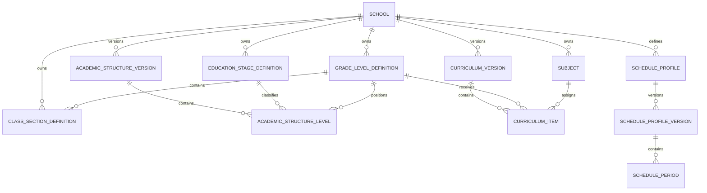
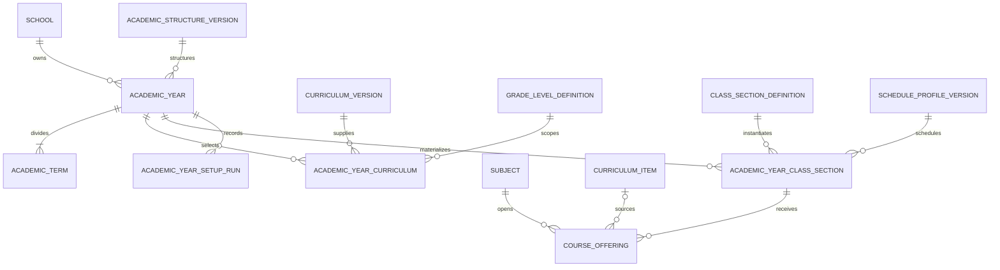
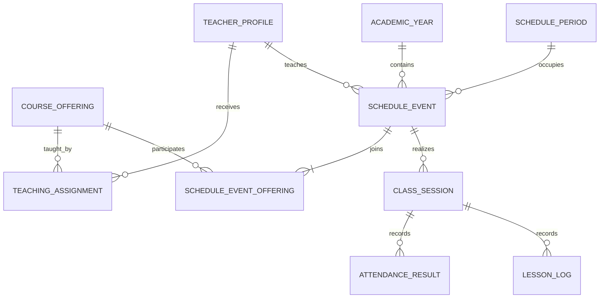

# 02 — Akademik hedef ER modeli ve güvenli geçiş planı

Tarih: 2026-09-30  
Durum: `UYGULANDI — TEMİZ GEÇİŞ`  
Dayanak: [01 — Hedef veri mimarisi ve karar defteri](./01-hedef-veri-mimarisi.md)

> Uygulama durumu — 30 Eylül 2026: Okul Admin tarafından girilmiş pilot verinin önemsiz olduğu onaylandıktan sonra, bu dokümandaki kademeli backfill yaklaşımı yerine kontrollü temiz geçiş uygulandı. `subjects` ve `subject_translations` korundu; eski yıl-bağımlı kademe, seviye, şube, ders açılımı ve ders saati tabloları kaldırıldı. Aşağıdaki hedef ana veri, sürüm ve yıllık gerçekleşme tabloları canlı şemaya eklendi. Bu not, Bölüm 11–14'teki eski veri taşıma adımlarından üstündür; o bölümler yüksek hacimli/üretim verisi bulunan başka bir kurulum için geri dönüş referansı olarak tutulmaktadır.

Canlı geçiş öncesi doğrulanan pilot kapsam:

- `gjimcamedu`: bütün akademik yapı tablolarında `0` kayıt,
- `horizonedu`: `1` öğretim yılı, `2` dönem, `4` kademe, `13` seviye, `4` şube,
- iki okulda da `0` ders açılımı ve `0` ders saati,
- `horizonedu` ders kataloğundaki `49` ders ve çevirileri korundu.

Uygulanan migration'lar:

- `20260930000100_rebuild_academic_structure`: hedef akademik çekirdeğe temiz geçiş,
- `20260930000200_allow_schedule_period_names_across_versions`: yayınlanmış saat profilinden taslak sürüm klonlanırken aynı çeviri adlarının tekrar kullanılabilmesi.

## 1. Kesinleşen tasarım sınırları

Bu teknik tasarım aşağıdaki kullanıcı kararlarını değiştirmeden uygular:

- Her okul bağımsız tenant'tır; akademik ana verisini Okul Admin yönetir.
- Süper Admin ders, seviye, şube veya program kataloğunu merkezi olarak yönetmez.
- Fiziksel kampüs, bina veya oda takibi yoktur.
- “Sınıf” eğitim seviyesidir; `4/1` veya `4/A`, seviye + şube birleşimidir.
- Seviye kimliği yıllar arasında korunur; seviyenin hangi kademeye ait olduğu sürümlenir.
- Şube tanımları okul genelinde bir kez oluşturulur; yıllık kullanım sistem tarafından ayrı bağlamda tutulur.
- Ders kataloğu okul genelindedir ve yıllık çoğaltılmaz.
- Dersler seviye düzeyinde tanımlanır; aynı seviyedeki bütün şubelere uygulanır.
- Seçmeli ve IGCSE derslerinde öğrenci bazlı katılım seçimi yoktur; ders ilgili sınıfın bütün öğrencilerine uygulanır.
- Haftalık hedef ders adedi sistem tarafından zorunlu kural olarak tutulmaz.
- Tam gün, sabahçı ve öğlenci için ayrı saat profilleri bulunur.
- Öğretmen görevlendirmesi ve haftalık program yeni yıla kopyalanmaz.
- Öğrenci yükseltme sınıf bazlı, checkbox ile seçilen öğrenciler üzerinden yapılır.
- Gelecek yıl mevcut yıl kapanmadan hazırlanmaz. Önceki yıl kapatıldıktan sonra yeni yıl oluşturulup aktif edilir.
- Okul kendi yıl ve dönem tarihlerini tanımlar; dönem sayısı sabit olarak ikiye kilitlenmez.
- Kapalı yılın akademik düzeltmeleri yalnız Okul Admin tarafından audit ile yapılır; öğrenci/veli geçmişi salt okunur Arşiv ekranından görür.
- Eski yıla ait ödenmemiş finans borçları, akademik yıl kapanmış olsa da tahsil edilebilir.

## 2. Hedef modelin ana fikri

Model dört veri katmanından oluşur:

```text
OKUL ANA VERİSİ
  Kademe · Seviye · Şube tanımı · Ders kataloğu
            │
            ▼
SÜRÜMLÜ KURALLAR
  Kademe–seviye yapısı · Seviye–ders planı · Saat profili sürümü
            │
            ▼
YILLIK GERÇEKLEŞME
  Öğretim yılı · Dönem · Yıllık şube · Ders açılımı
            │
            ▼
OPERASYON
  Öğretmen ataması · Haftalık program · Gerçek ders oturumu · Yoklama/not/ödev
```

Ana veri bir kez tanımlanır. Sürümlü kurallar değişikliklerin geçmişi bozmasını engeller. Yıllık kayıtlar geçmişi ayırır fakat kullanıcı tarafından tek tek yeniden girilmez; aktif tanımlardan idempotent olarak üretilir.

## 3. Üst seviye ER haritası

### 3.1 Ana veri ve sürümler



### 3.2 Öğretim yılı ve ders açılımları



### 3.3 Öğretmen ve program omurgası



`TeacherProfile`, öğrenci kayıtları, ders oturumu ve yoklama tabloları sonraki modüllerde ayrıntılandırılacaktır. Buradaki ilişkiler akademik çekirdeğin ileride yanlış yönde kurulmasını önleyen bağlayıcı sınırdır.

## 4. Okul ana verisi tabloları

### 4.1 `education_stage_definitions`

Okulun kullandığı kademe kimliklerini tutar: Anaokulu, İlkokul, Ortaokul, Lise gibi.

| Alan | Tür/özellik | Açıklama |
| --- | --- | --- |
| `id` | UUID PK | Kalıcı kademe kimliği |
| `school_id` | UUID FK | Tenant sahibi |
| `code` | varchar | Okul içi kararlı kod; ör. `PRIMARY` |
| `default_name` | varchar | Varsayılan dilde ad |
| `sequence` | integer | Görüntüleme sırası |
| `archived_at` | timestamptz nullable | Yeni kullanım dışı bırakma |
| `created_at`, `updated_at` | timestamptz | Audit destekli zamanlar |

Kurallar:

- `(school_id, code)` aktif kayıtlar için benzersizdir.
- Kademe arşivlenince geçmiş sürüm bağlantıları silinmez.
- Görünen adlar mevcut üç dilli yaklaşımı koruyan `education_stage_definition_translations` tablosunda tutulur.
- Hangi seviyelerin bu kademede olduğu bu tabloda tutulmaz; `academic_structure_levels` belirler.

### 4.2 `grade_level_definitions`

`PRF`, `1` … `12` gibi okul genelinde kalıcı seviye kimliklerini tutar.

| Alan | Tür/özellik | Açıklama |
| --- | --- | --- |
| `id` | UUID PK | Yıllar arasında değişmeyen seviye kimliği |
| `school_id` | UUID FK | Tenant sahibi |
| `code` | varchar | Kararlı kod; ör. `9` |
| `display_label` | varchar | UI etiketi; ör. `9. Sınıf` |
| `sequence` | integer | Seviye sıralaması |
| `archived_at` | timestamptz nullable | Artık yeni yapıda kullanılmıyorsa |
| `created_at`, `updated_at` | timestamptz | Zamanlar |

Kurallar:

- `(school_id, code)` aktif kayıtlar için benzersizdir.
- Doğrudan `education_stage_id` taşımaz.
- `9` ortaokuldan liseye geçtiğinde bu UUID değişmez; yeni yapı sürümündeki kademe bağlantısı değişir.
- `sequence` sınıf yükseltme önerisinin tek kaynağı değildir. Geçiş hedefi UI işleminde açıkça seçilir; böylece PRF ve mezuniyet yanlış otomasyona girmez.

### 4.3 `class_section_definitions`

Okulun tekrar kullandığı seviye + şube tanımını tutar.

| Alan | Tür/özellik | Açıklama |
| --- | --- | --- |
| `id` | UUID PK | Kalıcı şube tanımı |
| `school_id` | UUID FK | Tenant sahibi |
| `grade_level_definition_id` | UUID FK | `4` gibi üst seviye |
| `code` | varchar | `1`, `2`, `A`, `B` gibi okulun serbest etiketi |
| `display_label` | varchar nullable | Gerekirse `4/A Fen` gibi özel gösterim |
| `sequence` | integer | Aynı seviyedeki sıra |
| `archived_at` | timestamptz nullable | Yeni yılda kullanılmayacak tanım |
| `created_at`, `updated_at` | timestamptz | Zamanlar |

Kurallar:

- `(school_id, grade_level_definition_id, code)` aktif kayıtlarda benzersizdir.
- UUID teknik kimliktir; kullanıcıya görünen label serbesttir.
- Arşivleme geçmiş yıllık şube kayıtlarını etkilemez.
- Aktif/pasif değişikliği açık olan eski öğretim yılını yeniden yazmaz; yalnız sonraki setup çalışmasının seçimini etkiler.

### 4.4 `subjects` ve `subject_translations`

Mevcut tablolar korunur. `Subject` okul genelinde tek kimliktir; yeni öğretim yılında çoğaltılmaz.

Önemli düzeltme:

- Mevcut `subjects.track` alanı dersin varsayılan sınıflandırması olarak korunabilir.
- “Bu seviyede zorunlu/seçmeli/IGCSE olarak uygulanıyor” bilgisi `curriculum_items.delivery_type` alanında otoritatif olmalıdır.
- Böylece aynı ders gelecekte farklı seviyelerde farklı uygulama türüne sahip olursa katalog kaydı çoğaltılmaz.
- Kullanıcı kararına göre hiçbir `course_offering_participants` veya öğrenci–ders seçim tablosu oluşturulmaz.

## 5. Sürümlü yapı ve müfredat tabloları

### 5.1 `academic_structure_versions`

Kademe–seviye sınıflamasının sürüm başlığını tutar.

| Alan | Tür/özellik | Açıklama |
| --- | --- | --- |
| `id` | UUID PK | Sürüm kimliği |
| `school_id` | UUID FK | Tenant sahibi |
| `name` | varchar | Ör. `2026 Öncesi 5+4+3`, `Yeni 4+4+4` |
| `status` | enum | `DRAFT`, `PUBLISHED`, `RETIRED` |
| `published_at` | timestamptz nullable | Yayın zamanı |
| `created_by_id` | UUID FK nullable | Oluşturan kullanıcı |
| `created_at`, `updated_at` | timestamptz | Zamanlar |

Yayınlanmış sürüm yerinde değiştirilmez. Değişiklik için yeni sürüm oluşturulur.

### 5.2 `academic_structure_levels`

Bir yapı sürümünde seviyenin hangi kademede olduğunu belirtir.

| Alan | Tür/özellik | Açıklama |
| --- | --- | --- |
| `academic_structure_version_id` | UUID FK | Sürüm |
| `school_id` | UUID FK | Tenant doğrulaması |
| `grade_level_definition_id` | UUID FK | Kalıcı seviye |
| `education_stage_definition_id` | UUID FK | Bu sürümdeki kademe |
| `sequence` | integer | Bu sürümdeki sıralama |

Anahtar ve kurallar:

- PK: `(academic_structure_version_id, grade_level_definition_id)`.
- Aynı seviye bir sürümde yalnız bir kademeye bağlanır.
- Bütün foreign key'ler aynı `school_id` kapsamını doğrular.
- Eski öğretim yılı eski sürüme, yeni öğretim yılı yeni sürüme bağlı kalır.

### 5.3 `curriculum_versions`

Seviye–ders planının yayınlanmış sürümünü tutar.

| Alan | Tür/özellik | Açıklama |
| --- | --- | --- |
| `id` | UUID PK | Müfredat sürümü |
| `school_id` | UUID FK | Tenant sahibi |
| `name` | varchar | Okulun verdiği ad |
| `revision` | integer | Aynı planın revizyon sırası |
| `status` | enum | `DRAFT`, `PUBLISHED`, `RETIRED` |
| `published_at` | timestamptz nullable | Yayın zamanı |
| `created_by_id` | UUID FK nullable | Oluşturan |
| `created_at`, `updated_at` | timestamptz | Zamanlar |

Yıl içinde ders eklenmesi gerektiğinde yayınlanmış kayıt düzenlenmez:

1. mevcut sürümden yeni revizyon oluşturulur,
2. yeni ders eklenir,
3. revizyon yayınlanır,
4. ilgili seviye için geçerlilik tarihiyle yeni `academic_year_curricula` satırı açılır,
5. bütün aktif şubeler için eksik `CourseOffering` kayıtları idempotent üretilir.

### 5.4 `curriculum_items`

Bir müfredat sürümündeki seviye–ders bağını tutar.

| Alan | Tür/özellik | Açıklama |
| --- | --- | --- |
| `id` | UUID PK | Plan kalemi |
| `school_id` | UUID FK | Tenant kapsamı |
| `curriculum_version_id` | UUID FK | Üst sürüm |
| `grade_level_definition_id` | UUID FK | Hedef seviye |
| `subject_id` | UUID FK | Okul ders kataloğu |
| `delivery_type` | enum | `GENERAL`, `ELECTIVE`, `IGCSE` |
| `grading_bucket` | varchar nullable | İleride ortak not hanesi için |
| `created_at` | timestamptz | Zaman |

Kurallar:

- `(curriculum_version_id, grade_level_definition_id, subject_id)` benzersizdir.
- Haftalık ders adedi zorunlu alan değildir ve ilk sürümde eklenmez.
- Şube kimliği taşımaz; aynı seviyenin bütün aktif şubelerine uygulanır.
- Öğrenci katılımcı tablosu yoktur.

## 6. Saat profili tabloları

### 6.1 `schedule_profiles`

Okulun çalışma düzeni başlığını tutar.

| Alan | Tür/özellik | Açıklama |
| --- | --- | --- |
| `id` | UUID PK | Profil kimliği |
| `school_id` | UUID FK | Tenant sahibi |
| `code` | varchar | Ör. `FULL_DAY`, `MORNING_1` |
| `name` | varchar | Ör. Tam Gün, Sabahçı, Öğlenci |
| `kind` | enum | `FULL_DAY`, `MORNING`, `AFTERNOON`, `UNCLASSIFIED` |
| `archived_at` | timestamptz nullable | Yeni atamalarda kullanım dışı |
| `created_at`, `updated_at` | timestamptz | Zamanlar |

`UNCLASSIFIED` yalnız eski veriyi güvenli taşımak içindir. Yeni UI bu türde profil oluşturmaz; import sonrası Okul Admin doğru türü seçer.

### 6.2 `schedule_profile_versions`

Saat değişikliklerinin geçmişi bozmaması için profil sürümünü tutar.

| Alan | Tür/özellik | Açıklama |
| --- | --- | --- |
| `id` | UUID PK | Sürüm kimliği |
| `school_id` | UUID FK | Tenant kapsamı |
| `schedule_profile_id` | UUID FK | Tam gün/sabahçı/öğlenci profili |
| `version` | integer | Artan sürüm |
| `status` | enum | `DRAFT`, `PUBLISHED`, `RETIRED` |
| `published_at` | timestamptz nullable | Yayın zamanı |
| `created_at`, `updated_at` | timestamptz | Zamanlar |

### 6.3 `schedule_periods`

Profil sürümündeki gerçek ders saatlerini tutar.

| Alan | Tür/özellik | Açıklama |
| --- | --- | --- |
| `id` | UUID PK | Saat bloğu |
| `school_id` | UUID FK | Tenant kapsamı |
| `schedule_profile_version_id` | UUID FK | Profil sürümü |
| `code` | varchar | Ör. `P1` |
| `default_name` | varchar | Ör. `1. Ders` |
| `sequence` | integer | Görüntüleme sırası |
| `start_time`, `end_time` | time | Başlangıç/bitiş |

Kurallar:

- Aynı profil sürümünde `sequence` benzersizdir.
- `end_time > start_time` zorunludur.
- Aynı profil sürümündeki aktif bloklar çakışamaz.
- Çeviriler `schedule_period_translations` içinde tutulur.
- Öğrenci/veli/öğretmen ekranı bütün okulun saat birleşimini çizmez. İlgili yıllık şubenin profilinden veya öğretmenin gerçek program olaylarından saatleri getirir; böylece sabahçı kullanıcı öğleden sonraki boş blokları görmez.

### 6.4 Profil ataması için kesin tasarım kararı

E03 yanıtı görüntüleme ihtiyacını netleştirmiş, fakat atama seviyesini sınırlamamıştır. En esnek ve kullanıcıya ek yük oluşturmayan teknik karar şudur:

- Her `academic_year_class_section` bir `schedule_profile_version_id` taşır.
- Okul tek düzen kullanıyorsa bütün şubelere toplu varsayılan atanır.
- Sabahçı/öğlenci okulunda seviye veya seçili şubeler topluca profile atanabilir.
- UI toplu atamayı seviye bazında sunar; DB bağı yine yıllık şube düzeyindedir.
- Aynı yıllık şubenin profilini değiştirmek yeni program oluşturulmadan önce serbesttir. Program başladıktan sonra değişiklik yeni profil sürümü ve açık geçerlilik tarihiyle yapılır; eski olayların saatleri değişmez.

Bu tasarım hem okul geneli hem seviye/şube bazlı kullanımı ek tablo değişikliği olmadan destekler.

## 7. Öğretim yılı tabloları

### 7.1 `academic_years`

Mevcut tablo korunur ve aşağıdaki bağlar eklenir:

| Yeni/değişen alan | Açıklama |
| --- | --- |
| `academic_structure_version_id` | O yıl kullanılan kademe–seviye sürümü |
| `setup_status` | `NOT_STARTED`, `IN_PROGRESS`, `READY`, `FAILED` |
| `setup_completed_at` | Otomatik yıllık kayıt üretiminin son başarılı zamanı |

Durum davranışı:

```text
DRAFT (yalnız yıl + dönem tanımı)
  → ACTIVE (o okulun kullanılan tek yılı)
  → CLOSED (UI'daki Pasif/Kapalı yıl)
  → ARCHIVED (yönetim listesinde gizlenmiş tarihsel yıl)
```

Kesin kurallar:

- Okul başına yalnız bir `ACTIVE` yıl bulunur.
- Aktif yıl kapanmadan yeni yılın hazırlanmasına izin verilmez.
- Yeni yıl kaydı oluşturulurken okulda `ACTIVE` yıl bulunmamalıdır.
- `DRAFT`, yalnız yıl/dönem formunun tamamlanması için kısa ömürlü durumdur; gelecek yıl paralel hazırlama alanı değildir.
- Yılın başlangıç/bitiş tarihleri ve en az bir dönem tanımlandıktan sonra yıl aktif edilebilir.
- Kademe, şube, ders veya öğretmen/program eksikliği aktivasyonu engellemez; kurulum uyarısı üretir.
- `CLOSED` UI etiketi Türkçe kullanımda “Pasif” gösterilebilir; DB'de belirsiz `ACTIVE/PASSIVE` ikilisi yerine anlamlı yaşam döngüsü korunur.

### 7.2 `academic_terms`

Mevcut tablo ve üç dilli çeviri yapısı korunur.

- Okul bir veya daha fazla dönem tanımlayabilir.
- “1. Semester / 2. Semester” sabit enum değildir.
- Dönem tarihleri yıl içinde kalır ve çakışamaz.
- Dönem adları, sırası ve tarihleri okul tarafından belirlenir.
- Yıl etkinleşince mevcut sistemdeki gibi dönemlerin yaşam döngüsü yıl ile birlikte yönetilebilir.

### 7.3 `academic_year_curricula`

Bir öğretim yılında her seviyenin hangi müfredat sürümünü hangi tarihlerde kullandığını tutar.

| Alan | Tür/özellik | Açıklama |
| --- | --- | --- |
| `id` | UUID PK | Atama kimliği |
| `school_id` | UUID FK | Tenant kapsamı |
| `academic_year_id` | UUID FK | Yıl |
| `grade_level_definition_id` | UUID FK | Seviye |
| `curriculum_version_id` | UUID FK | Uygulanan sürüm |
| `valid_from`, `valid_to` | date | Yıl içindeki geçerlilik |
| `created_at` | timestamptz | Zaman |

Kurallar:

- Aynı yıl + seviye için geçerlilik aralıkları çakışamaz.
- Başlangıç ve bitiş yıl tarihleri içinde kalır.
- Yıl içinde yeni ders eklenirse yeni curriculum revision bu ilişkiyle tarihlenir.
- Öğrenci veya şube bazlı curriculum ataması yoktur.

### 7.4 `academic_year_class_sections`

Kalıcı şube tanımının belirli öğretim yılındaki operasyonel örneğidir.

| Alan | Tür/özellik | Açıklama |
| --- | --- | --- |
| `id` | UUID PK | Yıllık şube kimliği |
| `school_id` | UUID FK | Tenant kapsamı |
| `academic_year_id` | UUID FK | Yıl |
| `class_section_definition_id` | UUID FK | `4/A` ana tanımı |
| `schedule_profile_version_id` | UUID FK nullable | Tam gün/sabahçı/öğlenci saatleri |
| `status` | enum | `ACTIVE`, `INACTIVE` |
| `created_at`, `updated_at` | timestamptz | Zamanlar |

Kurallar:

- `(academic_year_id, class_section_definition_id)` benzersizdir.
- Aynı tenant ve yıl bileşik foreign key'lerle korunur.
- Kullanıcı bu satırları her yıl tek tek yazmaz; setup aktif şube tanımlarından üretir.
- Yıllık satır, öğrenci yerleşimi, ders açılımı ve programın bağlandığı tarihsel kimliktir.

### 7.5 `course_offerings`

Mevcut kavram korunur; yeni yıllık şube ve müfredat kaynağına bağlanır.

| Alan | Tür/özellik | Açıklama |
| --- | --- | --- |
| `id` | UUID PK | Yıllık sınıf–ders kimliği |
| `school_id` | UUID FK | Tenant kapsamı |
| `academic_year_id` | UUID FK | Yıl |
| `academic_year_class_section_id` | UUID FK | Yıllık şube |
| `subject_id` | UUID FK | Ders kataloğu |
| `curriculum_item_id` | UUID FK nullable | Otomatik üretim kaynağı |
| `source` | enum | `CURRICULUM`, `MANUAL` |
| `valid_from`, `valid_to` | date | Özellikle yıl içi ders ekleme için |
| `archived_at` | timestamptz nullable | Kullanım dışı |
| `created_at`, `updated_at` | timestamptz | Zamanlar |

Kurallar:

- Aktif tarih aralığında aynı yıllık şube + ders ikinci kez açılamaz.
- Curriculum item seviyeye ait olduğundan setup bunu o seviyenin bütün aktif yıllık şubelerine üretir.
- `MANUAL` yalnız istisna/yıl içi acil ekleme için kullanılabilir ve audit ister.
- Öğretmen, program, ders oturumu, ödev, konu ve not işlemleri bu kimlik üzerinden yürür.
- Öğrenci katılımcı listesi yoktur; yıllık şubedeki bütün geçerli enrollment/placement kayıtları kapsamdadır.

### 7.6 `academic_year_setup_runs`

Yıllık kayıt üretimini tekrar çalıştırılabilir ve denetlenebilir yapar.

| Alan | Açıklama |
| --- | --- |
| `id`, `school_id`, `academic_year_id` | Kimlik ve kapsam |
| `idempotency_key` | Aynı komutun iki kez kayıt üretmesini engeller |
| `status` | `RUNNING`, `SUCCEEDED`, `FAILED` |
| `input_snapshot` | Seçilen yapı/müfredat/profil kimlikleri |
| `result_summary` | Oluşan, atlanan ve hata veren kayıt sayıları |
| `started_by_id`, `started_at`, `finished_at` | Actor ve zaman |
| `error_summary` | Kişisel veri içermeyen hata özeti |

Bu tablo öğretmen ataması veya program kopyalamaz. Yalnız yıllık şubeleri ve curriculum kaynaklı ders açılımlarını hazırlar.

## 8. Öğretmen ataması ve haftalık program sınırı

### 8.1 `teaching_assignments`

| Alan | Açıklama |
| --- | --- |
| `id`, `school_id`, `academic_year_id` | Kimlik ve tenant/yıl kapsamı |
| `course_offering_id` | Öğretmenin verdiği yıllık sınıf–ders |
| `teacher_profile_id` | Öğretmen |
| `valid_from`, `valid_to` | Görev süresi |
| `status` | Aktif/pasif/sona ermiş |

- Yeni öğretim yılına otomatik kopyalanmaz.
- Aynı derste birden fazla öğretmen gerekiyorsa çakışmayan veya açık ortak görev desteklenebilir.
- Program kaydı öğretmenin ilgili ders açılımında görevi olduğunu doğrular.

### 8.2 `schedule_events`

Tek haftalık zaman olayını tutar.

| Alan | Açıklama |
| --- | --- |
| `id`, `school_id`, `academic_year_id` | Kimlik ve kapsam |
| `teacher_profile_id` | O zaman olayındaki öğretmen |
| `schedule_period_id` | İlgili profil sürümündeki ders saati |
| `weekday` | Haftanın günü |
| `valid_from`, `valid_to` | Program sürüm/geçerlilik aralığı |
| `status` | Taslak, yayınlanmış, iptal |

### 8.3 `schedule_event_offerings`

Bir zaman olayına bir veya daha fazla ders açılımı bağlar.

- Normal kullanımda bir etkinlik → bir `CourseOffering`.
- Ortak derste tek etkinlik → birden fazla `CourseOffering`.
- Katılan bütün ders açılımları aynı okul/yıl kapsamında olmalıdır.
- Ortak ders tek öğretmen çakışması ve tek zaman olayıdır; yoklama/konu/ödev kapsamı yıllık şube bazında ayrılabilir.

### 8.4 Çakışma kuralları

Yayınlanmış ve tarih aralığı çakışan programlarda:

- bir öğretmen aynı gün/saatte iki bağımsız `ScheduleEvent` içinde olamaz,
- bir yıllık şube aynı gün/saatte iki bağımsız etkinliğe katılamaz,
- etkinlikteki ders saati, katılan yıllık şubenin atanmış saat profili sürümüne ait olmalıdır,
- ortak ders aynı `ScheduleEvent` içinde birleştirildiğinde çakışma sayılmaz.

Fiziksel oda çakışması kontrolü yoktur.

## 9. Öğrenci yıl geçişi sınırı

Öğrenci modülü daha sonra ayrıntılandırılacak olsa da yıllık akademik çekirdek şu davranışları desteklemelidir:

```text
StudentProfile
  └── Enrollment (öğrenci + öğretim yılı)
        └── StudentGroupPlacement (yıllık şube + geçerlilik tarihleri)
```

Geçiş komutları:

1. Okul Admin kaynak yıllık şubeyi seçer.
2. Öğrenciler checkbox listesinde gelir; varsayılan olarak tümü seçilebilir.
3. Hedef yılın hedef şubesi açıkça seçilir.
4. `1 → 2`, `4/1 → 5/1` gibi toplu işlem önizlenir.
5. Tekrar çalıştırma kopya enrollment üretmez.
6. Anaokulu/PRF → 1 otomatik önerilmez; 1. sınıf yerleşimi manuel yapılır.
7. 12. sınıfta “seçilenleri mezun et” işlemi uygulanır; 13. seviye oluşturulmaz.
8. Sınıfta kalma veya farklı şubeye geçiş tek öğrenci için manuel düzeltilebilir.

Önerilen işlem tabloları ileride `student_transition_batches` ve `student_transition_items` olarak modellenebilir. Başarılı/geçersiz/atlanan her öğrenci sonucu audit ve idempotency için ayrı saklanır.

## 10. Geçmiş yıl ve finans ayrımı

`AcademicYear.CLOSED` akademik kayıtların normal düzenlemeye kapanmasıdır; öğrencinin eski borcunu silmez veya tahsilatı engellemez.

| İşlem | Kapalı yılda davranış |
| --- | --- |
| Öğrenci/veli geçmiş not, yorum, devamsızlık görüntüleme | Salt okunur Arşiv ekranında izinli |
| Öğretmen normal ders/not/yoklama düzenleme | İzin verilmez |
| Okul Admin akademik düzeltme | Özel permission + zorunlu neden + before/after audit |
| Eski taksit ödeme/tahsilat | Finans permission'ıyla devam eder |
| Eski sözleşme tutarını sessizce değiştirme | İzin verilmez; düzeltme/ters kayıt gerekir |

Bu nedenle finans tabloları yıl durumuna körlemesine cascade edilmez ve “yıl kapalı” kontrolü ödeme kaydını engellemek için kullanılmaz.

## 11. Mevcut Prisma → hedef model eşlemesi

| Mevcut model/tablo | Hedef | İşlem |
| --- | --- | --- |
| `School` / `schools` | Aynı | Korunur; yeni ilişkiler eklenir |
| `AcademicYear` / `academic_years` | Aynı + yapı sürümü/setup alanları | Eklemeli değişiklik |
| `AcademicTerm` | Aynı | Korunur |
| `AcademicTermTranslation` | Aynı | Korunur |
| `EducationStage` | `EducationStageDefinition` + `AcademicStructureLevel` | Okul/yıl tekrarları ayrıştırılıp backfill edilir |
| `EducationStageTranslation` | `EducationStageDefinitionTranslation` | Aynı kademe tanımlarına birleştirilir; çakışma raporlanır |
| `GradeLevel` | `GradeLevelDefinition` + `AcademicStructureLevel` | Kod okul kapsamında tek kalıcı kimliğe dönüştürülür |
| `ClassSection` | `ClassSectionDefinition` + `AcademicYearClassSection` | Ana tanım ile yıllık gerçekleşme ayrılır |
| `Subject` | Aynı | Korunur |
| `SubjectTranslation` | Aynı | Korunur |
| `Subject.track` | `Subject.track` varsayılan + `CurriculumItem.deliveryType` otoritatif | Mevcut değer ilk item'a kopyalanır |
| `CourseOffering` | Genişletilmiş `CourseOffering` | Yeni yıllık şube ve curriculum item bağları backfill edilir |
| `LessonPeriod` | `ScheduleProfile` + `ScheduleProfileVersion` + `SchedulePeriod` | Yıllık tekrarlar sürümlü profile dönüştürülür |
| `LessonPeriodTranslation` | `SchedulePeriodTranslation` | Yeni period kimliğine taşınır |
| `AuditEvent` | Aynı | Backfill ve sonraki yazmalar için korunur |

### 11.1 Neden mevcut tablolar doğrudan yerinde dönüştürülmeyecek?

Mevcut tablolar production/pilot verisi taşıyor ve servisler bugün onların bileşik yıl foreign key'lerine bağlı. Tek migration içinde `academic_year_id` kolonlarını düşürmek:

- mevcut FK'leri kırabilir,
- iki farklı yıllık kaydın yanlış ana kayıtta birleşmesine yol açabilir,
- geri dönüşü zorlaştırır,
- çalışan Okul Admin ekranını aynı anda kullanılamaz hale getirebilir.

Bu nedenle önce yeni hedef tablolar eklenir, veri doğrulanarak backfill edilir, servisler yeni okumalara geçirilir; eski tablolar en son ayrı cleanup migration'ında kaldırılır.

## 12. Fiziksel hedef tablo adları

İlk migration için önerilen yeni tablolar:

```text
education_stage_definitions
education_stage_definition_translations
grade_level_definitions
class_section_definitions

academic_structure_versions
academic_structure_levels

curriculum_versions
curriculum_items
academic_year_curricula

schedule_profiles
schedule_profile_versions
schedule_periods
schedule_period_translations

academic_year_class_sections
academic_year_setup_runs
```

Mevcut `course_offerings` ilk etapta yeni nullable foreign key'lerle genişletilir. Yeni okuma yolu doğrulandıktan sonra eski `class_section_id` bağı kaldırılır veya yeni anlamıyla yeniden adlandırılır.

## 13. Migration ve backfill planı

### Faz M0 — Değişiklik öncesi envanter

Salt okunur rapor iki pilot okul için aşağıdakileri çıkarır:

- öğretim yılı/dönem sayıları ve durumları,
- kademe kod/ad/sıra değerleri,
- seviye kodları ve bağlı kademeleri,
- şube kodları,
- ders ve çeviri sayıları,
- seviye/şube–ders ilişkileri,
- ders saatleri ve çakışmalar,
- aynı okulda yıllar arasında aynı kodla farklı anlama gelen kayıtlar,
- orphan veya tenant/yıl uyuşmazlıkları.

Bu rapor migration'ın kabul tabanıdır; PII içermez.

### Faz M1 — Yalnız eklemeli şema

- Bölüm 12'deki tablolar oluşturulur.
- Mevcut `academic_years` ve `course_offerings` tablolarına yeni alanlar nullable eklenir.
- Bileşik `(id, school_id)` ve gereken `(id, school_id, academic_year_id)` unique/FK hedefleri hazırlanır.
- Eski kolon, FK, index veya tablo kaldırılmaz.
- Yeni kod henüz eski okuma yolunu kullanmaya devam eder.

Geri dönüş: Yeni tablolar kullanılmadığı için uygulama eski şemayla çalışmaya devam eder.

### Faz M2 — Dry-run backfill raporu

Her okul için uygulanmadan önce deterministik eşleme hazırlanır:

1. Kademe adayları `(school_id, normalized_code)` ile gruplanır.
2. Seviye adayları `(school_id, normalized_code)` ile gruplanır.
3. Şube adayları kalıcı seviye + normalize şube koduyla gruplanır.
4. Her eski öğretim yılı için bir yapı sürümü ve kademe–seviye bağlantıları çıkarılır.
5. Eski `CourseOffering` satırları seviye–ders item adaylarına dönüştürülür.
6. Aynı seviyenin şubeleri arasında ders farkı varsa otomatik birleştirme yapılmaz; fark raporda açıkça gösterilir.
7. Her farklı ders saati seti için schedule profile/version adayı çıkarılır.
8. Eski veriden `FULL_DAY/MORNING/AFTERNOON` türü saatlere bakarak tahmin edilmez; tür `UNCLASSIFIED` bırakılır ve Okul Admin incelemesine sunulur.

Çakışan kod, farklı çeviri veya farklı ilişki bulunan gruplar kullanıcı kararı olmadan birleştirilmez.

### Faz M3 — Kontrollü backfill

Her tenant ayrı Serializable transaction ve ayrı import batch kimliğiyle işlenir:

1. Kademe ve seviye tanımları oluşturulur.
2. Her yılın eski ilişkilerinden academic structure version oluşturulur.
3. Şube tanımları ve yıllık şube kayıtları oluşturulur.
4. Curriculum version/item kayıtları mevcut offering'lerden üretilir.
5. Mevcut `CourseOffering` kayıtlarına yeni FK'ler bağlanır; ID'leri korunur.
6. Lesson period kayıtları schedule profile/version/period yapısına taşınır.
7. Academic year yeni yapı sürümüne bağlanır.
8. Her adım `IMPORT` audit özeti ve eşleme tablosu üretir.

Backfill tekrar çalıştırıldığında aynı kaynak kimlik için ikinci hedef kayıt üretmez.

### Faz M4 — Gölge okuma ve mutabakat

Uygulama kullanıcıya hâlâ eski sonucu gösterirken sunucuda hedef modelden aynı görünüm hesaplanır ve yalnız karşılaştırma metriği kaydedilir:

- seçilen yılın seviye sayısı,
- şube listesi ve etiketleri,
- ders kataloğu,
- şube başına ders açılımları,
- ders saati listesi,
- tenant/yıl kapsamı.

PII veya içerik loglanmaz. Fark varsa cutover yapılmaz.

### Faz M5 — Okuma/yazma cutover'ı

Önerilen ekran ayrımı:

```text
Akademik Ana Veriler
  ├── Kademeler
  ├── Seviyeler
  ├── Şube Tanımları
  └── Ders Kataloğu

Akademik Kurallar
  ├── Kademe–Seviye Yapısı
  ├── Seviye–Ders Planı
  └── Tam Gün / Sabahçı / Öğlenci Saatleri

Aktif Yıl Kurulumu
  ├── Yıllık Şubeler
  ├── Ders Açılımları
  ├── Öğrenci Geçişi
  └── Kurulum Eksikleri
```

- Server Component okumaları hedef sorgulara geçirilir.
- Server Action yazmaları yalnız yeni servislere gider.
- `school_id` yine doğrulanmış tenant bağlamından alınır.
- Bütün kritik yazmalar permission, optimistic concurrency ve audit kullanır.
- Öğretmen/program ekranları hazır olmadığı için akademik çekirdek cutover'ı bunları otomatik oluşturmaz.

### Faz M6 — Zorunlu kısıtlar

Backfill ve iki tenant doğrulandıktan sonra:

- yeni foreign key alanları `NOT NULL` yapılır,
- kısmi unique index ve tarih çakışma constraint/trigger'ları etkinleştirilir,
- eski model üzerine yeni yazma kapatılır,
- orphan üretilemediği test edilir.

### Faz M7 — Eski şema temizliği

En az bir kararlı yayın ve veri mutabakatından sonra ayrı migration ile:

- artık okunmayan eski academic structure tabloları/kolonları kaldırılır veya önce `_legacy` olarak yeniden adlandırılır,
- gereksiz index ve trigger'lar temizlenir,
- Prisma modelleri hedef isimlere sadeleştirilir,
- cleanup öncesi son snapshot ve satır sayımı saklanır.

Bu faz ilk uygulama PR'ına dahil edilmez.

## 14. Geri dönüş stratejisi

| Aşama | Geri dönüş |
| --- | --- |
| M1 öncesi | Migration uygulanmaz; mevcut sistem değişmez |
| M1–M3 | Uygulama eski okuma/yazmaya devam eder; yeni tablolar izole edilir |
| M4 | Fark bulunduğunda cutover feature flag'i açılmaz |
| M5 sonrası, yeni yazma azsa | Yazmalar durdurulup eşleme ile eski alana geri senkron planı gerekir |
| M5 sonrası anlamlı yeni veri varsa | Geri migration yerine roll-forward düzeltme yapılır |
| M7 sonrası | Yalnız doğrulanmış snapshot/backup üzerinden geri dönüş mümkündür |

Yeni modele yazma başladıktan sonra “tabloları silip eskiye dönmek” güvenli rollback değildir. Bu nedenle cleanup geciktirilir ve esas strateji feature flag + roll-forward olur.

## 15. DB kısıtları ve bütünlük matrisi

| Kural | Koruma |
| --- | --- |
| Okul başına tek aktif öğretim yılı | Partial unique index |
| Aktif yıl varken yeni yıl hazırlanmaması | Servis state transition + transaction kilidi; gerekirse DB trigger |
| Dönemlerin yıl içinde ve çakışmasız olması | Mevcut servis + DB trigger/constraint |
| Tenant dışı bağ kurulamayması | Bileşik foreign key |
| Bir yapı sürümünde seviyenin tek kademe bağı | Composite PK/unique |
| Aynı seviyede aynı şube kodunun tekrarlanmaması | Partial unique index |
| Aynı curriculum sürümünde seviye–ders tekrarı | Unique constraint |
| Aynı yıl/seviyede curriculum tarih çakışması | Exclusion constraint veya trigger |
| Aynı yılda aynı şube tanımının tek örneği | Unique constraint |
| Aynı yıllık şubede aynı dersin tarih çakışması | Exclusion constraint veya trigger |
| Saat bloğunda bitişin başlangıçtan sonra olması | Check constraint |
| Aynı profil sürümünde saat çakışmaması | DB trigger/exclusion + servis doğrulaması |
| Programda öğretmen/grup zaman çakışması | DB destekli servis doğrulaması |
| Setup'ın tekrar çalışınca kopya üretmemesi | Idempotency key + unique constraint |
| Kapalı yıl normal yazmasının engellenmesi | Yetki/policy servisi; admin correction ayrı komut |

## 16. Servis ve UI veri akışları

### 16.1 Okulun ilk akademik kurulumu

```text
Kademe/seviye/şube/ders ana verisini oluştur
  → kademe–seviye yapı sürümünü yayınla
  → seviye–ders curriculum sürümünü yayınla
  → Tam Gün/Sabahçı/Öğlenci profil ve saatlerini yayınla
  → öğretim yılı ve dönemleri oluştur
  → yılı aktif et
  → yıllık setup'ı çalıştır
  → şubelere saat profili ata
```

### 16.2 Yeni öğretim yılı

```text
Aktif yılı kapat
  → gerekirse ana şube tanımlarını ekle/arşivle
  → gerekiyorsa yeni yapı/curriculum/saat sürümlerini yayınla
  → yeni yıl + okulun dönem tarihlerini oluştur
  → yeni yılı aktif et
  → yıllık şubeleri ve ders açılımlarını üret
  → öğrencileri sınıf bazlı toplu taşı
  → öğretmenleri manuel ata
  → haftalık programı hızlı UI ile manuel oluştur
```

### 16.3 Yıl içinde yeni ders

```text
Dersi okul kataloğuna ekle veya mevcut dersi seç
  → curriculum revision oluştur
  → seviye + ders item'ını ekle
  → etkili tarihi seçip yayınla
  → seviyenin bütün aktif yıllık şubelerine offering üret
  → öğretmen ataması ve programı manuel tamamla
```

### 16.4 Saat ekranı

```text
Öğrenci/veli: enrollment → yıllık şube → atanmış profil + program olayları
Öğretmen: kendi yayınlanmış program olayları
Okul Admin: seçili profil veya şube filtresi
```

Karşı vardiyanın boş saatleri kullanıcıya gösterilmez.

## 17. Uygulama paketleri

Tek büyük değişiklik yerine aşağıdaki küçük ve doğrulanabilir paketler önerilir:

### Paket A — Ana veri ve yapı sürümü

- Kademe, kalıcı seviye, kalıcı şube tanımları
- Kademe–seviye yapı sürümü
- Mevcut veriden dry-run/backfill
- Henüz mevcut UI cutover edilmez

### Paket B — Curriculum ve yıllık ders üretimi

- Curriculum version/item
- Academic year curriculum assignment
- Yıllık şube
- Course offering yeni bağları
- Idempotent setup servisi

### Paket C — Saat profilleri

- Tam gün/sabahçı/öğlenci profil ve sürümleri
- Period migration
- Yıllık şube profil ataması
- Kullanıcıya yalnız ilgili saatleri gösteren okuma modeli

### Paket D — Akademik Admin UI cutover

- Ana Veri / Kurallar / Aktif Yıl Kurulumu ekran ayrımı
- Eski akademik yapı ekranından kontrollü geçiş
- İki tenant kabul testleri

### Paket E — Öğrenci geçişi

- Enrollment ve placement modelinin ayrıntılı tasarımı
- Sınıf bazlı checkbox yükseltme
- 1. sınıfa manuel giriş ve 12. sınıf mezuniyet

### Paket F — Öğretmen ve program

- Person/teacher modeline bağlanma
- Teaching assignment
- Drag/drop veya hızlı select program UI'si
- Çakışma ve ortak ders kuralları

Paket A–D tamamlanmadan personel/finans gibi daha geniş modüllerle akademik yabancı anahtarlar sabitlenmemelidir.

## 18. Doğrulama ve kabul kriterleri

### 18.1 Şema ve tenant güvenliği

- Başka okulun stage/grade/section/subject/version ID'siyle kayıt oluşturma DB tarafından reddedilir.
- İki pilot okulun aynı `4/A` veya `Matematik` etiketi birbirine karışmaz.
- Okul başına en fazla bir aktif yıl vardır.
- Aktif yıl kapanmadan yeni yıl kurulum akışı başlatılamaz.

### 18.2 Backfill mutabakatı

- Her mevcut stage/grade/section satırı tam bir kaynak→hedef eşleme kaydına sahiptir.
- Her mevcut `CourseOffering` aynı ID veya doğrulanmış birebir hedef ID ile korunur.
- Her mevcut `LessonPeriod` bir schedule period'a bağlanır.
- Okul/yıl/şube başına ders sayıları migration öncesi ve sonrası açıklanabilir biçimde eşittir.
- Çakışmalı veya belirsiz veri sessizce birleştirilmez.

### 18.3 İş akışları

- Şube tanımı yeni yılda elle tekrar yazılmadan yıllık şube oluşur.
- Bir seviyeye ders eklendiğinde o seviyenin bütün aktif şubelerine offering oluşur.
- Aynı setup ikinci kez çalışınca yeni satır üretmez.
- Seçmeli/IGCSE için öğrenci bazlı seçim ekranı veya tablosu oluşmaz.
- Sabahçı kullanıcı yalnız sabah profilinin saatlerini; öğlenci kullanıcı yalnız öğlen profilini görür.
- Öğretmen görevlendirmesi ve program yeni yıla taşınmaz.
- PRF/anaokulu öğrencileri otomatik 1. sınıfa geçirilmez.
- 12. sınıf öğrencileri seçilerek mezun edilir.
- Kapalı yıl öğretmen tarafından değiştirilemez; Admin düzeltmesi gerekçe ve audit üretir.
- Kapalı yıla ait açık taksit tahsil edilebilir.

### 18.4 Teknik doğrulama

- Prisma validate/generate başarılıdır.
- Migration temiz veritabanına sıfırdan ve pilot şemanın kopyasına uygulanabilir.
- Backfill dry-run ile apply sayıları aynıdır.
- Unit testler state transition, idempotency ve normalize kod kurallarını kapsar.
- Integration testler iki tenant, farklı yıl ve çakışma senaryolarını kapsar.
- Cutover öncesi eski/yeni read model karşılaştırmasında açıklanmayan fark sıfırdır.

## 19. Bilinçli olarak bu tasarımın dışında kalanlar

Bu belgede henüz ayrıntılı tablo tasarımı yapılmayan başlıklar:

- gerçek kişi, personel, öğretmen, öğrenci ve veli profilleri,
- öğrenci enrollment/placement ayrıntıları ve geçiş batch tabloları,
- gerçek ders oturumu, yoklama ve gün içi durum devamlılığı,
- konu, ödev, materyal, sınav ve not,
- öğrenci finans sözleşmeleri ve tahsilat,
- okul giderleri, tedarikçiler, bütçe ve muhasebe,
- bildirim, SMS ve günlük e-posta raporları.

Bu modüller akademik çekirdeğin kimliklerini kullanacaktır; ancak bu belgede tahminle kolon eklenmeyecektir.

## 20. Uygulamaya geçmeden önce yapılacak son kontrol

Bu tasarım ürün soruları bakımından tamamlanmıştır. Kodlama öncesi bir sonraki çalışma, yalnız teknik hazırlık olmalıdır:

1. iki pilot tenant'ın M0 envanter scripti,
2. gerçek veriye göre collision/backfill raporu,
3. Paket A için kesin Prisma modelleri ve migration SQL taslağı,
4. rollback/cutover feature flag ayrıntısı,
5. test fixture ve kabul sorguları.

M0 raporu yalnız okuma yapmalı; migration uygulanması ayrı ve açık bir uygulama adımı olmalıdır.
