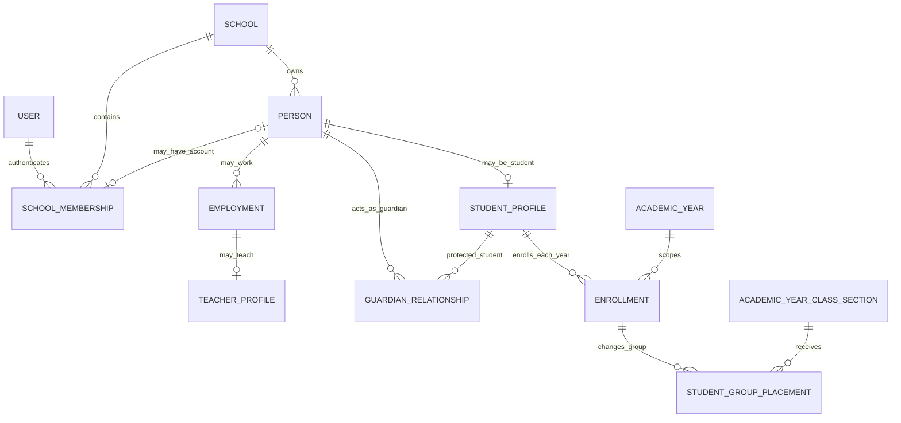

# 03 — Kişi, öğrenci, veli, personel ve öğretmen veri mimarisi

Tarih: 2026-09-30  
Durum: `KARARLAR TAMAMLANDI — TEKNİK TASARIM 04 BELGESİNE AKTARILDI`  
Önceki aşama: [02 — Akademik hedef ER modeli ve güvenli geçiş planı](./02-akademik-hedef-er-ve-gecis-plani.md)

> Bu belge bir migration veya kodlama talimatı değildir. Amaç; gerçek kişi, okul profili, giriş hesabı, çalışma ilişkisi, öğrenci yıllık kaydı ve veli bağlantısı kavramlarını kodlamadan önce kesinleştirmektir. Bu inceleme sırasında Arsimio şeması ve canlı veriler değiştirilmemiştir.

## 1. Bu fazın amacı

Akademik ana veri, müfredat, yıllık şube ve ders açılımı omurgası tamamlandı. Sıradaki modüllerin tamamı gerçek kişilere dayanacaktır:

- öğrenci yıllık kaydı ve sınıf yükseltme,
- öğretmen görevlendirmesi ve haftalık program,
- veli erişimi,
- personel ve insan kaynakları,
- öğrenci ücret sözleşmeleri ve tahsilat,
- yoklama, not, ödev, davranış ve iletişim.

Bu nedenle önce aşağıdaki kavramlar birbirinden ayrılmalıdır:

```text
Gerçek kişi
  ≠ giriş hesabı
  ≠ okul üyeliği
  ≠ öğrenci profili
  ≠ çalışma ilişkisi
  ≠ öğretmen niteliği
  ≠ veli–öğrenci ilişkisi
  ≠ öğrencinin yıllık kaydı
```

Hedef; aynı kişiyi gereksiz yere çoğaltmadan, hesabı olmayan kişileri de kaydedebilmek ve hiçbir okulun kişisel verisini başka tenant ile paylaşmamaktır.

## 2. İncelenen kaynaklar

### 2.1 Güncel Arsimio

- `prisma/schema.prisma`
- `src/server/auth/service.ts`
- `src/server/authorization/guards.ts`
- `src/server/platform/initial-school-admin-service.ts`
- `scripts/seed-pilot.mts`
- [Kullanıcılar, roller ve yetkiler](./users-roles-permissions.md)
- [Denetim, geçmiş ve veri yaşam döngüsü](./audit-history-data-lifecycle.md)
- [Hedef veri mimarisi ve karar defteri](./01-hedef-veri-mimarisi.md)

### 2.2 Eski HorizonEdu

- `horizonedu/backend/app/modeller/models.py`
- `horizonedu/backend/app/blueprints/students/routes.py`
- `horizonedu/backend/app/blueprints/admin/routes.py`
- `horizonedu/backend/app/blueprints/parents/routes.py`
- `horizonedu/backend/app/blueprints/mobiles/auth_mob.py`
- `horizonedu/backend/app/blueprints/mobiles/student_mob.py`
- `horizonedu/backend/app/blueprints/mobiles/parents_mob.py`
- 1 Ağustos 2024 tarihli depo içi `horizonschool.db` SQLite kopyası
- [Eski sistem veri akışı raporu](./00-veri-akisi.md)
- [Eski sistem canlı veri incelemesi](./legacy-live-data-review.md)

Kişisel veri güvenliği nedeniyle belgeye ad, kimlik numarası, telefon, e-posta, parola/hash veya belge içeriği alınmamıştır.

## 3. Güncel Arsimio’da hazır olan temel

Arsimio’nun hesap ve tenant çekirdeği bu faz için doğru bir başlangıçtır.

| Mevcut model | Bugünkü anlamı | Bu fazdaki rolü |
| --- | --- | --- |
| `User` | Küresel giriş kimliği | Gerçek kişinin kendisi değildir; hesabı temsil eder |
| `UserCredential` | Kullanıcının parola hash’i ve sürümü | Profil tablolarına parola eklenmesini önler |
| `SchoolMembership` | Kullanıcının belirli okuldaki üyeliği ve kullanıcı adı | İsteğe bağlı olarak okul içi kişi kaydına bağlanacaktır |
| `Role`, `Permission` | Okul veya platform kapsamlı yetki paketleri | Öğretmen/öğrenci/veli hesabının yetkisini belirler |
| `MembershipRole` | Bir üyeliğin aynı okul içindeki rolleri | Aynı kişinin birden fazla rol taşımasını destekler |
| `AuthSession` | Hostname ve üyelik kapsamlı oturum | Tenant dışı oturumu engeller |
| `AuditEvent` | Actor, okul, önce/sonra ve gerekçe | Profil, ilişki ve toplu geçiş işlemlerinde kullanılacaktır |

Bugünkü güçlü kurallar:

- Okul kullanıcısı kendi okul domaininde okul içi kullanıcı adıyla giriş yapar.
- Aynı kullanıcı farklı okullarda farklı üyelik ve kullanıcı adına sahip olabilir.
- Bir üyelik birden fazla rol taşıyabilir.
- Parola profil tablolarında değil yalnız `UserCredential` içinde tutulur.
- Tenant ve permission kontrolü Server Action/servis tarafında yapılır.
- Öğretmen, öğrenci ve veli rolleri seed içinde vardır; fakat şu anda yalnız temel dashboard iznine sahiptir.

Eksik olan bağ şudur:

```text
SchoolMembership ──?── okul içindeki gerçek kişi/profil
```

Mevcut ilk Okul Admin hesabında ad/soyad `User` üzerinde bulunur; henüz `Person`, `Employment`, `StudentProfile`, `TeacherProfile` veya veli ilişkisi yoktur.

## 4. Eski HorizonEdu’dan anlaşılan kişi yapısı

### 4.1 Öğrenci

`student_tbl` aynı satırda aşağıdaki farklı veri türlerini taşır:

- kalıcı öğrenci dosyası,
- kayıt tarihi ve ilk sınıf metni,
- kişisel/ulusal kimlik değeri,
- ad, soyad, anne ve baba adı,
- cinsiyet, doğum tarihi/yeri, uyruk,
- adres, bölge, iki telefon ve iki e-posta,
- aktif/pasif durumu,
- ayrıca artık fiilen kullanılmayan bir öğrenci parola hash’i.

Öğrencinin öğretim yılı ve sınıf geçmişi `stu_period_class` içindedir. Bu doğru bir ayrım fikridir; ancak yıl ve sınıf ID’leri gerçek foreign key değildir, adlar tekrar satıra kopyalanır ve yaşam döngüsü yalnız `Active/Passive` metnine dayanır.

Öğrenci giriş hesabı ayrıca `admin` tablosunda `admin_group='Nxënësit'` ve FK olmayan `admin_empID → student_tbl.id` yorumuyla tutulur. Böylece profil ve hesap farklı tablolarda olmasına rağmen ilişki DB tarafından korunmaz. Mobil JWT içinde bazı yerlerde `admin.id`, bazı cevaplarda `student_tbl.id` kullanılır.

### 4.2 Veli

`parent` tablosu profil, kullanıcı adı, e-posta ve parola hash’ini tek kayıtta birleştirir. `parent_student` köprüsü bir veliye birden fazla öğrenci ve bir öğrenciye birden fazla veli bağlayabilecek yapıdadır; fakat `(parent_id, student_id)` DB tekilliği yoktur.

Öğrenci kartındaki `stu_father` ve `stu_mother` metinleri gerçek `parent` kayıtlarına otomatik bağlanmaz. Sonuç olarak “anne/baba adı” ile “sisteme giriş yapan/yasal yetkili veli” iki ayrı gerçekliktir.

### 4.3 Personel ve öğretmen

`current_tbl` aynı tabloda şunları temsil eder:

- çalışan/personel,
- öğretmen,
- yönetici,
- finans tarafında şirket/tedarikçi.

Kişisel bilgi, banka hesabı, departman, işe giriş tarihi ve cari hareket ilişkileri aynı kartta toplanmıştır. `current_emp_department` gerçek foreign key değildir; bazı akışlarda departman ID’si, bazı akışlarda `5210` şirket/tedarikçi işareti olarak kullanılır.

Öğretmen ayrı bir gerçek kişi kaydı değildir. Personel kartının öğretmen departmanında olması ve/veya `admin_group='Mësues'` hesabı bulunmasıyla öğretmen kabul edilir. Yıllık ders görevi `teacher_period`, sınıf sorumluluğu `res_teach_class` içindedir.

### 4.4 Hesaplar

Eski `admin` tablosundaki `admin_empID` çok biçimli bir bağdır:

- öğretmen/yönetici hesabında `current_tbl.id`,
- öğrenci hesabında `student_tbl.id`.

Hedef tabloyu yalnız `admin_group` metni belirler. Veli ise tamamen ayrı `parent` tablosundan giriş yapar. Aynı gerçek kişi hem çalışan hem veli olduğunda tek hesap/kişi kimliği kullanılamaz.

## 5. Sayısal kanıt ve sınırı

### 5.1 Son yetkili canlı snapshot

19–30 Eylül 2026 tarihli salt-okunur incelemede:

| Ölçüm | Sonuç |
| --- | ---: |
| Kalıcı öğrenci dosyası | 447 |
| Aktif öğrenci | 330 |
| Pasif öğrenci | 117 |
| Yıllık öğrenci–sınıf kaydı | 1.051 |
| Aktif yıllık kayıt | 330 |
| Pasif yıllık kayıt | 721 |
| Hiç yıllık kaydı olmayan pasif öğrenci | 27 |
| Öğretmen/personel kartı | 52 |
| Aktif personel kartı | 38 |
| Aktif ataması/programı görünen öğretmen | 32 |

Canlı veli sayısı, veli–öğrenci ilişki sayısı, hesap–profil eşleşmesi ve doğrudan DB kısıtları yetkili snapshot içinde kesinleştirilmemiştir. Migration planından önce authenticated salt-okunur API veya tercihen doğrudan salt-okunur SQL ile ayrıca sayılmalıdır.

### 5.2 Depodaki eski SQLite kopyası

1 Ağustos 2024 tarihli kopyada yalnız sayısal inceleme yapılmıştır:

| Ölçüm | Sonuç |
| --- | ---: |
| Öğrenci | 187 |
| Yıllık öğrenci–sınıf kaydı | 374 |
| Veli | 3 |
| Veli–öğrenci bağlantısı | 7 |
| `current_tbl` kişi/şirket kartı | 45 |
| `admin` hesabı | 11 |
| Öğrenci hesabı | 1 |
| Öğretmen hesabı | 5 |
| Yönetim hesabı | 5 |
| Öğrenci belgesi | 1.236 |

Bu kopyada üç velinin de birden fazla öğrenciyle bağlantısı vardır; aynı veli–öğrenci çiftinin tekrarı görülmemiştir. Ancak yalnız 7 bağlantı bulunduğu için gerçek okul veli yapısını temsil ettiği varsayılamaz. Kopya canlı migration kaynağı değildir; yalnız eski model davranışını doğrulayan tarihsel kanıttır.

## 6. Korunması ve düzeltilmesi gereken fikirler

### Korunacak fikirler

- Kalıcı öğrenci dosyası ile yıllık sınıf kaydı ayrı olmalıdır.
- Veli–öğrenci bağı N:N köprü ilişkisidir.
- Öğretmen ders görevi ile sınıf sorumluluğu ayrı kavramlardır.
- Bir kişinin sisteme giriş hesabı sonradan oluşturulabilir.
- Öğrenci ve personel fotoğraf/belgeleri ana kişi satırına gömülmemelidir.

### Düzeltilmesi gerekenler

- Profil tablolarında parola tutulmamalıdır.
- Kişi türü serbest metin `admin_group` veya özel sayı ile anlaşılmamalıdır.
- Aynı kişi veli, çalışan ve öğretmen olduğunda ayrı kişi kopyaları oluşmamalıdır.
- Şirket/tedarikçi ile gerçek kişi aynı tabloda tutulmamalıdır.
- Öğrencinin “okulda aktif olması”, belirli yıldaki kaydı ve belirli şubedeki yerleşimi aynı `status` ile yönetilmemelidir.
- Kimlik, iletişim, banka ve sağlık gibi hassas alanların erişimi role ve amaca göre ayrılmalıdır.
- Kayıtlar normal operasyonda fiziksel silinmemeli; tarihçe ve audit korunmalıdır.

## 7. Önerilen kavram modeli

Ana öneri: **kişisel okul verisi tenant kapsamında; giriş kimliği platform kapsamında olmalıdır.**



### 7.1 Neden `Person` okul kapsamında öneriliyor?

Tek bir platform-geneli kişi satırını iki okulun ortak kullanması şu riskleri üretir:

- bir okulun adres/telefon güncellemesinin diğer okulu etkilemesi,
- bir okulun başka okul tarafından girilmiş kişisel veriyi görmesi,
- ulusal kimlik numarasıyla tenant’lar arası istemsiz kişi keşfi,
- farklı hukuki saklama ve silme taleplerinin birbirine bağlanması.

Bu nedenle önerilen ayrım:

```text
User = platform-geneli giriş kimliği ve credential
Person = okulun sahip olduğu gerçek kişi dosyası
SchoolMembership = User’ın o okuldaki hesabı
```

Aynı insan iki okulda bulunuyorsa iki ayrı okul kapsamlı `Person` kaydı olabilir; isterse ikisi aynı `User` hesabına kendi `SchoolMembership` kayıtları üzerinden bağlanır. Okullar birbirinin kişi verisini görmez veya güncellemez.

### 7.2 Hesap bağlantısı

`SchoolMembership` üzerinde nullable bir `person_id` bağı önerilmektedir:

- kişi/profil hesap olmadan oluşturulabilir,
- hesap daha sonra oluşturulup kişiye bağlanabilir,
- bir okulda bir kişi en fazla bir üyelik/giriş hesabına bağlanır,
- platform Süper Admin’i için okul içi `Person` zorunlu değildir,
- mevcut Okul Admin üyelikleri geçiş sırasında kişi kaydına bağlanabilir.

Kişi adı ile `User.first_name/last_name` farklı anlam taşır. Okul ekranlarında bağlı `Person` adı otoritatiftir; `User` adı yalnız hesap düzeyi gösterim/fallback bilgisidir.

## 8. Önerilen tablo sorumlulukları

Bu liste nihai Prisma şeması değildir; karar sorularının değerlendirilmesi için sınır taslağıdır.

| Önerilen model | Sorumluluk | Taşımaması gereken veri |
| --- | --- | --- |
| `Person` | Okul kapsamlı gerçek kişi, temel ad/doğum bilgisi, yaşam döngüsü | Parola, rol, yıllık sınıf, maaş |
| `PersonIdentityDocument` | Ulusal kimlik/pasaport gibi belge türü, ülke ve korunmuş değer | Giriş parolası |
| `PersonContactPoint` | Telefon/e-posta ve tür/öncelik/doğrulama bilgisi | Veli yetkisi |
| `PersonAddress` | Adres türü ve tarihli adres | Öğrenci şubesi |
| `StudentProfile` | Okul öğrenci numarası, kabul tarihi ve kalıcı öğrenci durumu | Yıllık sınıf |
| `GuardianRelationship` | Veli kişi + öğrenci + yakınlık/yetki/öncelik | Parola veya öğrenci notu |
| `Employment` | Çalışma türü, başlangıç/bitiş, durum, departman/pozisyon | Ders/sınıf görevi |
| `TeacherProfile` | Çalışanın öğretmen olarak kullanılabildiğini gösteren profil | Yıllık ders ataması |
| `Department` | Organizasyon birimi | Pozisyonu özel sayı ile kodlama |
| `Position` | Görev/unvan kataloğu | Personel kimlik bilgisi |
| `Enrollment` | Öğrenci + öğretim yılı kaydı ve yıl sonucu | Güncel şube adını metin kopyası olarak tutma |
| `StudentGroupPlacement` | Enrollment’ın tarih aralığında bulunduğu yıllık şube | Öğrenci ana profili |
| `PersonAsset` / modül belgesi | Fotoğraf/dosya metadata ve erişim sınıfı | Dosyanın yerel Vercel disk yolu |

## 9. Durum ve yaşam döngüsü ayrımı

Önerilen durum katmanları:

```text
Person
  ACTIVE / ARCHIVED

StudentProfile
  ACTIVE / INACTIVE / ARCHIVED

Enrollment
  DRAFT / ACTIVE / COMPLETED / WITHDRAWN / CANCELLED
  outcome: PROMOTED / REPEATED / GRADUATED / TRANSFERRED / WITHDRAWN / UNKNOWN

StudentGroupPlacement
  valid_from / valid_to
  aynı anda en fazla bir aktif yerleşim

Employment
  PLANNED / ACTIVE / SUSPENDED / ENDED / CANCELLED

SchoolMembership
  INVITED / ACTIVE / SUSPENDED / ARCHIVED
```

Örnek: Bir öğrenci okuldan ayrıldığında `User`, `StudentProfile`, `Enrollment` ve `Placement` aynı şey olmadığı için bütün satırlar tek `Passive` değerine çevrilmez. Yıllık kayıt ayrılma sonucu ve tarihiyle kapanır; hesap gerekiyorsa ayrıca askıya alınır; geçmiş kayıtlar korunur.

## 10. Öğrenci kayıt akışı önerisi

Yeni öğrenci için tek işlem sihirbazı önerilir:

```text
Kişisel bilgiler
  → öğrenci profili ve okul öğrenci numarası
  → aktif/taslak öğretim yılı enrollment
  → yıllık şube yerleşimi
  → veli kişi ve ilişkileri (varsa)
  → fotoğraf/belge (isteğe bağlı)
  → öğrenci/veli giriş hesabı (isteğe bağlı ve ayrı onay)
```

Zorunlu çekirdek adımlar tek Serializable transaction içinde yazılır. Hesap, fotoğraf ve belgeler ana kayıt başarısızlığına neden olmayacak ayrı işlemler olabilir.

Yıl geçişinde daha önce kesinleşen kurallar korunur:

- 1–11. seviye öğrencileri checkbox ile seçilip hedef şubeye toplu taşınır,
- normal öneride şube kodu korunabilir,
- PRF/anaokulu → 1. sınıf dağılımı manuel yapılır,
- 12. sınıfta “seçilenleri mezun et” uygulanır,
- aynı geçiş ikinci kez çalıştırıldığında ikinci enrollment oluşmaz,
- sınıfta kalma veya istisna tek öğrenci detayından düzeltilir.

## 11. Personel ve öğretmen akışı önerisi

```text
Person oluştur veya mevcut kişiyi seç
  → Employment oluştur
  → departman + pozisyon + çalışma türü ata
  → öğretmenlik yapacaksa TeacherProfile etkinleştir
  → hesap gerekiyorsa SchoolMembership oluştur/bağla
  → uygun rol(ler)i üyeliğe ata
  → TeachingAssignment ile yıllık ders açılımına görevlendir
```

Öğretmenlik, departman adından veya hesap rolünden türetilmemelidir. `TeacherProfile` öğretmen olarak atanabilirliği; `MembershipRole=TEACHER` uygulamaya giriş yetkisini; `TeachingAssignment` ise belirli yıl ve dersteki gerçek görevi anlatır.

## 12. Eski → hedef kavram eşlemesi

| Eski kaynak | Hedef | Not |
| --- | --- | --- |
| `student_tbl` temel kişi alanları | `Person` | Ad, doğum, iletişim ve adres ayrıştırılır |
| `student_tbl.stu_persid` | Karara göre öğrenci numarası veya `PersonIdentityDocument` | Anlamı doğrulanmadan taşınmaz |
| `student_tbl.stu_date_reg` | `StudentProfile.admission_date` | Gerçek kabul tarihi olduğu doğrulanmalı |
| `student_tbl.stu_situation` | `StudentProfile` yaşam döngüsü | Enrollment sonucunun yerine kullanılmaz |
| `student_tbl.stu_father/stu_mother` | Guardian kişi + `GuardianRelationship` veya inceleme kuyruğu | Salt metinden otomatik hesap oluşturulmaz |
| `student_tbl.studpass_hash` | Taşınmaz | Kullanılmayan ikinci parola alanı kaldırılır |
| `stu_period_class` | `Enrollment` + `StudentGroupPlacement` | Yıl ve yıllık şube gerçek FK olur |
| `parent` | `Person` + isteğe bağlı `User/SchoolMembership` | Parola hash’i profil tablosuna taşınmaz |
| `parent_student` | `GuardianRelationship` | Çift benzersizliği ve yetki alanları eklenir |
| `current_tbl` gerçek kişi satırı | `Person` + `Employment` | Banka/maaş alanları ayrı güvenlik kapsamına alınır |
| `current_tbl` şirket/tedarikçi satırı | Gelecekte `Organization/Vendor` | Gerçek kişi tablosuna alınmaz |
| `cont_departments` | `Department` + `Position` | Mevcut iki anlam ayrıştırılır |
| `admin` | `User` + `SchoolMembership` + `MembershipRole` | `admin_empID` yerine gerçek FK kullanılır |
| `current_contract` | Gelecekte `EmploymentContract` | HR kapsamı kararı sonrası |
| `student_photo/current_foto` | `PersonAsset` veya profil fotoğrafı alanı | Object storage anahtarı kullanılır |
| `stu_attached/emp_attached` | Yetkili belge metadata modeli | Dosya türü, erişim ve saklama süresi gerekir |
| `teacher_period` | Gelecekte `TeachingAssignment` | Bu fazda yalnız hedef FK sınırı belirlenir |
| `res_teach_class` | Gelecekte `HomeroomAssignment` | Ders öğretmenliğinden ayrı kalır |

Aşağıdaki eski alanlar iş anlamı doğrulanmadan otomatik taşınmamalıdır:

- `student_tbl.stu_profession`,
- `current_tbl.current_autorized`,
- `current_tbl.current_tax`,
- `current_tbl.current_emp_department=5210`,
- bağımsız `director` kaydı,
- serbest metin `Active/Passive` değerleri.

## 13. Tenant, yetki ve hassas veri kuralları

1. Her `Person`, profil, ilişki, enrollment ve employment satırı `school_id` taşır.
2. Tenant içi FK’ler `(id, school_id)` ile doğrulanır.
3. Formdan gelen `school_id` güvenilmez; hostname/session tenant bağlamından alınır.
4. Öğretmen yalnız atandığı öğrenci ve ders kapsamını görür.
5. Veli yalnız aktif ve yetkili `GuardianRelationship` ile bağlı öğrencileri görür.
6. Öğrenci yalnız kendi profil/üyelik bağı üzerinden kendi verisini görür.
7. Kimlik belgesi, sağlık, banka, maaş ve yasal belge alanları ayrı permission ister.
8. Liste ekranları minimum DTO döndürür; ulusal kimlik, banka ve tam adres varsayılan listeye çıkmaz.
9. Profil, veli ilişkisi, enrollment, placement, employment, hesap bağlantısı ve toplu geçiş audit üretir.
10. Normal operasyonda fiziksel silme yapılmaz. Birleştirme/düzeltme işlemi kaynak ve hedef kimlikleriyle audit edilir.
11. Dosyalar Vercel’in geçici yerel diskinde tutulmaz; DB yalnız object-storage anahtarı ve güvenli metadata taşır.
12. Arama için gereken hassas kimlik değerleri açık log veya audit JSON’una yazılmaz.

## 14. Kodlamayı engelleyen karar soruları

Her soruda öneriye katılıyorsanız yalnız `Onay` yazabilirsiniz. Farklı işleyiş istiyorsanız gerçek kullanım örneğiyle açıklayın.

### P01 — Gerçek kişinin tenant kapsamı

**Öneri:** `Person` okul/tenant kapsamında olsun. `User` platform-geneli giriş hesabı olarak kalsın. Aynı insan iki okulda bulunursa iki okul ayrı kişi dosyasına sahip olabilir; hesaplar istenirse aynı `User` üzerinden bağlanabilir.

**Soru:** Okulların birbirinden bağımsız kişi dosyası tutması uygun mudur?

**Yanıt:**
tüm okullar birbirinden farklı okullar olacak. Her okulun yönetimi öğretmenleri farklı olarak yönetilecek. Yani bu platformu kullanan iki okulda örneğin Öğretmen MEHMET YILMAZ iki okulda da çalışabilir. Fakat iki okuldan ayrı derslere ayrı öğrencilere ayrı maaşlara çalışacaktır ve iki okulun kendi Yönetimi içerisinde yönetilecektir.  Ben şuanda bu projeyi iki farklı okula sattım ve iki ayrı okul kullanıyor. Her okul yöneticileri ayrı ve okulların hesapları giderleri personel - öğrenci kayıtları kendi okul içisinde yönetiliyor. 

### P02 — Aynı kişinin birden fazla işlevi

**Öneri:** Aynı okulda hem personel hem veli veya hem yönetici hem öğretmen olan insan için tek `Person` kullanılsın. İşlevler `Employment`, `TeacherProfile`, `GuardianRelationship` ve üyelik rolleriyle eklensin.

**Soru:** Aynı kişi kaydına birden fazla işlev bağlanmasını onaylıyor musunuz?

**Yanıt:**
Ben bunun giriş sistemini bozacağını düşünüyorum. Şuan horizonEdu da  Yönetim departmanında çalışan bir bayanın kızı da okulda okuyor. 
ben Admin olarak ona  ayse.yilmaz kullanı adı oluşturdum.  Kızının hesabında Veli olarak giriş için de yilmaz.ayse olarak kullanıcı adı oluşturdum.  Yani ana giriş ekranında kullanıcılar sadece  user ve password girerek giriş yapsın istiyorum. 


### P03 — Ad yapısı

**Öneri:** `first_name`, `last_name`, isteğe bağlı `middle_name` ve `preferred_name` ayrı tutulsun. Liste ve resmi belge gösterimleri bu alanlardan üretilsin; tek `full_name` otoritatif olmasın.

**Soru:** Baba adı/orta ad kişinin resmi adının parçası olarak ayrıca tutulmalı mı? Okulda kullanılan tercih edilen ad ihtiyacı var mı?

**Yanıt:**
 name ve surname olarak kullandık. Yani Kosova ve Türkiye de isim soyisim olarak kullanmak yüzde 99 u karşılıyor. Ama First Name , Second Name , Surname olarak kullanmak yeterlidir.  Second name boş bırakılabilir bir yapıda kullanırız. 

### P04 — `stu_persid` ve kimlik numaraları

**Öneri:** Okul öğrenci numarası ile ulusal kimlik/pasaport numarası ayrılmalıdır. `StudentProfile.student_number` okul içinde benzersiz ve kalıcı olur. Resmî kimlikler tür + ülke + korunmuş değer olarak ayrı tabloda tutulur.

**Soru:** Eski `stu_persid` alanı ulusal kimlik numarası mı, okul öğrenci numarası mı, yoksa ikisi farklı okullarda farklı mı kullanılıyor? Yeni öğrencide hangileri zorunludur?

**Yanıt:**
Şimdi burada personel ID ben ülkenin verdiği kimlik numarasını girmek için eklemiştim ve tabi bunu benzersiz kullanacaktım. Fakat bu bana sorun oldu çünkü kosova'da çocuklar kimlikleri 16 yaşına girdikten sonra alıyorlar. O yüzden ilk okul anaokulu ve ortaokulda ki öğrencilerde girişler yapılamadı ve sistemde stu_persid zorunlu bıraktığım için kayıtlarda 32423432 - 54554455  gibi anlamsız numaralar verildi. Ben bu sistemi bilgi olarak tutmak istiyorum.  Yani isteğe bağlı oluşmasını istiyorum. Zorunlu alan olmasın. Birde acaba hem boş bırakıp , yada giriş yaparken aynı ID daha önce giriş yapıldı bilgisini UI de verebiirmiyiz ? Burayı planlayalım. Öğrenci Kimliğini buradan kurmayalım. 
Öğrenci benzersizliğini nasıl yapacağız ? aynı isim soyisim deki öğrenci olabilir .. belki kayıt NO ile takip edeceğiz belkide. Ne yapalım bir tavsiyede bulun. Eskiden ben öğrenci olduğum yıllarda okul numarası verilirdi bir öğrencilere. Belkide biz bir okul numarası oluşturmalıyız. 


### P05 — Temel demografik alanlar

**Öneri:** Doğum tarihi, doğum yeri, uyruk/uyruklar ve cinsiyet kontrollü alanlar olsun; bilinmiyor/belirtilmedi seçenekleri desteklensin. Serbest metin yalnız açıklama için kullanılsın.

**Soru:** Kullanmanız gereken cinsiyet seçenekleri ve bir öğrencide birden fazla uyruk ihtiyacı nedir?

**Yanıt:**
Evet  ,  Erkek - Kız öğrenci , Uyruk için de liste hazırlamak gereksiz geliyor. Çünkü Tek uyruk yazılır. Liste yaparsak eğer çok uzun liste olur. en iyisi metin olarak yazılsın. Birden fazla uyruğa ihtiyaç yoktur. Cinsiyet için Enum kullanırız. 


### P06 — Telefon, e-posta ve adres

**Öneri:** Eski `phone1/phone2` ve `email1/email2` kolonları yerine birden fazla iletişim noktası; tür, öncelik ve açıklama ile tutulmalıdır. Adres de ev/yazışma türü ve geçerlilik tarihi taşıyabilir.

**Soru:** Bir kişi için birden fazla telefon/e-posta/adres aktif olarak kullanılıyor mu? SMS, WhatsApp veya e-posta için ayrı “tercih edilen iletişim” seçimi gerekli mi?

**Yanıt:**
iki telefon ve iki mail adresi velilerin bilgileri aslında. Öğrenci telefonu ve email adresi olarak kullanmadık. İlkokul - ortaokul ve hatta lisede bile öğrencilerin velileri ile iletişimde oluyor okul. Öğrenci ile irtibat kurmuyor. Belki bu bilgileri Veli kısmında kullanmamız gerekiyor. 


### P07 — Anne/baba adları ve gerçek veli profili

**Öneri:** Anne, baba veya diğer yasal/yakın kişi `Person` olarak oluşturulsun ve öğrenciye `GuardianRelationship` ile bağlansın. Hesap açmak zorunlu olmasın. Yalnız adı bilinen veli için eksik/stub kişi kaydı oluşturulabilsin; daha sonra tamamlanabilsin.

**Soru:** Öğrenci kartındaki anne ve baba adlarının ikisi de her zaman gerçek veli kişi kayıtlarına dönüşmeli mi? Vefat etmiş, iletişim kurulmayan veya yalnız bilgi amaçlı yazılan ebeveyn nasıl gösterilmeli?

**Yanıt:**
Şimdi çocuğun resmi kimliğine Anne Adı Baba Adı gibi bilgiler var Fakat anne ve babası boşanmış çocuklar oluyor. Anne soyadı çcouktan farklı olabiliyor.  Yani burada Veli kaydı oluşturup Çocuğu mı eklenmeli .. O yüzden ilişiği düşünmemiz lazım.  Çünkü bir Veli'nin 3-4 tane çocuğu da aynı okulda olabiliyor. 
yani UI de de öğrenciyi ana hatları ile kaydı oluşturup ekranı öğrenci detay sayfasına geçirmeliyiz. Anne - Baba yı seçmeli kayıt yoksa Anne Baba tanımla şeklinde yönetmeliyiz. 


### P08 — Veli ilişkisindeki yetki ve öncelikler

**Öneri:** İlişki türüne ek olarak şu bağımsız alanlar bulunsun: birincil iletişim, yasal veli, finansal sorumlu, öğrenciyi teslim alma yetkisi ve bildirim alma tercihi. Bir öğrencinin birden fazla velisi olabilir.

**Soru:** Bu alanların hangileri okulunuzda gerçekten kullanılacaktır? Veli türleri yalnız anne/baba mı; vasi, büyükanne/büyükbaba, kardeş veya diğer seçenekleri de gerekli mi?

**Yanıt:**
Şimdiye kadar sorun yaşamadım. büyükanne kardeş gibi bir seçeneklere hiç ihtiyaç olmadı. Ben ailede her akşam günlük raporu sadece veli Anne'ye gönder yada babaya gönder gibi seçti. ona göre parent tablosuna veli girişi yapmıştım. 
Şimdi burada bizim veli'yi Anne - Baba olarak girişleri yapmak yeterli olacaktır. Fakat sistemde olması için ek olarak yasal veli alanı seçmeli olarak bulundurmak faydalı olacaktır. 


### P09 — Hesap oluşturma zamanı

**Öneri:** Öğrenci, veli veya personel profili hesap olmadan oluşturulabilsin. Okul Admin daha sonra “Hesap oluştur” işlemiyle okul kullanıcı adı, rol ve tek kullanımlık/geçici parola oluştursun; kullanıcı ilk girişte parolasını değiştirsin. Herkese aynı varsayılan parola verilmesin.

**Soru:** Hesaplar kayıt sırasında otomatik mi, yoksa ihtiyaç halinde manuel mi açılmalı? Geçici parolayı okul hangi kanaldan teslim ediyor?

**Yanıt:**
Her öğrenci için bir Veli hesabı oluşturdum daha önce.  Bazı öğrencilerde Baba bazı öğrencilerde ise Anne Platforma bağlanıyor derleri notları öğretmen yorumlarını takip ediyor. Hangisi istiyorsa ona kullanıcı oluşturuyorum.  Yani burada öğrenci için kullanıcı oluştur. Veli için kullanıcı oluştur işlemlerini manuel yapmak daha kullanışlı olacaktır. Otomatik olması sakıncalı çünkü veli nin birden fazla çocuğu okulda oluyor. 

### P10 — Bir kişinin tek okul hesabı

**Öneri:** Aynı kişi aynı okulda hem personel hem veli ise tek kullanıcı adı ve tek `SchoolMembership` kullansın; üyeliğe birden fazla rol verilsin. Ayrı parolalı ikinci hesap oluşturulmasın.

**Soru:** Kullanıcıların rol seçerek aynı hesapta öğretmen/veli ekranlarına geçmesi uygun mudur, yoksa operasyonel bir nedenle ayrı hesap şart mıdır?

**Yanıt:**
Hesaplar ayrı olsun.  O kullanıcılar da giriş yapaken Admin - Veli olarak ayrı giriş yapsın. Kullanımı da daha kolay oluyor. 
Öğretmen - Veli olduğunu düşüneli birinin ,  Veli olarak  soyadı.adı kullanıcı adı ..  Öğretmen hesabı ise adı.soyadı olarak oluşsun. 
Yani Veli olarak bambaşka bir UI , öğretmen olarak bambaşka bir UI kullanacak. İlk Index sayfasında kullanıcı adı ve parola harici bir veri girişi istemiyorum. 

### P11 — Öğrenci hesabı

**Öneri:** Öğrenci hesabı zorunlu olmasın. Okul Admin yaş/seviye ve ihtiyaç durumuna göre açsın; veli hesabı öğrenciden bağımsız olsun.

**Soru:** Hangi seviyeden itibaren öğrencilerin kendi hesabı olması bekleniyor? Küçük yaşlarda yalnız veli hesabı yeterli midir?

**Yanıt:**
Öğrenci girişleri sadece Lise seviyesinde kullanıldı. Ortaokul seviyesinde ki öğrencilerden de kullananlar var. Burada isteğe bağlı olarak Admin oluştursun. 


### P12 — Çalışma ilişkisi türleri

**Öneri:** En az `FULL_TIME`, `PART_TIME`, `FIXED_TERM`, `CONTRACTOR`, `GUEST`, `INTERN` türleri desteklensin; görünen adlar okul diline çevrilsin veya okul kataloğundan yönetilsin.

**Soru:** Okulunuzda fiilen hangi personel/öğretmen çalışma türleri var? Bir kişi ayrılıp tekrar işe başladığında yeni `Employment` kaydı mı açılmalıdır?

**Yanıt:**
Okul Personel yönetimini biraz insan kaynakları gibi detaylı yapmak gerekiyor. işe gelmediği günler , hastalık izni , yıllık izin hakları kullandığı günler . banka hesap numaraları maaş ödemeleri gibi detayları istedğinde kullanabilsin. İlk versiyonda bu çok zayıftı. 

Görev kısmında ise  ,  Muhasebe , Müdür , Md. Yardımcısı , Temizlik görevlisi , güvenlik görevlisi , Muftak çalışanı gibi bir sürü farklı görevlerde çalışan personel var. Öğretmenlerde de  Sınıf Öğretmenleri var ve branş öğretmenleri var.  Burada da Ana kaydı oluşturup bu içerikleri personel detay sayfasında modül modül ekleriz şeklinde bir yapı kuralım. 


### P13 — Departman ve pozisyon

**Öneri:** `Department` ve `Position` ayrı okul katalogları olsun. Personelin çalışma kaydı ikisine ayrı bağlansın; “Öğretmen”, “Finans”, “Yönetim” gibi değerler kişi türü veya özel sayı olarak kullanılmasın.

**Soru:** Bir çalışan aynı anda birden fazla departman veya pozisyonda bulunabilir mi? Geçmiş pozisyon değişikliklerinin tarihçesi gerekli mi?

**Yanıt:**
Burada önemli bir ayırım şu . Çalışanlar ile kontrat yapılıyor her kontrat ta görev tanımı va maaşı ile kotnrat başlama ve bitiş süresi oluyor. burada tarihçeyi de saklayabiliriz.  yani her yeni kontrat yada anex kontrat ile hem maaşındaki değişimleri , görev değişimleri tarihsel olarak ta tutulmuş olur.  Yani çalışma kontratları ekleriz. burayı oluşturmadan önce detaları nasıl planlayacağını benimle paylaş. 


### P14 — Öğretmen olma kuralı

**Öneri:** Her öğretmen bir `Person` ve geçerli `Employment` kaydına sahip olsun. Dışarıdan/ücretli öğretmen de `CONTRACTOR` veya `GUEST` employment ile temsil edilsin. `TeacherProfile`, kişinin ders atamasına uygun olduğunu göstersin.

**Soru:** Okulda personel kaydı olmadan ders veren öğretmen/eğitmen var mı? Varsa hangi minimum bilgiler ve sözleşme ilişkisi tutuluyor?

**Yanıt:**
Okulda guest öğretmen yok. Burada bir önceki soruda detaylarını verdim. Sınıf Öğretmeni , Branş öğretmeni olarak kaydı oluşturacağız. bu ana bilgi olarak kalacak.  Yani Öğretmen birden fazla branş dersine de girebiliyor. Örneğin bir öğretmen Hem Tarih , Hemde Sosya Bilgiler dersine girebiliyor fakat Öğretmen Title olarak bir tane TARİH ÖĞRETMENİ olarak Kişisel personel kayıt ekranında bilgi olacak. 


### P15 — Maaş, banka, sözleşme ve özlük verisinin ilk kapsamı

**Öneri:** Bu ilk kişi omurgasında yalnız personel kimliği, çalışma tarihleri, türü, departmanı, pozisyonu ve durumu yapılsın. Maaş, banka hesabı, iş sözleşmesi, izin/devamsızlık ve bordro ayrı HR/Payroll paketinde, daha dar permission’larla eklensin.

**Soru:** İlk personel sürümünde maaş/banka/sözleşme/izin alanlarından mutlaka bulunması gereken var mı, yoksa önerilen ayrımı onaylıyor musunuz?

**Yanıt:**
bunları hep ilişkili tablolarda tutalım ve okul yönetimi hangilerini isterse verileri girsin. isteğe bağlı bırakmış oluruz. 


### P16 — Öğrenci kalıcı durumu ve ayrılma nedenleri

**Öneri:** Öğrencinin kalıcı profili ile yıllık sonucu ayrıştırılsın. Yıllık sonuçlarda en az `PROMOTED`, `REPEATED`, `GRADUATED`, `TRANSFERRED`, `WITHDRAWN`, `UNKNOWN` bulunsun. Ayrılma/transfer/mezuniyet tarihi ve nedeni saklansın.

**Soru:** Okulda kullanılan gerçek ayrılma ve kayıt kapatma nedenleri nelerdir? “Kaydını yenilemedi”, “başka okula transfer”, “mezun”, “geçici dondurma” gibi ayrımlar gerekli mi?

**Yanıt:**
Evet bu önemli . Bu eski sistemde eksik bir yapı. Öğrenci Kaydı silmesine izin vermiyorum. Öğrenci Passive çeviriyorum fakat passive dönme nedenini eski versiyonda kullanmadım. Dediğin gibi Mezun mu oldu , Başka okula mı gitti , Şehir Ülke mi değiştirdiği için kayıt yenilemedi detaylarını okul istatistik olarak tutabilmeli. 


### P17 — Yıllık enrollment ve sınıf değişikliği

**Öneri:** Bir öğrenci için aynı öğretim yılında en fazla bir `Enrollment` olsun. Yıl içinde şube değişirse enrollment değişmesin; eski `StudentGroupPlacement` kapanıp yenisi başlasın. Tarih aralıkları çakışmasın.

**Soru:** Bir öğrenci aynı öğretim yılında iki farklı program/yıllık kayıt taşıyabilir mi, yoksa tek enrollment kuralı kesin midir? Şube değişikliğinin başlangıç tarihi gün hassasiyetinde tutulmalı mı?

**Yanıt:**
KAtılıyorum. 


### P18 — Yeni öğrenci kayıt işleminin zorunlu adımları

**Öneri:** Person + StudentProfile zorunlu; öğretim yılı ve şube hazırsa Enrollment + Placement aynı kayıt sihirbazında oluşturulsun. Veli, hesap, fotoğraf ve belge isteğe bağlı sonraki adımlar olsun.

**Soru:** Öğrenci yalnız ön kayıt/admission adayı olarak sınıfsız tutulabilir mi? Kesin kayıtta zorunlu alanlar ve zorunlu belgeler nelerdir?

**Yanıt:**
Kesin kayıt olan öğrenciler Platforma işlenir. Ön görüşmeler kayıt adayı gibi durumlar Excel ile yönetim tarafında takip ediliyor. 


### P19 — Fotoğraf ve belgeler

**Öneri:** Dosya binary’si veritabanına veya uygulamanın yerel diskine değil object storage’a yazılsın. DB’de dosya anahtarı, türü, boyutu, checksum, erişim sınıfı, yükleyen ve zaman tutulsun. Sağlık/kimlik belgesi ile genel fotoğraf aynı erişim iznini kullanmasın.

**Soru:** Öğrenci ve personel için hangi belge türleri tutuluyor ve hangileri zorunlu? Belgelerin yasal saklama süresi veya silme talebi kuralı var mı?

**Yanıt:**
Ben belgeleri taratarak isterlese döküman olarak eklesinler diye alan oluşturdum fakat server de gereksiz aşırı yer kaplıyor. burada sadece fotoğraf kullanacağız. Fotoğrafın ölçülerini belirleyeceğim. Kullanıcı JPG , PNG gibi hangi görsel uzantısı yüklerse yüklesin ben vercel blob olarak kaydı upload ederken WEBP formatına çevirerek upload edeceğim . Resim ölçülerini daha sonra konuşuruz. Biraz Kare cep telefonları ile resim çekerek yüklüyorlar. Bu upload kısmının UI kısmını düzenleriz. 


### P20 — Eski verinin aktarım kapsamı

**Öneri:** Bütün öğrenci profilleri ve doğrulanabilen 1.051 yıllık kayıt geçmişi korunmalı; bilinmeyen durumlar tahmin edilmeden `UNKNOWN`/inceleme kuyruğuna alınmalıdır. Eski parola hash’leri taşınmamalı; hesaplar güvenli yeniden aktivasyonla açılmalıdır. Personel ile şirket satırları önce ayrıştırılmalıdır.

**Soru:** Geçmiş öğrenci/personel/veli verisinin tamamı mı taşınacak, yoksa yalnız aktif kişiler ve zorunlu akademik geçmiş mi? Eski kullanıcıların yeni sistemde yeniden parola oluşturması kabul edilebilir mi?

**Yanıt:**
Burayı Manuel olarak ben seed oluşturarak adım adım yükleyeceğiz. MySql'den export alıp sonra Neone PostgreSql'e import yapmayacağız. MySql de ben ID leri sayı olarak tuttum şimdiki sistemde ID leri string olarak tutuyoruz.  Ben yeni sisteme geçerken tüm öğrencileri ekleyeceğim fakat geçen yıl ve daha eski ödevler , commentler gibi verileri aktarmayacağım. burada seed ile manuel olarak çalışacağız. 


## 15. Son netleştirmeler ve kesin kararlar

30 Eylül 2026 tarihli takip görüşmesinde aşağıdaki beş konu kesinleştirildi:

1. **Tek kişi, ayrı giriş hesapları:** Aynı gerçek kişi okulda birden fazla işlev taşıdığında ikinci bir `Person` oluşturulmayacak. Buna karşılık Admin/Öğretmen, Veli veya Öğrenci portalları için ayrı kullanıcı adı, parola, oturum ve rol bağlamı oluşturulabilecek. Giriş ekranı yalnız kullanıcı adı ve parola isteyecek; hesap bağlamı kullanıcıyı doğru portala otomatik yönlendirecek.
2. **Öğrenci okul numarası:** Öğretim yılı içermeyen, okul içinde benzersiz ve kalıcı düz okul numarası kullanılacak. Resmî kimlik numarası isteğe bağlı kalacak; boş değerler tekrarlanabilecek, dolu bir numaranın aynı okulda tekrarı UI uyarısı ve DB kısıtıyla engellenecek.
3. **Tek ücretli bildirim alıcısı:** Bir öğrenciye anne ve baba birlikte bağlanabilecek; ancak SMS/e-posta gibi ücretli otomatik gönderimler yalnız `primary` veliye gidecek. Bir öğrenci için aynı anda en fazla bir primary veli bulunacak.
4. **HR parça parça geliştirilecek:** Personel temeli, çalışma ilişkisi, sözleşme/tarihçe, banka, izin/devamsızlık ve bordro tek teslimde yapılmayacak. Veri sınırları baştan planlanacak, her paket ayrı uygulanıp doğrulanacak.
5. **Eski veri aktarımı ertelendi:** MySQL → PostgreSQL doğrudan import yapılmayacak. Uygulama ve gerekli ekranlar tamamlandıktan sonra kullanıcı yönlendirmesiyle kontrollü/idempotent seed paketleri hazırlanacak; kapsam o aşamada kesinleştirilecek.

Bu kararların teknik karşılığı [04 — Kişi, öğrenci, veli ve personel teknik tasarımında](./04-kisi-ogrenci-veli-personel-teknik-tasarim.md) yer alır.

## 16. Hazırlanan teknik çıktı

P01–P20 cevapları ve son beş netleştirme tamamlandı. [04 numaralı teknik tasarım](./04-kisi-ogrenci-veli-personel-teknik-tasarim.md) aşağıdakileri kesinleştirir:

1. Nihai ER diyagramı ve tablo/enum listesi.
2. Her tablonun alanları, unique/index ve tenant bileşik foreign key’leri.
3. Profil–hesap bağlama ve rol atama transaction’ları.
4. Öğrenci kayıt ve yıllık enrollment/placement servis akışları.
5. Toplu öğrenci yükseltme batch modeli ve idempotency kuralları.
6. Eski `student_tbl`, `parent`, `current_tbl`, `admin` ve `stu_period_class` eşleme kuralları.
7. PII permission matrisi, minimum DTO’lar ve audit sınırları.
8. Migration, dry-run raporu, karantina/inceleme kuyruğu ve geri dönüş planı.
9. Okul Admin kişi/öğrenci/personel ekranlarının uygulama paketleri.

Bu teknik tasarımdaki Paket 1 onaylanmadan Prisma migration veya kişi modülü UI kodlamasına başlanmamalıdır.
