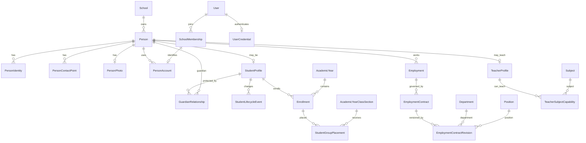

# 04 — Kişi, öğrenci, veli ve personel teknik tasarımı

Tarih: 2026-09-30 — son durum 2026-10-01

Durum: `PAKET 1 TAMAMLANDI — PAKET 2A YEREL KOD + DB HAZIR`

Girdi: [03 — Kişi, öğrenci, veli, personel ve öğretmen veri mimarisi](./03-kisi-ogrenci-personel-veli-veri-mimarisi.md)

> Bu belge hedef şemayı, kısıtları ve uygulama paketlerini tanımlar. Paket 1 kişi–öğrenci–veli omurgası uygulanmıştır; Paket 2A profil hesapları yerel kod ve DB migration olarak hazırlanmıştır. Kararlar ve uygulama notu [05 numaralı belgede](./05-profil-hesaplari-karar-sorulari.md) tutulur.

## 1. Kesinleşen ürün kararları

1. Her okul kendi kişi dosyalarını, öğrenci kayıtlarını, personelini ve finansal verisini bağımsız yönetir.
2. `Person` gerçek insanı, `User` giriş hesabını temsil eder. İkisi aynı kavram değildir.
3. Aynı kişi ikinci kez kaydedilmeden farklı portallar için ayrı kullanıcı adı ve parolalara sahip olabilir.
4. Giriş ekranı yalnız kullanıcı adı ve parola ister; kullanıcı rol veya portal seçmez.
5. Öğrenci okul numarası öğretim yılı içermez, okul içinde benzersizdir ve öğrencinin okul yaşamı boyunca değişmez.
6. Ulusal kimlik/pasaport bilgisi isteğe bağlıdır; öğrenci benzersizliği bunun üzerine kurulmaz.
7. Anne ve baba ayrı kişi kayıtlarıdır. Aynı veli birden fazla öğrenciye bağlanabilir.
8. Ücretli otomatik SMS/e-posta gönderimleri öğrenci başına yalnız bir primary veliye gider.
9. Öğrenci, veli ve personel hesapları otomatik açılmaz; Okul Admin ihtiyaç halinde açar.
10. Öğrenci hesabı seviye zorunluluğu olmadan isteğe bağlıdır.
11. Bir öğrencinin aynı öğretim yılında tek enrollment kaydı olur; şube değişiklikleri tarihçeli placement kayıtlarıdır.
12. Ön kayıt/admission adayı bu modülün kapsamında değildir; yalnız kesin kayıtlı öğrenci platforma alınır.
13. Personel/HR modülü bir defada değil, bağımlılık sırasına göre küçük paketlerle geliştirilir.
14. Şimdilik belge arşivi yapılmaz. Yalnız kişi fotoğrafı object storage'da tutulur ve WebP'ye dönüştürülür.
15. Eski MySQL verisi doğrudan import edilmez. Sistem tamamlandıktan sonra kullanıcı yönlendirmeli seed paketleri hazırlanır.

## 2. Kavramların kesin sınırı

| Kavram | Sorumluluğu | Taşımadığı bilgi |
| --- | --- | --- |
| `Person` | Okul içindeki gerçek insan ve temel profil | Parola, rol, yıllık sınıf, maaş |
| `User` | Bağımsız giriş hesabı ve credential sahibi | Otoritatif kişi/öğrenci/personel profili |
| `SchoolMembership` | Hesabın belirli okul domainindeki kullanıcı adı ve yetki üyeliği | Gerçek kişinin bütün iş ilişkileri |
| `PersonAccount` | Bir kişi ile bir okul hesabını belirli portal bağlamında eşler | Yetkinin kendisi; yetki rollerde kalır |
| `StudentProfile` | Öğrencinin okul boyunca kalıcı kimliği ve okul numarası | Hangi yıl ve şubede olduğu |
| `Enrollment` | Öğrencinin bir öğretim yılındaki kaydı ve yıl sonucu | Kalıcı öğrenci profili |
| `StudentGroupPlacement` | Enrollment'ın tarih aralığında bulunduğu yıllık şube | Yıl sonucu veya öğrenci hesabı |
| `GuardianRelationship` | Anne/baba ile öğrenci arasındaki ilişki ve primary iletişim | Veli giriş parolası |
| `Employment` | Kişinin okul ile çalışma ilişkisi | Tek tek sözleşme revizyonlarının içeriği |
| `EmploymentContract` | Hukuki sözleşme üst kaydı | Değiştirilebilir güncel maaş alanı |
| `EmploymentContractRevision` | İlk metin veya ek sözleşmeyle değişen görev/maaş şartları | Personelin kalıcı kimliği |
| `TeacherProfile` | Personelin öğretmen olarak kullanılabilmesi ve ana öğretmen niteliği | Gerçek yıllık ders ataması |

## 3. Hedef ilişki haritası



## 4. Hesap mimarisi: tek kişi, birden fazla bağımsız giriş

### 4.1 Neden `PersonAccount` gerekir?

Mevcut Arsimio'da `User`, `UserCredential`, `SchoolMembership` ve üyelik rolleri doğru şekilde ayrılmıştır. Yeni ihtiyaç, aynı gerçek kişinin aynı okulda birden fazla bağımsız giriş bağlamına sahip olmasıdır.

Örnek:

```text
Person: Ayşe Yılmaz
  ├─ SCHOOL_ADMIN hesabı
  │    username: ayse.yilmaz
  │    ayrı User + credential + SchoolMembership
  └─ GUARDIAN hesabı
       username: yilmaz.ayse
       ayrı User + credential + SchoolMembership
```

Bu modelde:

- iki parola ve iki oturum birbirinden bağımsızdır;
- bir hesabı askıya almak diğerini askıya almaz;
- girişten sonra portal seçimi sorulmaz;
- personel/veli profil bilgisi iki kez tutulmaz;
- HR yetkileri veli hesabına, veli yetkileri personel hesabına sızmaz.

### 4.2 `PersonAccount` alanları

| Alan | Kural |
| --- | --- |
| `id` | UUID |
| `school_id` | Zorunlu tenant anahtarı |
| `person_id` | Aynı okuldaki `Person` |
| `membership_id` | Aynı okuldaki `SchoolMembership`; benzersiz |
| `portal` | `SCHOOL_ADMIN`, `TEACHER`, `STAFF`, `GUARDIAN`, `STUDENT`, `DRIVER` |
| `status` | `ACTIVE`, `SUSPENDED`, `ARCHIVED` |
| `created_at`, `updated_at` | Audit destekli zamanlar |

Kısıtlar:

- `UNIQUE(school_id, membership_id)`
- `UNIQUE(school_id, person_id, portal)`
- `Person`, `PersonAccount` ve `SchoolMembership` aynı `school_id` değerine sahip olmalıdır.
- Portal, yetki yerine geçmez. Gerçek yetki mevcut `MembershipRole → RolePermission` zincirinden gelir.
- Tenant kullanıcılarında gerçek iletişim e-postası `User.email` içine zorunlu yazılmaz. E-posta `PersonContactPoint` içinde tutulur; böylece aynı insanın iki portal hesabı global e-posta benzersizliğine takılmaz.

### 4.3 Giriş ve yönlendirme

```text
okul domaini + username + password
  → SchoolMembership
  → UserCredential doğrulaması
  → PersonAccount.portal
  → portal başlangıç route'u
  → route içinde ayrıca permission/resource kontrolü
```

Kullanıcı adı biçimi (`ad.soyad`, `soyad.ad`) yalnız öneri üretir. Portal veya yetki kullanıcı adından tahmin edilmez.

### 4.4 Hesap oluşturma transaction'ı

Okul Admin “Hesap oluştur” dediğinde tek transaction:

1. Kişinin ve hedef portalın aynı okula ait olduğunu doğrular.
2. Bu kişi+portal için aktif hesap olup olmadığını kontrol eder.
3. Okul kapsamında kullanıcı adı benzersizliğini kontrol eder.
4. Yeni `User` ve `UserCredential` oluşturur.
5. Yeni `SchoolMembership` oluşturur.
6. Portal için izin verilen rolü üyeliğe bağlar.
7. `PersonAccount` bağlantısını oluşturur.
8. Parola/hash içermeyen audit kaydı yazar.

Bir adım başarısız olursa hiçbir hesap parçası kalmaz.

## 5. Kişi çekirdeği

### 5.1 `Person`

| Alan | Tür / kural |
| --- | --- |
| `id` | UUID |
| `school_id` | Zorunlu; bütün ilişkilerde tenant anahtarı |
| `first_name` | Zorunlu |
| `middle_name` | İsteğe bağlı |
| `last_name` | Zorunlu |
| `birth_date` | İsteğe bağlı `date` |
| `birth_place` | İsteğe bağlı metin |
| `nationality_text` | İsteğe bağlı serbest metin; tek değer |
| `sex` | İsteğe bağlı `MALE` / `FEMALE` |
| `status` | `ACTIVE` / `ARCHIVED` |
| `archived_at`, `archived_by_id` | Fiziksel silme yerine arşiv |
| `created_at`, `updated_at` | Zaman bilgileri |

Ad+soyad hiçbir zaman benzersizlik ölçütü değildir.

### 5.2 `PersonIdentity`

Ulusal kimlik/pasaport bilgisi isteğe bağlı ve hassastır.

| Alan | Amaç |
| --- | --- |
| `person_id`, `school_id` | Tenant güvenli bağlantı |
| `type` | `NATIONAL_ID` veya `PASSPORT` |
| `country_code` | İsteğe bağlı ülke kodu |
| `encrypted_value` | Şifreli gerçek değer |
| `lookup_hash` | Normalize değerin anahtarlı arama özeti |
| `last_four` | Maskeli UI gösterimi |
| `archived_at` | Normal silme yok |

Kurallar:

- Kullanıcı boş bırakırsa satır oluşturulmaz; sahte numara üretilmez.
- Aynı okulda dolu kimlik tekrarını `lookup_hash` üzerindeki partial unique index engeller.
- UI kaydetmeden önce dostça uyarı verir; son güvence DB kısıtıdır.
- İki okulun kayıtları birbirine karşı aranmaz veya birleştirilmez.
- Açık kimlik numarası log ve audit JSON'una yazılmaz.

### 5.3 `PersonContactPoint`

Telefon ve e-posta kişiye bağlanır. Öğrenci ekranında küçük yaş öğrencisine telefon/e-posta girmek zorunlu değildir; normal iletişim anne/baba kişi kayıtlarından alınır.

Temel alanlar: `kind`, `value`, `normalized_value`, `label`, `is_primary_for_person`, `verified_at`, `archived_at`.

Bir aile aynı telefon/e-postayı paylaşabileceği için iletişim değeri okul genelinde unique yapılmaz.

### 5.4 `PersonPhoto`

DB yalnız `blob_key`, güvenli erişim metadata'sı, `mime_type`, `width`, `height`, `byte_size`, `checksum`, yükleyen ve zaman bilgisini tutar. Kaynak dosya sunucu diskinde kalıcı tutulmaz.

Yükleme akışı daha sonra kesinleştirilecek ölçüye göre:

1. MIME ve gerçek görüntü içeriği doğrulanır.
2. Dosya boyutu/piksel sınırı uygulanır.
3. EXIF metadata temizlenir ve görüntü doğru yöne çevrilir.
4. Kare kırpma UI'si uygulanır.
5. WebP'ye dönüştürülür.
6. Okul+kişi kapsamlı anahtarla object storage'a yüklenir.
7. Önceki görsel yeni kayıt başarıyla yazıldıktan sonra güvenli temizleme kuyruğuna alınır.

Fotoğraf ölçüsü ayrı UI görüşmesinde belirlenecektir; ilk migration'ı bloke etmez.

## 6. Öğrenci kimliği ve okul numarası

### 6.1 Üç ayrı kimlik

| Kimlik | Kullanım |
| --- | --- |
| `Person.id` / `StudentProfile.id` | Sistem içi UUID; kullanıcıya iş anahtarı olarak gösterilmez |
| `student_number` | Okul personelinin kullandığı kalıcı, yıl içermeyen okul numarası |
| Ulusal kimlik | İsteğe bağlı resmî bilgi; öğrenci anahtarı değildir |

### 6.2 Numara üretimi

`SchoolNumberSequence` tablosu okul ve `STUDENT_NUMBER` anahtarı için sıradaki sayıyı tutar. Tahsis tek atomik DB işlemiyle yapılır; iki eşzamanlı kayıt aynı numarayı alamaz.

- Numara DB'de string olarak tutulur; yalnız rakamlardan oluşan otomatik değer üretilebilir.
- Başlangıç sayısı okulun ilk öğrenci kaydından önce ayarlanabilir; ayarlanmazsa sade bir varsayılan kullanılır.
- Otomatik verilen numara kullanıcı tarafından normal edit ekranında değiştirilemez.
- Eski verinin seed aşamasında açık `student_number` verilebilir; aynı okulda çakışırsa seed durur.
- `UNIQUE(school_id, student_number)` zorunludur.

## 7. Öğrenci, veli ve yıllık kayıt tabloları

### 7.1 `StudentProfile`

Temel alanlar:

- `id`, `school_id`, `person_id`
- `student_number`
- `status`: `ACTIVE`, `INACTIVE`, `GRADUATED`
- `admitted_on`
- `inactive_on` ve isteğe bağlı güncel durum özeti
- audit/arşiv zamanları

Kısıtlar:

- `UNIQUE(school_id, person_id)`
- `UNIQUE(school_id, student_number)`
- StudentProfile fiziksel olarak silinmez.

### 7.2 `GuardianRelationship`

| Alan | Kural |
| --- | --- |
| `student_profile_id` | Öğrenci |
| `guardian_person_id` | Anne veya baba kişi kaydı |
| `relationship_type` | İlk kapsamda `MOTHER` / `FATHER` |
| `is_legal_guardian` | İsteğe bağlı yasal veli işareti |
| `is_primary_contact` | Ücretli bildirim alıcısı |
| `archived_at` | İlişki geçmişini korur |

Kısıtlar:

- Aynı anne/baba aynı öğrenciye iki kez bağlanamaz.
- Bir `Person` birden fazla öğrencinin velisi olabilir.
- PostgreSQL partial unique index ile bir öğrenci için aynı anda en fazla bir aktif primary veli olabilir.
- Primary veli değişikliği tek transaction'da eski primary'yi kapatır, yenisini açar ve audit yazar.
- Veli hesabı ilişki kaydından bağımsızdır; anne/baba hesap olmadan da veli olarak kayıtlı olabilir.

### 7.3 Ücretli bildirim alıcısı

Otomatik SMS/e-posta servisi alıcıyı şu sırayla çözer:

```text
StudentProfile
  → aktif GuardianRelationship(is_primary_contact = true)
  → Guardian Person
  → kanala uygun aktif PersonContactPoint
```

- Aynı öğrenci için ikinci veliye otomatik kopya gönderilmez.
- Primary velinin ilgili kanal bilgisi yoksa gönderim yapılmaz ve yöneticiye veri eksiği gösterilir.
- Bir veli birden fazla çocuğun primary kişisiyse gelecekte rapor birleştirme/deduplication ayrı mesajlaşma tasarımında ele alınır.

### 7.4 `Enrollment`

| Alan | Kural |
| --- | --- |
| `school_id` | Tenant |
| `student_profile_id` | Kalıcı öğrenci |
| `academic_year_id` | Yıllık bağlam |
| `status` | `ACTIVE`, `COMPLETED`, `CANCELLED` |
| `enrolled_on`, `ended_on` | Tarihler |
| `outcome` | Aktifken boş; kapanırken yıllık sonuç |
| `outcome_on` | Sonuç tarihi |
| `revision` | Eşzamanlı düzenleme kontrolü |

`UNIQUE(school_id, student_profile_id, academic_year_id)` kesin kuraldır.

Yıllık sonuçlar: `PROMOTED`, `REPEATED`, `GRADUATED`, `TRANSFERRED`, `WITHDRAWN`, `UNKNOWN`.

### 7.5 `StudentGroupPlacement`

Enrollment'ın hangi tarih aralığında hangi `AcademicYearClassSection` içinde bulunduğunu tutar.

- `valid_from` gün hassasiyetindedir.
- `valid_to` dahil bitiş tarihidir ve boşsa aktif yerleşimdir.
- Aynı enrollment'ın placement tarihleri çakışamaz.
- Şube değişikliğinde eski satır kapatılır ve yeni satır açılır; enrollment ID değişmez.
- Placement'ın şubesi, enrollment'ın yılı ve okulu ile aynı olmalıdır.

Çakışma PostgreSQL tarih aralığı/exclusion constraint'iyle korunur; yalnız uygulama kontrolüne bırakılmaz.

### 7.6 `StudentLifecycleEvent`

Öğrenciyi silmeden güncel durumun nedenini ve tarihçesini tutar.

Olay örnekleri:

- `ACTIVATED`
- `INACTIVATED`
- `REACTIVATED`
- `TRANSFERRED_OUT`
- `WITHDRAWN`
- `GRADUATED`

Ayrılma nedeni kodları daha önce onaylanan sözlüğü kullanır: aile taşınması, okul ücreti/maliyet, başka okul tercihi, diğer, belirtilmedi/bilinmiyor. Mezuniyet yıllık sonuç/olaydır; ayrılma nedeni gibi sayılmaz.

### 7.7 Eski tablolardan hedef modele eşleme

Bu eşleme gelecekteki seed paketinin sözleşmesidir; doğrudan MySQL import talimatı değildir.

| Eski kaynak | Hedef | Dönüşüm kuralı |
| --- | --- | --- |
| `student_tbl` temel ad/doğum bilgileri | `Person` | Ad parçaları normalize edilir; ad benzerliğiyle otomatik birleştirme yapılmaz |
| `student_tbl` öğrenci durumu | `StudentProfile` + `StudentLifecycleEvent` | `Active/Passive` taşınabilir; bilinmeyen pasif nedeni tahmin edilmez |
| `student_tbl.stu_persid` | `PersonIdentity` adayı | Sahte/çakışan değerler kimlik olarak yüklenmez; inceleme raporuna gider |
| Eski sistemde bulunmayan okul numarası | `StudentProfile.student_number` | Yeni sistem sırası tarafından üretilir; `stu_persid` okul numarası yapılmaz |
| `stu_period_class` | `Enrollment` + `StudentGroupPlacement` | Yıl ve şube eşleşmesi doğrulanabilen satırlar taşınabilir |
| `parent` | `Person` + `PersonContactPoint` | Parola/hash taşınmaz; kişi ve iletişim bilgisi ayrılır |
| `parent_student` | `GuardianRelationship` | İlişki türü doğrulanamıyorsa anne/baba uydurulmaz; inceleme gerekir |
| `current_tbl` insan satırları | `Person` + `Employment` | Öğretmen niteliği ayrıca `TeacherProfile` olur |
| `current_tbl` şirket/tedarikçi satırları | Bu kişi modelinin dışında | Personel olarak yüklenmez; ileride tedarikçi modeline veya inceleme kuyruğuna gider |
| `admin` | Yeni `User` + credential + membership + `PersonAccount` | Eski parola hash'i taşınmaz; güvenli yeni hesap açılır |

Seed tekrar güvenliği için her kaynak satırına `source_system + entity_type + legacy_id` birleşik anahtarı verilir. Aynı anahtar ikinci çalıştırmada yeni kişi üretmez. Ham PII veya seed girdi dosyası Git deposuna eklenmez.

## 8. Öğrenci kayıt ekranı ve transaction akışı

Ön kayıt modülü olmadığı için “Yeni öğrenci” kesin kayıt oluşturur.

### Adım 1 — Ana öğrenci kaydı

Zorunlu girişler:

- ad ve soyad,
- öğretim yılı,
- yıllık sınıf/şube,
- kayıt tarihi.

İsteğe bağlı girişler:

- ikinci ad,
- doğum/demografik bilgiler,
- ulusal kimlik,
- fotoğraf.

Tek transaction:

1. Tenant ve `students.manage` yetkisi doğrulanır.
2. Okul numarası atomik tahsis edilir.
3. `Person` ve isteğe bağlı kimlik kaydı oluşturulur.
4. `StudentProfile` oluşturulur.
5. Seçili yılda `Enrollment` oluşturulur.
6. Seçili yıllık şubede ilk `StudentGroupPlacement` oluşturulur.
7. Hassas değer içermeyen audit kaydı yazılır.

Başarıdan sonra öğrenci detay sayfasına gidilir.

### Adım 2 — Anne/baba ilişkileri

Detay ekranında her ilişki için:

- mevcut kişi ara ve seç,
- veya yeni anne/baba oluştur,
- yasal veli işaretle,
- primary veli seç,
- telefon/e-posta ekle.

Veli aynı okulda daha önce başka çocuğa bağlıysa yeni kişi oluşturulmaz. Ad benzerliği tek başına otomatik birleştirme yapmaz; kullanıcı seçim yapar.

### Adım 3 — İsteğe bağlı hesaplar

- “Öğrenci hesabı oluştur” isteğe bağlıdır.
- “Veli hesabı oluştur” seçilen anne veya baba için manuel çalışır.
- Anne ve babanın ikisine de hesap açılabilir; ücretli bildirim yine yalnız primary kişiye gider.

### Adım 4 — Yeni yıl toplu geçişi

Öğrenci omurgası tamamlandıktan sonra toplu geçiş ayrı, idempotent servis olarak eklenir:

- kaynak yıl `CLOSED`, hedef yıl `ACTIVE` olmalıdır;
- 1–11. seviyelerde kullanıcı kaynak sınıfı ve hedef sınıfı seçer, öğrencileri checkbox ile onaylar;
- normal durumda şube kodu korunabilir (`4/1 → 5/1`), fakat hedef açıkça seçilir;
- PRF öğrencileri otomatik yükseltilmez; hedef 1. sınıf/şube manuel seçilir;
- 12. sınıfta seçili öğrenciler mezun edilir, seçilmeyenlere işlem yapılmaz;
- işlem eski enrollment/placement kayıtlarını değiştirmez;
- hedef yılda enrollment zaten varsa o öğrenci atlanır ve sonuç raporuna yazılır.

`StudentTransitionBatch` okul, kaynak/hedef yıl, işlem türü, idempotency key, input snapshot ve sonuç sayımlarını; `StudentTransitionBatchItem` ise öğrenci bazlı `CREATED`, `SKIPPED`, `FAILED` sonucunu tutar. `UNIQUE(school_id, idempotency_key)` aynı toplu işlemin iki kez kayıt üretmesini engeller.

## 9. Personel ve öğretmen hedef modeli

Bu bölüm bütün sınırları şimdiden belirler fakat tablolar aynı teslimde uygulanmayacaktır.

### 9.1 Okul katalogları

- `Department`: Yönetim, Muhasebe, Eğitim, Operasyon vb.
- `Position`: Müdür, Müdür Yardımcısı, Muhasebeci, Temizlik Görevlisi, Güvenlik, Mutfak Çalışanı, Öğretmen vb.

Katalog değerleri okul kapsamlıdır, arşivlenebilir ve geçmiş sözleşmelerdeki bağlantıları korunur.

### 9.2 `Employment`

Kişinin okul ile genel çalışma ilişkisini taşır:

- işe giriş ve ayrılış tarihleri,
- `ACTIVE`, `ON_LEAVE`, `ENDED` durumu,
- personel numarası gerekiyorsa okul kapsamlı değer,
- ayrılma bilgisi,
- yeniden işe girişte yeni employment kaydı.

### 9.3 Sözleşme ve ek sözleşme tarihçesi

`EmploymentContract` hukuki belge üst kaydıdır. Her yeni bağımsız kontrat yeni kayıt açar.

`EmploymentContractRevision` ilk şartları ve her ek/anex değişikliğini etkili tarih aralığıyla tutar:

- sözleşme türü,
- departman,
- pozisyon,
- görev unvanı,
- maaş tutarı ve para birimi,
- aylık/saatlik ödeme esası,
- çalışma saati gibi şartlar,
- `ORIGINAL` veya `AMENDMENT` kaynağı,
- geçerlilik başlangıç/bitişi.

Yeni ek sözleşme eski satırı değiştirmez. Tarih aralığı kapanır, yeni revizyon açılır. Böylece maaş ve görev geçmişi raporlanabilir.

### 9.4 `TeacherProfile`

- Öğretmen her zaman bir `Person` ve geçerli `Employment` kaydına dayanır.
- Kategori `CLASSROOM` veya `BRANCH` olabilir.
- Görünen ana unvan “Tarih Öğretmeni” gibi tek bir başlıktır.
- `TeacherSubjectCapability` ile bir öğretmene birden fazla ders bağlanabilir; örneğin Tarih ve Sosyal Bilgiler.
- Capability gerçek yıllık ders ataması değildir. Daha sonraki öğretmen atama modülü `CourseOffering` ile öğretmeni eşler.

### 9.5 Sonraki HR tabloları

Parça parça uygulanacak ayrı güvenlik alanları:

- banka hesapları,
- izin türleri ve hakları,
- izin talepleri/kullanımları,
- personel işe geliş/devamsızlık olayları,
- maaş tahakkuku,
- maaş ödeme kayıtları.

Bu tablolar isteğe bağlı veri girişini destekler; okul kullanmadığı alanı doldurmak zorunda değildir. Ancak banka/maaş verisi genel personel okuma yetkisiyle açılmaz.

## 10. Önerilen enum ve kontrollü değerler

| Enum | Değerler |
| --- | --- |
| `PersonSex` | `MALE`, `FEMALE` |
| `PersonStatus` | `ACTIVE`, `ARCHIVED` |
| `AccountPortal` | `SCHOOL_ADMIN`, `TEACHER`, `STAFF`, `GUARDIAN`, `STUDENT`, `DRIVER` |
| `PersonAccountStatus` | `ACTIVE`, `SUSPENDED`, `ARCHIVED` |
| `IdentityType` | `NATIONAL_ID`, `PASSPORT` |
| `ContactKind` | `PHONE`, `EMAIL` |
| `StudentStatus` | `ACTIVE`, `INACTIVE`, `GRADUATED` |
| `GuardianRelationshipType` | `MOTHER`, `FATHER` |
| `EnrollmentStatus` | `ACTIVE`, `COMPLETED`, `CANCELLED` |
| `EnrollmentOutcome` | `PROMOTED`, `REPEATED`, `GRADUATED`, `TRANSFERRED`, `WITHDRAWN`, `UNKNOWN` |
| `EmploymentStatus` | `ACTIVE`, `ON_LEAVE`, `ENDED` |
| `EmploymentType` | `FULL_TIME`, `PART_TIME`, `FIXED_TERM`, `CONTRACTOR`, `INTERN` |
| `TeacherCategory` | `CLASSROOM`, `BRANCH` |
| `ContractRevisionSource` | `ORIGINAL`, `AMENDMENT` |
| `SalaryBasis` | `MONTHLY`, `HOURLY` |

Uyruk enum değildir; isteğe bağlı serbest metindir. UI enum etiketlerini Türkçe/Arnavutça/İngilizce sözlükten gösterir.

## 11. Veritabanı bütünlük kuralları

Prisma ilişkilerine ek olarak migration SQL'inde korunması gerekenler:

1. Bütün iş tablolarında `school_id` bulunur ve bileşik foreign key tenant dışı bağlantıyı engeller.
2. `PersonAccount`, kişi ve üyeliği aynı okuldan bağlar.
3. Dolu resmî kimlik aynı okulda aynı tür için tekrarlanamaz; boş değer satır oluşturmaz.
4. Öğrenci okul numarası okul içinde benzersizdir.
5. Bir kişi okulda en fazla bir `StudentProfile` taşır.
6. Bir öğrenci+yıl için en fazla bir `Enrollment` vardır.
7. Placement tarih aralıkları aynı enrollment içinde çakışamaz.
8. Placement'ın sınıfı enrollment ile aynı okul ve öğretim yılına aittir.
9. Bir öğrenci için aynı anda en fazla bir aktif primary veli vardır.
10. Aynı kişi+portal için en fazla bir aktif hesap bağlantısı vardır.
11. Sözleşme revizyonlarının etkili tarihleri aynı sözleşmede çakışamaz.
12. Normal iş akışında `CASCADE DELETE` kullanılmaz; arşivleme ve `Restrict` tercih edilir.

## 12. Yetki sınırları

Önerilen permission grupları:

| Permission | Kapsam |
| --- | --- |
| `persons.read` / `persons.manage` | Temel kişi profili |
| `persons.identity.read` / `persons.identity.manage` | Resmî kimlik; dar yetki |
| `students.read` / `students.manage` | Öğrenci profil ve yıllık kayıt |
| `guardians.read` / `guardians.manage` | Anne/baba ilişkileri ve primary seçim |
| `school_accounts.read` / `school_accounts.manage` | Hesap açma, askıya alma, rol bağlama |
| `staff.read` / `staff.manage` | Personel temel bilgileri |
| `staff.contracts.read` / `staff.contracts.manage` | Sözleşme ve görev geçmişi |
| `staff.bank.read` / `staff.bank.manage` | Banka verisi; çok dar yetki |
| `staff.leave.read` / `staff.leave.manage` | İzin ve devamsızlık |
| `payroll.read` / `payroll.manage` | Maaş tahakkuk/ödeme |

Permission tek başına yeterli değildir. Veli yalnız bağlı olduğu öğrencileri, öğrenci yalnız kendisini, öğretmen yalnız atandığı kapsamı görmelidir. Bu kaynak-kapsam kontrolleri bütün Server Action/Route Handler'larda ayrıca yapılır.

## 13. DTO, hassas veri ve audit kuralları

- Liste DTO'su: ID, okul numarası, ad/soyad, sınıf, durum ve eksik veri göstergeleri.
- Ulusal kimlik, tam adres, banka, maaş ve parola liste sorgularına dahil edilmez.
- Kimlik UI'da varsayılan maskeli gösterilir.
- Credential hiçbir profil DTO'suna girmez.
- Audit; kişi, veli bağlantısı, primary değişimi, enrollment, placement, hesap, employment ve kontrat işlemlerinde zorunludur.
- Audit JSON'unda açık kimlik, telefon, e-posta, banka hesabı, maaş bordrosu veya parola/hash tutulmaz; değişen alan türleri ve maskeli özet tutulur.
- Fotoğraf URL'si kalıcı herkese açık iş anahtarı yapılmaz; erişim tenant ve permission kontrolünden geçer.

## 14. Uygulama paketleri

Kullanıcının “adım adım” kararı gereği her paket ayrı migration, servis, UI ve kabul testiyle tamamlanacaktır.

### Paket 1 — Öğrenci kayıt omurgası (`TAMAMLANDI / YEREL KOD + DB`)

- `Person`, iletişim, isteğe bağlı kimlik ve okul numarası dizisi
- `StudentProfile`
- `GuardianRelationship` ve tek primary kuralı
- `Enrollment` ve `StudentGroupPlacement`
- öğrenci listesi, yeni kayıt ve detay sayfası
- anne/baba seç/oluştur akışı
- arşiv/pasif yapma ve temel lifecycle olayı
- permission, audit ve tenant testleri

Fotoğraf upload'ı ölçü/kalite kararı sonrasında Paket 1'e küçük ek dilim olarak bağlanabilir.

2026-09-30 uygulama notu: Paket 1 modelleri, additive migration, permission/audit servisleri ve öğrenci liste–kayıt–detay UI'si tamamlandı; migration bağlı Neon'a uygulandı ve rollback DB doğrulaması geçti. Vercel yayını ile kullanıcı kabulü henüz tamamlanmadı. Fotoğraf bu teslimin dışında kaldı.

2026-10-01 kabul notu: Kullanıcı canlı öğrenci detayında anne ve baba kayıtlarının birlikte oluşturulabildiğini doğruladı. Paket 1'in öğrenci–veli çekirdeği kabul edildi; profil hesapları ayrı Paket 2 olarak açıldı.

### Paket 2 — Profil hesapları

- `PersonAccount`
- öğrenci/veli/personel için manuel hesap oluşturma
- portal bazlı otomatik yönlendirme
- hesap askıya alma ve parola yaşam döngüsü
- aynı Person için iki bağımsız hesap kabul testleri

### Paket 3 — Personel ve öğretmen çekirdeği

- Department, Position, Employment
- TeacherProfile ve çoklu ders capability
- personel listesi/kayıt/detay
- öğretmen hesabı ve sonraki atama modülüne hazır bağlantılar

### Paket 4 — Sözleşme ve görev/maaş tarihçesi

- EmploymentContract
- EmploymentContractRevision
- ilk sözleşme, ek sözleşme ve tarihçe UI'si
- hassas maaş permission'ları

### Paket 5 — İzin ve personel devamı

- izin türleri/hakları/talepleri
- hastalık/yıllık/mazeret izinleri
- işe gelmeme ve personel devam olayları

### Paket 6 — Banka ve bordro

- şifreli banka hesapları
- maaş tahakkuku ve ödeme kayıtları
- dar permission ve finans mutabakatı

### Paket 7 — Eski veri seed'i

Uygulama ekranları tamamlandıktan sonra kapsam kullanıcıyla belirlenir. Doğrudan MySQL import yoktur; her seed:

- yalnız yerel/güvenli giriş kaynağı okur; gerçek PII Git'e yazılmaz,
- önce `dry-run` sayım ve hata raporu üretir,
- idempotent kaynak anahtarları kullanır,
- sahte/çakışan kimlikleri ve eşleşmeyen yıllık kayıtları karantina raporuna ayırır,
- hata varsa transaction'ı geri alır veya önceden tanımlı güvenli parçayı işler,
- kişi/yıl/şube sayımlarıyla mutabakat verir,
- başarılı yazmaları `IMPORT` audit kaynağıyla işaretler.

## 15. Paket 1 migration ve yayın stratejisi

1. Yeni enum ve tablolar additive migration ile eklenir; mevcut auth/akademik tabloları silinmez.
2. `School` ve `AcademicYearClassSection` ilişkileri tenant bileşik foreign key'lerle bağlanır.
3. Yeni permission kayıtları idempotent seed edilir; ilk aşamada yalnız `SCHOOL_ADMIN` rolüne yönetim yetkileri verilir.
4. Mevcut iki pilot okulun login akışı değiştirilmeden yeni öğrenci route'ları feature olarak eklenir.
5. İlk migration boş tablolarla yayımlanır; eski MySQL verisi yüklenmez.
6. Gerçek DB testleri transaction sonunda rollback ile tenant/unique/exclusion kurallarını doğrular.
7. Kullanıcı yeni ekranı canlıda küçük deneme kaydıyla kabul ettikten sonra sonraki pakete geçilir.

Geri dönüşte yeni route kapatılabilir; mevcut auth ve akademik akışlar yeni tablolar boşken çalışmaya devam eder. Migration ile oluşturulmuş gerçek kişi/öğrenci verisi varsa tablo düşürme geri dönüş yöntemi kullanılmaz.

## 16. Zorunlu kabul testleri

### Tenant ve güvenlik

- HorizonEdu öğrencisi GjimCamEdu sorgusunda okunamaz veya değiştirilemez.
- Başka okulun kişi, veli, enrollment ve şube ID'leri yazma isteğine verilirse işlem reddedilir.
- Kimlik/iletişim değerleri hata mesajı, log veya audit'e sızmaz.

### Öğrenci

- Eşzamanlı iki kayıt farklı okul numarası alır.
- Aynı ad/soyadda iki öğrenci farklı okul numarasıyla kaydedilebilir.
- Kimlik numarası boş iki kişi kaydedilebilir.
- Aynı dolu kimlik aynı okulda ikinci kez kaydedilemez; başka okulda bağımsızdır.
- Aynı öğrenci+yıl ikinci enrollment alamaz.
- Aynı enrollment'ta iki placement tarih aralığı çakışamaz.

### Veli

- Aynı anne üç kardeşe bağlanabilir.
- Bir öğrenciye anne ve baba birlikte bağlanabilir.
- Aynı anda yalnız bir ilişki primary olabilir.
- Primary değişimi auditli ve atomiktir.
- Otomatik mesaj alıcısı yalnız primary veliden çözülür.

### Hesap paketi geldiğinde

- Bir Person'ın Admin ve Veli hesapları farklı kullanıcı adı/parola/oturum taşır.
- Admin hesabı veli portalına, veli hesabı admin portalına yetkisiz erişemez.
- Bir hesabın askıya alınması aynı Person'ın diğer hesabını etkilemez.
- Girişte portal seçimi sorulmadan doğru başlangıç sayfasına yönlenir.

## 17. Bilinçli olarak ertelenen konular

- Fotoğrafın kesin piksel ölçüsü, sıkıştırma kalitesi ve kırpma oranı
- Eski veriden hangi aktif/pasif kişilerin seed edileceği
- Eski yıllık akademik geçmişin seed kapsamı
- SMS/Brevo sağlayıcı entegrasyonu, fiyat ve gönderim kuyruğu
- Maaşın net/brüt ve ülke vergi hesapları
- Banka/izin/bordro UI ayrıntıları
- Öğretmen–ders–sınıf yıllık atama ekranı

Bu konular ilgili uygulama paketine gelindiğinde kararlaştırılacaktır; Paket 1'in kişi/öğrenci veri sınırını bozmaz.

## 18. Sıradaki kontrollü adım

Sıradaki kontrollü adım **Paket 2A migration'ın canlıya uygulanması ve kullanıcı kabulüdür**. Öğrenci/veli hesabı, geçici parola, ilk giriş, askıya alma, portal yönlendirmesi ve mevcut Okul Admin hesaplarının `Person` ile eşleştirilmesi yerelde hazırlanmıştır. Öğretmen/personel hesap ekranı, personel çekirdeğinin kurulacağı Paket 3'e bırakılır.
